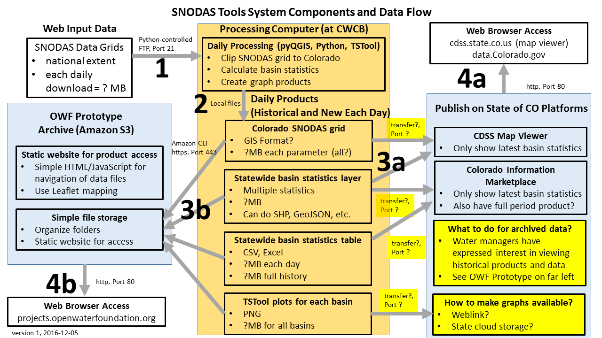

# Deployed Environment / Overview

**TODO smalers 2016-12-04 need to insert PowerPoint image summarizing final deployed system,
using OWF prototype approach as the starting point so CWCB/DWR/OIT can react.
Also need to insert images of example products.**

The following system image is from the software design documentation.

The deployed system consists of two main components:

1. Computer and software that process historical and daily SNODAS grids into snow data products for water supply analysis.
The software includes the SNODAS tools developed in this project.
This computer will publish products to resources listed below.
2. Computer resource(s) to publish the results from step 1 so that they are accessible to State of Colorado staff and water managers, including:
	* Web-accessible file storage for historical SNODAS grids for Colorado basins, and archive of daily output products.
	**TODO smalers 2016-12-04 OWF plans to prototype with Amazon S3 static website files using Leaflet dynamic maps and static data and time series plots.**
	* Latest-day snow products such as SWE basin totals, fed to the CDSS Map Viewer (or more specific mapping tool?).
	It does not appear that the Map Viewer would be suitable to access a historical archive.
	**TODO smalers 2016-12-04 need to finalize protocol for this with input from CWCB/DWR/OIT**
	* Latest-day snow products such as SWE basin totals, fed to Socrata data.colorado.gov
	It may be possible to publish the historical archive of values since it is in a tabular format.
	**TODO smalers 2016-12-04 need to finalize hand-off protocol for this with input from CWCB/DWR/OIT**

The deployed computer environment (item 1 above) will run the SNODAS tools operationally, performing the following tasks:

1. Download SNODAS grids...
2. **TODO smalers 2016-12-04 need to summarize to provide context.**

Consequently, the deployed environment must include software necessary to run the operational tools.
However, the deployed environment does not need to have development environment software installed.
In some cases the software is used in both the deployed and development environment.

## Computer System to Run SNODAS Tools

The following sections describe how to install necessary software on a computer that will run the SNODAS tools.

### Computer

The target computer environment is as follows, matching requirements for the State of Colorado environment:

* Windows 10, 64-bit
* Identified user to run software on CWCB computer (may be an existing user or special "robot" user)
* Capable of QGIS, and TSTool software install and execution - processes are not real-time so even slow processing is probably OK
* Local disk space for historical SNODAS grids and daily output snow products, to allow software to process
* Access to system components to publish results

### QGIS Software

The QGIS software should be installed in the standard location using the [same instructions as for the development environment](../dev-env/qgis).

### TSTool Software

The TSTool software should be installed in the standard location using the [same instructions as for the development environment](../dev-env/tstool).

**TODO smalers 2016-12-04 need to finalize which version and provide basic installation instructions -
not sure if another version is already installed on the computer**

### SNODAS Tools Software

**TODO smalers 2016-12-04 need to describe how to install the SNODAS tools.
For example, might install in `C:\CDSS\SNODAS-Tools\`.  Need to finalize script names, configuration files, location of data, etc.**

### SNODAS Tools Configuration

**TODO smalers 2016-12-04 need to describe final configuration of the SNODAS tools once all software components are installed**

### Test

**TODO smalers 2016-12-04 need to describe how to do basic testing to make sure things are working**

### Run Operationally

**TODO smalers need to describe how to run operationally, scheduled process and also manual re-run**

## Computer Systems to Publish Results

The following sections describe how to configure other system components to receive the SNODAS tools output products.

### Amazon S3

OWF's corporate Amazon S3 space is being used for the prototype SNODAS products, including historical SNODAS grids and
products generated from this project.
Expect that a folder will be created such as:
[http://projects.openwaterfoundation.org/cdss-snodas-tools](http://projects.openwaterfoundation.org/cdss-snodas-tools), with
a folder structure that allows simple Leaflet static web pages to be provided.  Scripts will be developed to push the products to OWF's Amazon S3,
using an Amazon Web Servides profile for CDSS-SNODAS that is restricted to only that project folder.**

**TODO smalers 2016-12-04 need to explain in more detail and flesh out when a working prototype is implemented.**

### CDSS Map Viewer

**TODO smalers 2016-12-04 Need to work out final details with CWCB/DWR/OIT on how to publish to Map Viewer**

### data.colorado.gov (Socrata Open Data Portal)

**TODO smalers 2016-12-04 Need to work out final details with CWCB/DWR/OIT on how to publish to Map Viewer**
