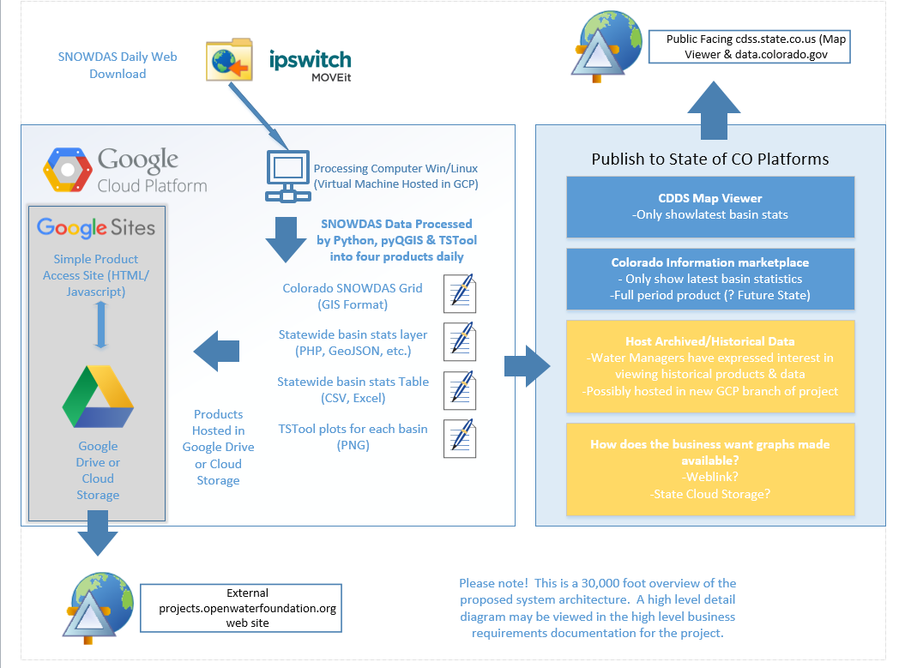

# Deployed Environment / Overview

This documentation describes the deployed environment configuration.
The deployed environment requires different software than the development environment, although some components are used in both.

This documentation includes the following sections:

* [Deployed Environment IT Infrastructure](#deployed-environment-it-infrastructure) - overview of integrated system
* [Computer System to Run SNODAS Tools](#computer-system-to-run-snodas-tools) - the computational system
	+ [Linux Virtual Machine Computer](#linux-virtual-machine-computer) - operating system for computer
	+ [QGIS Software](#qgis-software) - main geographic information system processing platform
	+ [SNODAS Tools Software](#snodas-tools-software) - Python programs to download SNODAS data and create snowpack products
	+ [TSTool Software](#tstool-software) - software to process time series
	+ [SNODAS Tools Configuration](#snodas-tools-configuration) - setup users environment to run SNODAS tools
	+ [Test SNODAS Tools](#test-snodas-tools) - test the configuration
	+ [Run Operationally](#run-operationally) - final comments on running operationally
* [Computer Systems to Publish Results](#computer-systems-to-publish-results) - systems to allow access to data products
	+ [Google Cloud Storage for Static Website Data Product Archive](#google-cloud-storage-for-static-website-data-product-archive)
	+ [CDSS Map Viewer](#cdss-map-viewer)
	+ [Colorado Information Marketplace](#colorado-information-marketplace)

# Deployed Environment IT Infrastructure

The following IT infrastructure design is from the Open Water Foundation's perspective.
This perspective is limited by the fact that OWF has not to date deployed software to the State's Google Cloud Platform environment.
OWF has utilized Amazon Web Services on other projects and uses a Google Site for [CDSS software downloads](https://sites.google.com/site/cdssstaging/home).

The following IT infrastructure design is from the State of Colorado Office of Information Technology's (OIT's) perspective.
The OIT perspective more specifically indicates the use of Google Cloud Platform to provide a virtual machine (VM) and cloud storage space (Google Sites).

The deployed computer environment (item 1 above) will run the SNODAS tools operationally,
as described in the [Software Design](../software-design/overview).

Consequently, the deployed environment must include software necessary to run the operational tools.
However, the deployed environment does not need to have development environment software installed.
In some cases the software is used in both the deployed and development environment.

## Computer Systems to Publish Results

The following sections describe how to configure other system components to receive the SNODAS tools output products.

## Google Cloud Storage for Static Website Data Product Archive

The VM that performs the calculations will have a local copy of input and output files.
A subset of these files will need to be pushed to a Google Cloud Storage bucket...only the files of interest to Colorado data users,
but not the large input files for the entire USE.

OWF has discussed with OIT using Google Cloud Storage, ideally published as a static website.
It is not clear whether a Google Site is needed given that website files can be stored on a static website.  See:

* [Hosting a Static Website](https://cloud.google.com/storage/docs/hosting-static-website).

**TODO smalers 2016-12-29 Need to figure out bucket name and domain for these resources.
Perhaps OIT can recommend a standard assuming that multiple cloud-hosted services could be implemented going forward.**

OWF will work with OIT to use the Google Cloud Storage.  However, OWF may also prototype on its Amazon S3 space,
which is similar to Google Cloud Storage.
This will involve configuring a bucket that will 
OWF's corporate Amazon S3 space is being used for the prototype SNODAS products, including historical SNODAS grids and
products generated from this project.
Expect that a folder will be created such as:
[http://projects.openwaterfoundation.org/cdss-snodas-tools](http://projects.openwaterfoundation.org/cdss-snodas-tools), with
a folder structure that allows simple Leaflet static web pages to be provided.  Scripts will be developed to push the products to OWF's Amazon S3,
using an Amazon Web Services profile for CDSS-SNODAS that is restricted to only that project folder.**

**TODO smalers 2016-12-04 need to explain in more detail and flesh out when a working prototype is implemented.**

### CDSS Map Viewer

The daily SNODAS Tools output map layers will need to be made available to one of the Map Viewers implemented by the CWCB.

**TODO smalers 2016-12-04 Need to work out final details with CWCB/DWR/OIT on how to publish to Map Viewer.
How will files generated on the VM be pushed to DWR/OIT staff to load into a Map Viewer?**

### Colorado Information Marketplace 

The Colorado Information Marketplace (CIM), [data.colorado.gov](http://data.colorado.gov) uses the Socrata data portal software,
and can be used to publish daily tabular datasets produced by the SNODAS Tools.

OWF has discussed with Jon Gottsegan the need for documented protocols for systems to submit datasets to CIM.
It is OWF's understanding that protocols are being written.

**TODO smalers 2016-12-04 Need to work out final details with CWCB/DWR/OIT on how to publish to CIM**
