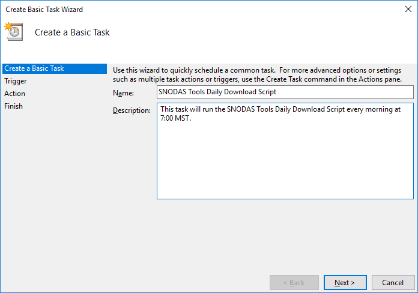
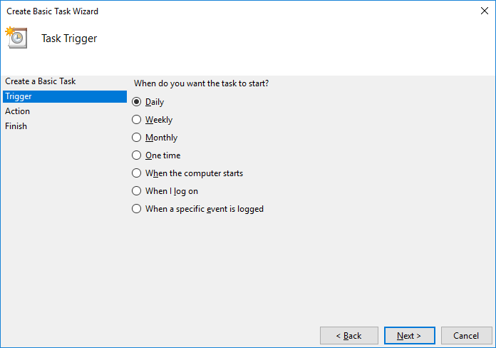
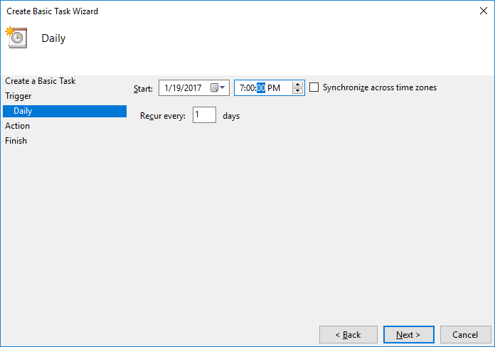
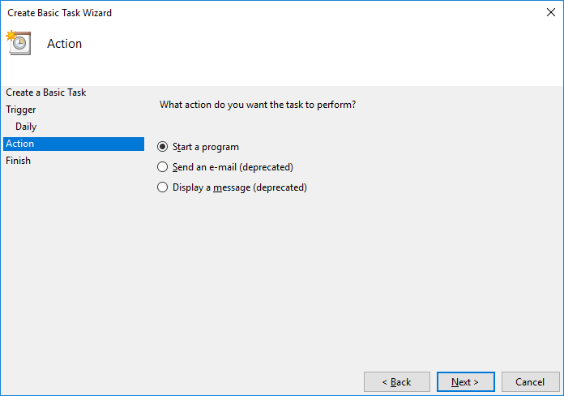
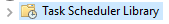
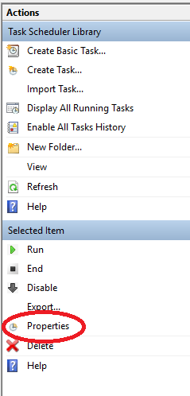
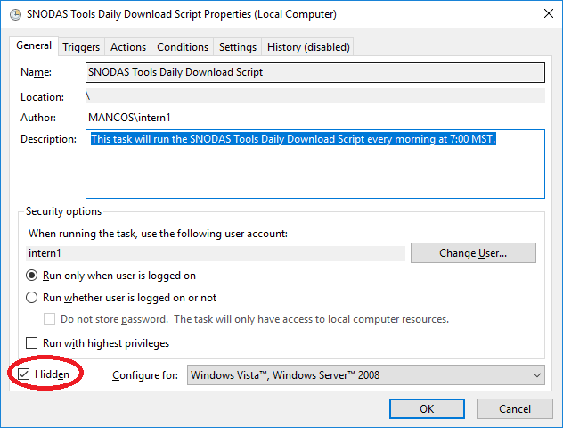
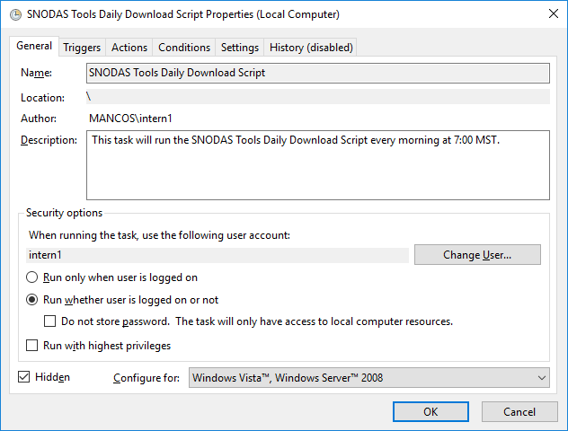
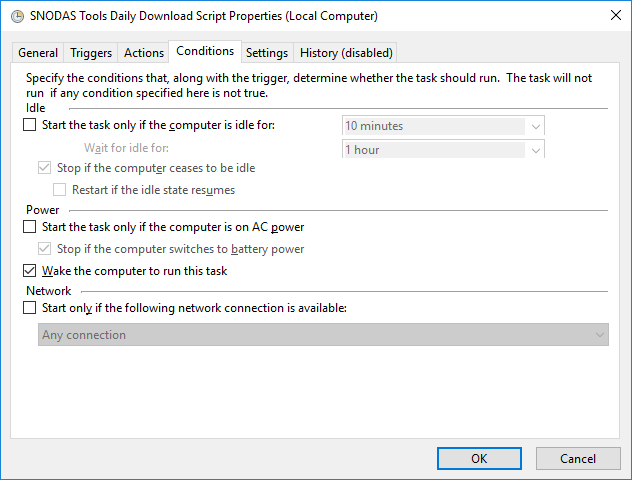
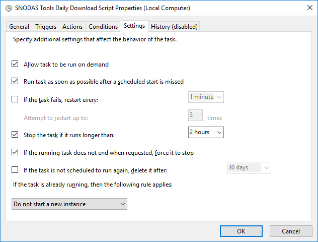

# Task Scheduler Overview

Task Scheduler is a Windows application allowing a user to automatically run programs on a timed schedule. This application is
beneficial to the SNODAS tools because new SNODAS data must be downloaded and processed everyday. 

The ```SNODASDaily_Automated.py```
script is designed to be programmed on a timed schedule. It will download the current day's SNODAS data from the SNODAS FTP site 
and export the daily zonal statistics in the [processedData](../software-design/data-management.md#snodastools92processeddata92) folder on the local computer. 

For information on the data processing steps of ```SNODASDaily_Automated.py```, refer to the 
[Processing Workflow](../software-design/overview.md#processing-workflow) section. For information on the SNODAS FTP site, refer to the
[SNODAS Tools Data](../../../doc-user-mkdocs-project/docs/data/overview.md) of the user guide. For information on
the output snowpack products, refer to the [SNODAS Tools Products](../../../doc-user-mkdocs-project/docs/products/overview.md)
section of the user guide.

**TODO egiles 2017-01-19 fix the broken links that direct to the user manual**

#  SNODASDaily_Automated_forTaskScheduler.bat

** TODO egiles 2017-01-19 add information about SNODASDaily_Automated_forTaskScheduler.bat**

# How to Set Up the Task Scheduler to Run SNODASDaily_Automated.py

## Grant *Log on as Batch Job* Rights to User 

*Log on as Batch Job* rights allow the ```SNODASDaily_Automated.py``` to run automatically with the user being logged off of their 
account. Note that the setting of running the script while the user is logged off still needs to be configured within the task scheduler,
see how in the [Set Other Options with Task Scheduler](#set-other-options-with-task-scheduler) section. The *Log on as Batch Job* rights
need to be granted in order for this setting to be enabled. The administrative account is defaulted to have these rights but other 
users are defaulted otherwise. An administrative account must grant the *Log on as Batch Job* rights to the user who will be running 
the ```SNODASDaily_Automated.py``` with the task scheduler. 

1. Sign in on administrative account
2. In the Control Panel, open Administrative Tools, then Local Security Policy.
3. Beneath Security Settings, open Local Policies and highlight User Rights Assignment.
4. Locate Log on as a batch job. Open the properties and add users who will be running the task scheduler SNODAS task.
5. When finished, save your changes and close the Local Security Settings window.

** TODO egiles 2017-01-19 add screenshots to the above workflow, cannot do this until I get admin login info. The above tutorial has
not been tested on a computer because I do not have admin login info. Need to test on computer. Tutorial was created by online source.**

## Set up Task in Task Scheduler

1. Sign in on the user account that will be running the daily script  

2. Navigate to and open *Task Scheduler*.   

3. On the right-hand side of the screen, click   

4. Give the task a name and description.  

	   
	

5.	Click *Next*.  

6.	Select *Daily*. Click *Next*.  

	  

7.	Select desired *Start* date and select the time for the script to run every day. Click *Next*.  

	  

8.	Under the *Action* menu, select *Start a program*. Click *Next*.  

	  

9.	Under *Program/Script*, navigate to the ```SNODASDaily_Automated_forTaskScheduler.bat``` script. Click *Next*.  
 
10.	Review task information and correct if necessary. Click *Finish*.   


## Set Other Options with Task Scheduler

### Hide command line prompt when task is running

Every time a task runs, a black command line prompt screen will appear on the screen. If you want this 
box to be hidden and the task to run in the background, follow the instructions below.

1.	Navigate to and open *Task Scheduler*. 
2.	On the left-hand side of the screen, click   
3.	Click the name of the *SNODAS Tools Daily Download Script* Task. Note that the name of the task may be something other
than *SNODAS Tools Daily Download Script*. It will be the name that was entered as the task name in step 4 of 
[Set up Task in Task Scheduler](#set-up-task-in-task-scheduler). 
		
4.	On the right-hand side of the screen, click *Properties* under the blue *Selected Item* menu bar. 

	
	
5.	Under the *General* tab, check the box next to *Hidden*. Click *OK*

	


### Enable task to run when user is not logged in

The ‘Create Basic Task’ interface does not enable manipulations of user properties. The task is defaulted to 
only run the task when the user is logged in. This can be changed to enable the task to also run when the 
user is logged off. To do so, follow the instructions below. 

1.	Ensure that the user has “Log on as Batch Job” rights. If not, refer to the 
[Grant *Log on as Batch Job* Rights to User](#grant-log-on-as-batch-job-rights-to-user) section.  

2.	Navigate to and open *Task Scheduler*.  
3.  On the left-hand side of the screen, click   
4.  Click the name of the *SNODAS Tools Daily Download Script* Task. Note that the name of the task may be something other
than *SNODAS Tools Daily Download Script*. It will be the name that was entered as the task name in step 4 of 
[Set up Task in Task Scheduler](#set-up-task-in-task-scheduler).   
5.  On the right-hand side of the screen, click *Properties* under the blue *Selected Item* menu bar. 

	  
	
6. Under the *Security options* of the *General* tab.
	- Select *Run whether user if logged on or not*.

		
	
7. Click the *Conditions* tab. 
	- Uncheck *Start the task only if the computer is on AC power*.
	- Check *Wake the computer to run this task*. 
		
		
	
8. Click the *Settings* tab. 
	- Check *Run task as soon as possible after a scheduled start is missed*. 
	- Change the *Stop the task if it runs longer than:*  selection to *2 hours*.  
	
		
	
9. Click *Ok*. 


