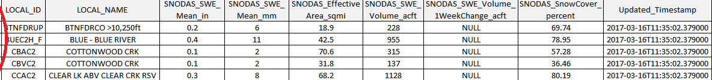

# Deployed Environment / Troubleshooting

## If Automated Download Fails

There are times where the automated daily download will fail. Some scenarios that would cause
this are:

 - The task in the task scheduler does not run because the computer is turned off. 
 - The SNODAS FTP site did not upload the current date of data at the time of set task.
 - The SNODAS FTP site was too busy to allow download at the time of the set task. 
 
If this occurs, the missed date of SNODAS data can be downloaded 
and processed using the ```SNODAS_DailyInteractive.py``` Python script
To run the ```SNODAS_DailyInteractive.py``` script, refer to the step-by-step instructions in the 
[Processing Workflow](../software-design/overview#processing-workflow) section. 

## User Input Error Messages in the Console

If you are experiencing error messages when typing your input into the console during the ```SNODASDaily_Interactive.py```script, the reason could be any of the following: 

- **If you are entering a date**:   
	* The date could be in the improper format. You should enter all dates in the mm/dd/yy format. For example, if you are interested in February 6th of 2005 then you will enter ```02/06/05```. 		
	* The date could be out of appropriate range. Remember that the SNODAS data is only available on or after September 28th, 2003. If you try to enter a date before then, you will receive an error message. The SNODAS data is
	only available up until today’s date. If you try to enter a date in the future, you will receive an error message. 
	* If you are interested in a range of dates, then your end date must be after your starting date. Make sure that you are entering a date later than the entered starting date. Otherwise, you will receive an error. 
	* Make sure that you do not add a space before or after the entered date. After typing in the year, press enter without adding any extra spacing. These extra spaces could cause the script to produce an error. <br><br>
- I**f you are entering text:**  
	* Make sure that you are typing one of the options that the prompt has asked you to type. If you enter text other than the preset options, you will receive an error. 
	* Make sure that you do not add a space before or after the entered text. After the last character of your input, press enter without adding any extra spacing. These extra spaces could cause the script to produce an error. <br><br>
- **If you accidentally choose an option in a prompt that is not the option you wanted:**  
	* If this occurs, there is no way for you to go back to the last question and fix the error. Instead you must shut down the running script and restart a new script. You will be prompted with the first question again. Go through the prompts as usual with the inputs that you want. 

## Interrupting the Script Mid-Process

It is important that once a script is running that it continues until completion without interruption. Interruption can mean one of two actions. First, it could mean that the script is manually terminated. Secondly, 
it could mean that the ```SNODASDaily_Interactive.py``` script is running at the same time as the ```SNODASDaily_Automated.py``` script. Both actions will result in a corrupted basin boundary shapefile. 

Why does this occur? 

The ```zStat_and_export``` function creates new fields in the basin shapefile attribute table for each day of processing. The statistics store under the newly created fields only to be written to a local csv file. 
The script then deletes the newly created fields to allow space for the next day of spatial statistics to be calculated and copied over to a new .csv file. <br>

The script is built to temporarily edit the structure of the basin’s attribute table only to be converted back to its original structure at the end of the script. If the script is interrupted in the middle 
of a process, it is possible that the structure of the basin’s attribute table will permanently corrupt causing the entire script to break and/or the script to calculate inaccurate statistics. Another possible outcome 
of interrupting the script mid-process would be permanent deletion of basin polygon/features within the basin shapefile.  <br>

If the script is interrupted mid-process, there is a fix. This is a semi-complicated process so it is best to avoid this troubleshooting issue altogether by never running both scripts at the same time.  The corrupted 
basin shapefile (not the basin extent shapefile) must be overwritten with an original copy because new fields have been created in the shapefile (that should have been deleted at the end of the script if 
the script ran to completion.)Most likely, the fields of the attribute table are not correct (either too many fields or not enough fields). If one does not have an original copy of the shapefile, follow the instructions below.

1. Open QGIS Desktop. 
2. In the menu bar click ```Layer``` > ```Add Layer``` > ```Add Vector Layer...```. 
3. Click ```Browse``` and navigate to the basin boundary shapefile. Click ```Open```.   
	- *Note: If you are unsure where this shapefile is located, 
		reference **section** VectorInputShapefile **option** pathname of the configuration file, [SNODASconfig.ini](../software-design/file-structure.md#snodastools92snodasconfigini).*
	 

4. The basin boundary shapefile will appear. Right-click the basin boundary shapefile layer in the Table of Contents and click ```Open Attribute Table```.
	

5. The attribute table will appear. First click the ```Toggle Editing Mode``` button () in the top left of the attribute table menu bar. 
This enables editing of the attribute fields.

6. Click the ```Delete field``` button (). This will prompt a pop-up 'Delete fields' 
window with a list of all available attribute fields. 

	

	If the script has stopped mid-process, the following fields *could* be present:  
	
	|```SWEMean_in```|```SWEMean_in``` |```SWE_mean```  |```SWE_max```  |```SWEMax_in```|```SWEMax_mm```|
	|-----|----|--|--|--|--|
	|```Area_sqmi```| ```SWEVol_af```  |```SWEVolC_af```  |```SWE_stdev``` |```SWESDev_in``` |```SWESDev_mm``` |
	|```SCover_pct``` |```SWE_min```  |```SWEMin_in```   |```SWEMean_mm```|```SWEMin_mm```  ||
 
  
7. Click to highlight all present fields in the above table. These fields are automatically deleted when the script runs all the way through without interruption. After all have been highlighted click ```OK``. 
This will manually delete the selected fields. 
8. Once again, click the ```Toggle Editing Mode``` button () in the top left of the attribute table menu bar. This will save the attribute field deletion edits you made.

Make sure to rerun the script for the days of SNODAS data that were affected by the script interruption to ensure statistical results are correct. 

## Enabling Optional SWE Statistics

The SNODAS Tools always calculate and export the [default SWE statistics](../software-design/overview.md#overview). The 
[optional SWE statistics](../software-design/overview.md#overview), however, are defaulted to be ignored by
the SNODAS Tools. If desired by the user, the optional statistics can be enabled to be calculated and exported to the csv files alongside 
the default SWE statistics. The desired optional statistics can be configured in the [configuration file](../software-design/file-structure.md#the-sections-and-options-of-the-configuration-file)
under **section** ```OptionalStatistics```. 

The SNODAS Tools export the statistics into two types of csv files, ```byDate``` and ```byBasin```. In both csv files, the statistic name is written 
to the first row, or the header row, as shown below. 



When an optional statistic is enabled in the configuration file, a new column is added to each of the csv files. For this reason, it is 
mandatory that the configuration of the optional SWE statistics is set *before* the script is first run. If the configuration of the optional
SWE statistics is changed *after* the first run of the SNODAS Tools (meaning that the csv files have already been created and there
is already data within the csv files), an error will occur within the 
[```byBasin``` csv file](../software-design/file-structure.md#processeddata5_calculatestatisticsstatisticsbybasin). 

For example, if the SNODAS Tools originally run with the default settings then the header row of the csv files will 
include the following 7 columns:

||Column Name|Column Description|
|-|---------|--------------|
|1|Date_YYYYMMDD|the date|
|2|LOCAL_ID|the unique local basin ID|
|3|SNODAS_SWE_Mean_in|the SWE mean (inches)|
|4|SNODAS_SWE_Mean_mm|the SWE mean (millimeters)|
|5|Effective_Area|the basin area|
|6|Snow_Cover_percent|the areal snow cover|
|7|SWE_volume_acft|the volume of water stored within the snowpack|
|8|one_week_SWE_volume_change_acft|the week change in water volume stored within the snowpack| 

It is important to understand that a *new* 
[```byDate``` csv file](../software-design/file-structure.md#processeddata5_calculatestatisticsstatisticsbydate) is created every time a *new* date of SNODAS 
data is processed with the SNODAS Tools. However, a new 
[```byBasin``` csv file](../software-design/file-structure.md#processeddata5_calculatestatisticsstatisticsbybasin) *is not* created every time a *new*
date of SNODAS data is processed. Instead, the statistics from the new day are *appended* to the original ```byBasin```
csv file. This is why the error occurs within the ```byBasin``` csv file if new statistics are introduced or disabled
after the header row of the ```byBasin``` csv file has already been previously established. 
 
If the user wants to enable or disable optional statistics after the SNODAS Tools have been run, then the 
byBasin csv files must be deleted from the 
[```processedData\5_CalculateStatistics\StatisticsbyBasin``` folder](../software-design/file-structure.md#processeddata5_calculatestatisticsstatisticsbybasin) 
and all dates of interest must be reprocessed by the SNODAS Tools. 