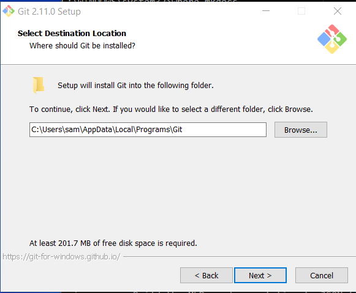
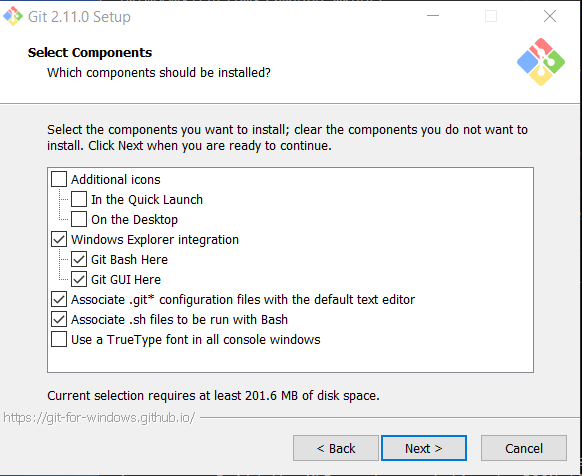
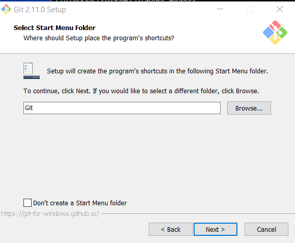
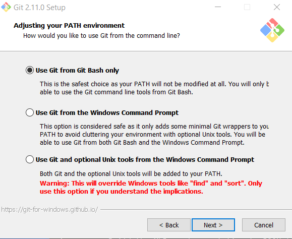
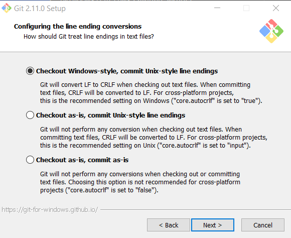
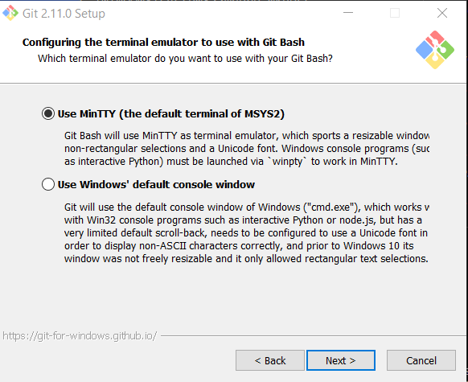
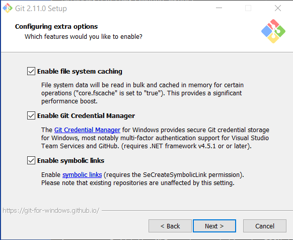
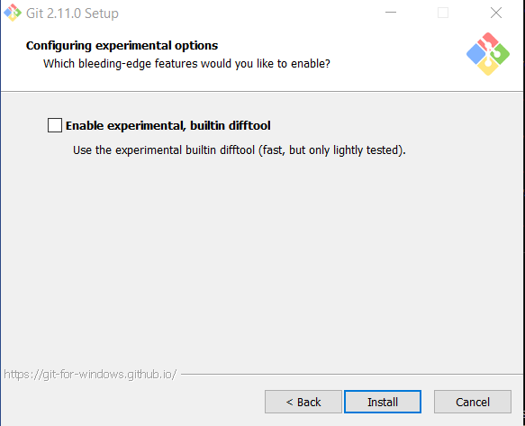

# Development Environment / Git

Git is used for revision control and all developers are expected to follow Git best practices.
This project is maintained as a [GitHub repository](https://github.com/OpenWaterFoundation/cdss-app-snodas-tools)
(see other sections for repository initialization and work tasks).

Git software must be installed and configured on the Windows computer in order to use Git for revision control.
The [PyCharm IDE](pycharm/) provides Git integration;
however, Git command line tools are also used when files are not managed in PyCharm, such as this documentation.
The following Git tools are specifically recognized as part of the development environment,
although other tools may be used based on developer skills.
The following provides a short overview of typical Git installation.

## Git Documentation

The following resources are helpful:

* [Pro Git](https://git-scm.com/book/en/v2)
* [Dealing with line endings (GitHub)](https://help.github.com/articles/dealing-with-line-endings/)
* [Using GitHub Integration](https://www.jetbrains.com/help/pycharm/2016.2/using-github-integration.html)

## Install Git for Windows

Determine whether Git for Windows is installed by looking for Git in the ***Windows Start*** menu.

The following is the installer for Git for Windows, which will install
the command-line Git BASH shell and interactive Git GUI.

* [Git for Windows Download](https://git-for-windows.github.io/) - 64-bit Windows installer

Run the installer.



Research indicates that although it may be possible to install Git software in another folder,
installing under the user files may be only option, so use the default.





The following setting is recommended and will require using Git BASH or Git GUI from the ***Windows Start*** menu.



The following setting ensures that text files in the Git repository will end with LF character and allow
files on the file system to use normal Windows CRLF characters.
This facilitates collaboration between developers on different operating systems.



The following setting provides better behavior when using Git BASH.



The following settings allow for advanced use, although that is not expected on this project.



Do not use experimental features.



## Configure Git

See [Git Pro / Getting Started / First-Time Git Setup](https://git-scm.com/book/en/v2/Getting-Started-First-Time-Git-Setup).

The default git global configuration may be fine for most settings.
However, a few settings need to be set at a minimum, as follows.
Note that these configuration steps generally need to be performed for each major Git software installation because
the Git tools may not share configuration files.
**TODO smalers 2016-12-04 Need to understand where PyCharm Git tools configuration is stored.**

Set the Git user name.  This is typically the same name that is used as the GitHub account.

Do the following in Git BASH.

```bash
$ git config --global user.name "First Last"
```

Set the email that should be used for the user, typically the TriLynx email:

```bash
$ git config --global user.email "first.last@trilynx.systems"
```

Set the editor to use when editing messages, etc. (replace `vim` with desired editor):

```bash
$ git config --global core.editor vim
```

To list the configuration, including settings stored in user's configuration file:

```bash
$ git config --list
```

Although it is possible to set other global parameters, the defaults are recommended in most cases,
in particular because the install process set properties to handle text file end of line.
See the next section for issues to be aware of.

Git commands that interact with the remote repository will prompt for authentication.
This can be inefficient and irritating.  The Git for Windows installer turns on a feature to cache the credentials.

## Git Issues to be Aware of

The following are important to keep in mind:

* If you do not feel comfortable with Git, spend time on online training and talk to other developers.
Understanding branches, merging, and overall git workflow is important.

* Text file end-of-line characters can be a problem because they are different on different operating systems.
Given that development for this project will occur on Windows for all developers, there should not
be an issue with end-of-line compatibility.
However, a `.gitattributes` file has been created for the project to enforce end-of-line handling in the repository.

* Do not commit dynamic files to the repository.
Use `.gitignore` files at the top level and strategically within folders, as appropriate.

* Avoid relying on global Git configuration across developers because this is prone to inconsistency.
Instead, rely on `.gitattributes` and other repository-stored configuration files that persist across developers.
