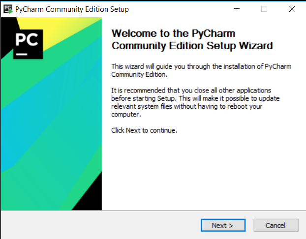
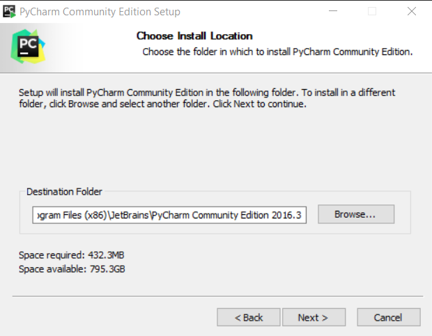
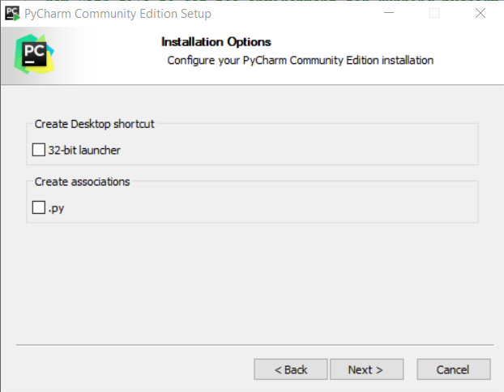
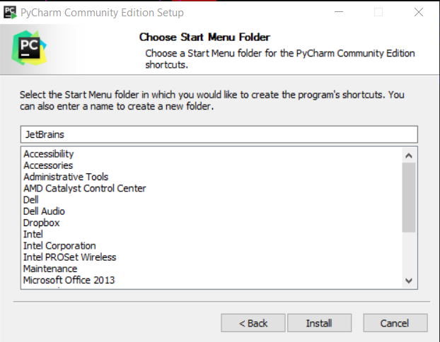
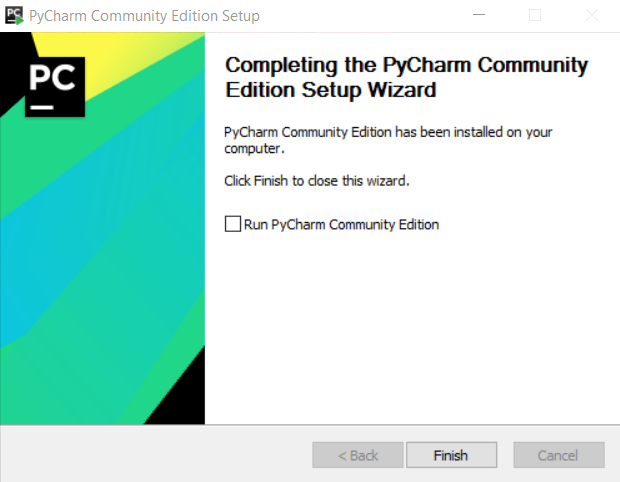
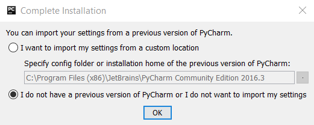
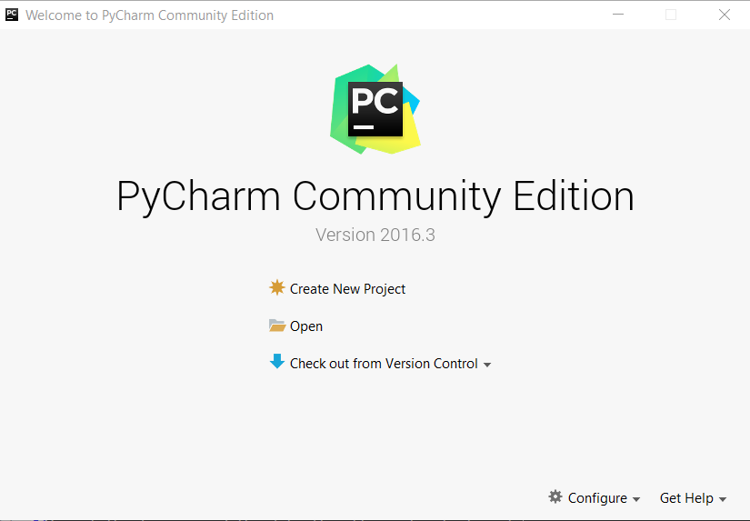

# Development Environment / PyCharm

The PyCharm Integrated Development Environment (IDE) is used to develop the SNODAS Tools,
based on a review of IDE options for pyQGIS development.
PyCharm is not required in the deployed environment unless there is a need to interactively debug the tools.

This documentation explains how to download, install, and configure the software.
Refer to the [Development Tasks](../dev-tasks/) for information about using PyCharm for development.

The following are prerequisites to installing PyCharm:

* [Install QGIS](qgis/) - PyCharm will use the Python 2.7 that is distributed with QGIS
* [Install Git for Windows](git/) - not sure if this needs to be installed first **TODO smalers 2016-12-11 evaluate PyCharm/GIT integration**

The sections in this documentation are:

* [Download and Run PyCharm Installer](#download-and-run-pycharm-installer)
* [Configure PyCharm to work with QGIS](#configure-pycharm-to-work-with-qgis)

## Download and Run PyCharm Installer

First [Download PyCharm Community Edition for Windows](https://www.jetbrains.com/pycharm/download/#section=windows) and save to the normal `Downloads` folder.
Then run the installer program with administrator privileges.  The installer should have a name similar to `pycharm-community-2016.3.exe`.











## Run PyCharm

Run PyCharm using the ***Start*** menu ***JetBrains PyCharm Community Edition 2016.3***



Accept the license and the default settings for fonts, etc.



The software is now installed and could be used as is to develop Python.
However, because development needs to be consistent with the QGIS/pyQGIS environment,
PyCharm needs to be configured to use the QGIS version of Python and pyQGIS libraries.

## Configure PyCharm to work with QGIS

Because QGIS is distributed with its own Python 2.7 software (installed in `C:\OSGeo4W64\apps\Python27`),
it is best to run PyCharm using the QGIS Python.  See the following resources that explain how to do this:

* [A Quick Guide to Getting Started with PyQGIS on Windows](http://spatialgalaxy.com/2014/10/09/a-quick-guide-to-getting-started-with-pyqgis-on-windows/) - relevant
* [Setting up  PyCharm for PyQGIS and Qt](http://planet.qgis.org/planet/tag/pycharm/) - useful background but seems incomplete

Based on the above information a script called `runPyCharmWithQgisEnv.bat` was created as shown below.
This script is saved in the Git repository in the `C:\Users\user\cdss-dev\CDSS-SNODAS-Tools\git-repos\cdss-app=snodas-tools\dev-util`
folder to facilitate access (**TODO smalers 2016-12-11 may move to a better location**).
**TODO smalers 2016-12-10 the following does not actually indicate which version of Python to use - need to understand better.**

The following snapshot of the script is for illustration - the version in the repository will be the most current.
Because each developer may have a different version of the software installed,
it will likely be necessary to copy the script to a personal version for modification, such as in developer files but outside of repository.


```bat
rem Batch file to set the environment and runn pycharm consistent with QGIS environment
rem - Use QGIS Python and libraries
rem - Start pycharm with the configured environment
rem
rem The following seems to be more relevant.
rem See:  http://spatialgalaxy.com/2014/10/09/a-quick-guide-to-getting-started-with-pyqgis-on-windows/
rem The following provides useful background but seems incomplete.
rem See:  http://planet.qgis.org/planet/tag/pycharm/

rem Where QGIS is installed
SET OSGEO4W_ROOT=C:\OSGeo4W64
rem Name of QGIS program to run
SET QGISNAME=qgis
rem Absolute path to QGIS program to run
SET QGIS=%OSGEO4W_ROOT%\apps\%QGISNAME%
rem Not sure what the following is used for but include in case PyCharm or QGIS uses
SET QGIS_PREFIX_PATH=%QGIS%
REM Set the absolute path to PyCharm program
REM SET PYCHARM="C:\Program Files (x86)\JetBrains\PyCharm 3.0\bin\pycharm.exe"
SET PYCHARM="C:\Program Files (x86)\JetBrains\PyCharm Community Edition 2016.2.3\bin\pycharm.exe"

REM Set the QGIS environment by calling the setup script that is distributed with QGIS
CALL %OSGEO4W_ROOT%\bin\o4w_env.bat

REM Add QGIS to the PATH environmental variable so that all QGIS, GDAL, OGR, etc. programs are found
SET PATH=%PATH%;%QGIS%\bin
REM Add pyQGIS libraries to the PYTHONPATH so that they are found by Python
set PYTHONPATH=%PYTHONPATH%;%OSGEO4W_ROOT%\apps\qgis\python;
set PYTHONPATH=%PYTHONPATH%;%OSGEO4W_ROOT%\apps\Python27\Lib\site-packages

REM Start the PyCharm IDE, /B indicates to use the same windows
REM Command line parameters passed to this script will be passed to PyCharm
start "PyCharm aware of QGIS" /B %PYCHARM% %*
```
Running the `runPyCharmWithQgisEnv.bat` batch file in a Windows command prompt window will start PyCharm.

## Next Steps

Now that PyCharm is installed it can be used to configured to initialized the SNODAS Tools project (for initial setup),
and can be used for development (new developer setup).
