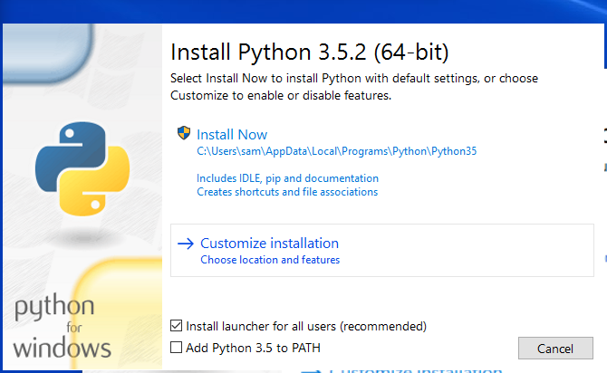
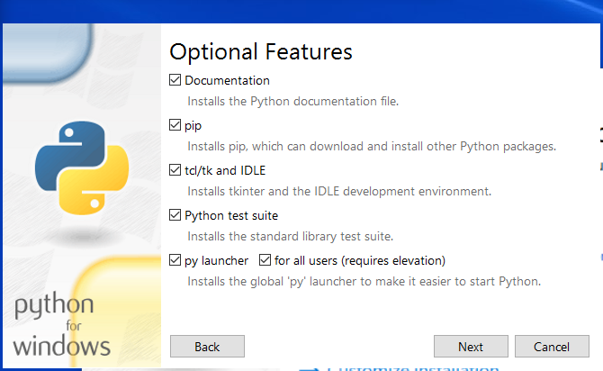
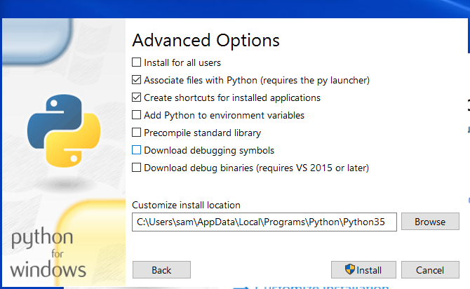
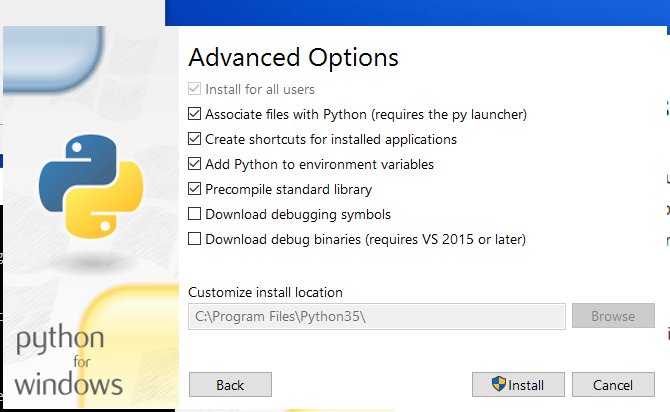
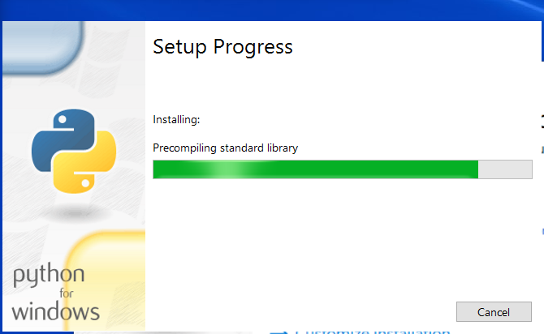
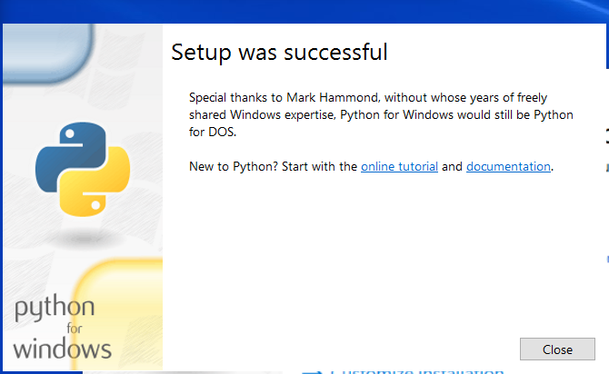

# Development Environment / Python

Python 2.7 is bundled with the [QGIS software](qgis.md).
However, the [Mkdocs software](mkdocs.md), which is used to prepare this documentation,
also requires Python, and only for the developer environment (MkDocs static websites do not require Python in the deployed environment).

Rather than changing the QGIS Python installation for general use, Python 3.5 is installed on the operating system for use with MkDocs.
This will also provide a home for general Python tools that should not be mixed in with QGIS Python.

This section of the documentation describes how to install Python separate from the QGIS installation.
See also the [documentation for installing `pip`](pip), which is used to install Python add-on packages.

## Python Installation Background

Python for Windows is installed by following the instructions:

* [Python Windows download page](https://www.python.org/downloads/) - general download page
* [Python Releases for Windows](https://www.python.org/downloads/windows/) - downloads for Windows
	+ Make sure to pick the desired Python version, for example pick latest Python 2.7 or 3.5
	+ Make sure to pick the desired operating system version, for example ***Windows x86-64 executable installer*** for Widows 64-bit
* [Using Python on Windows (Python 3)](https://docs.python.org/3/using/windows.html)
* [Using Python on Windows (Python 2)](https://docs.python.org/2/using/windows.html)

The Python documentation recommends installing Python in a shared location (not under User folder).
Python 2 will install in the top-level folder C:\\Python27 and Python 3 will install in C:\\Program Files\Python35 (for example).
When installing multiple versions of Python, the last installer to run when indicating that the `PATH` should be updated
will result in that version being found in the `PATH`.  Other versions would have to be run by specifying the install location,
or see the approach below.

## Install Python 3.5

Download Python 3.5.2 (or latest available) for Windows from the [Python Download site](https://www.python.org/downloads/windows/),
selecting the ***Windows x86-64 executable installer***,
and save in the `Downloads` folder for the user.

Run the installer as administrator (will be prompted for authorization as the process continues).
If the following indicates that the 32-bit version is being installed, then the wrong installer was downloaded.



Select ***Customize installation*** to ensure that the installation will be for all users.



Note selections for ***py launcher*** and ***for all users (requires elevation)***,
which means that administrator login will be requested.  Press ***Next***



The above shows the install being for the single user (***Install for all users*** is unchecked).
Change by selecting ***Install for all users***,
which will change the install location to `C:\Program Files\Python35`.

Also set the environment variables to have Python added to `PATH`, by selecting ***Add Python to environment variables***.
Otherwise, add-on programs like `pip` and `mkdocs` won't be found when typed on the command line and will need
to be run with longer command line syntax, for example, instead of:

```
pip
```

will need to use:

```
py -m pip
```

Making the recommended installation selections will change the dialog to the following.
Note that the installation folder is now defaulted to the shared software location.



Press ***Install*** to install.  The following progress will be shown:



The following is shown to indicate a successful installation.




## Running Python

Modern Python installations, when installed to the shared system location (not installed to user files), will install the `py` program
in the Windows software location, `C:\Windows`, which is always in the `PATH`.
Verify that `py` is available by running the following in a Windows Command Shell:

```
> where py

```


The `py` program will by default run the latest Python but can specify which Python to run:

* `py` - run latest Python version
* `py -2` - run the latest Python 2 version
* `py -3` - run the latest Python 3 version
* `py somefile.py` - run the specified Python module

The `py` program essentially wraps all Python versions and also provides a way to always run Python without conflicts in the `PATH` environment variable.
Note that it may not be necessary to use `py` if a custom script is used to run a Python program, and directly specifies the Python version to run
by specifying the path to the Python executable, for example `C:\Program Files\Python35\python.exe`.
