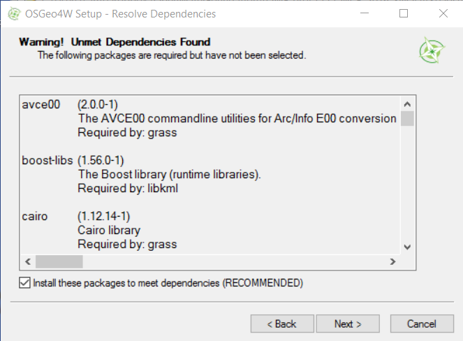
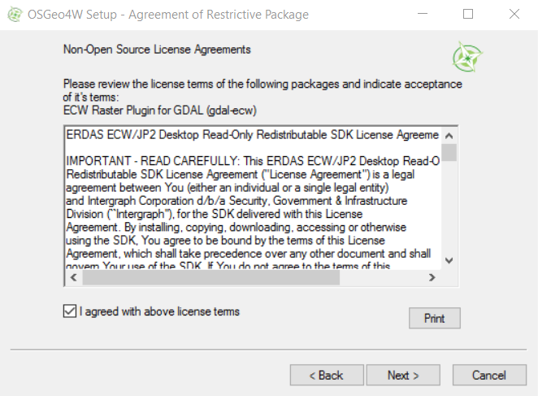

# Development Environment / QGIS and Bundled Python

The free and open source QGIS software provides pyQGIS Python libraries to process spatial data.
The version of QGIS used for this project is 2.18.1 (**TODO smalers 2016-12-11 Emma confirm**).
QGIS is bundled with Python 2.7 to ensure that Python integration performs as intended.

## Download and Install QGIS

Download and install [QGIS for Advanced Users](http://www.qgis.org/en/site/forusers/download.html) for Windows,
selecting ***OsGeo4W Network Installer (64 bit)*** for Windows 7 or 10 machine.

Run the installer with administrator privileges, which will have a name similar to `osgeo4w-setup-x86_64.exe`.

As instructed on the website, choose ***Desktop Express Install*** and select QGIS to install the latest release.

The following images illustrate the install process on a Windows 10 computer.  All of the defaults were accepted.

## Run QGIS

To run QGIS use the ***OSGeo4W*** start menu shown below:

Running ***QGIS Desktop 2.18.1*** displays the user interface similar to below:

The ***Help / About*** menu displays the software version information, which is useful when troubleshooting:

## Next Steps

After installing QGIS it is possible to [install and configure PyCharm](pycharm/) to use the QGIS version of Python 2.7 and access
the pyQGIS libraries for spatial processing.
However, installing PyCharm is only needed if doing software development.
The operational SNODAS Tools system can be run from the command line or using a scheduled process without needing PyCharm.
