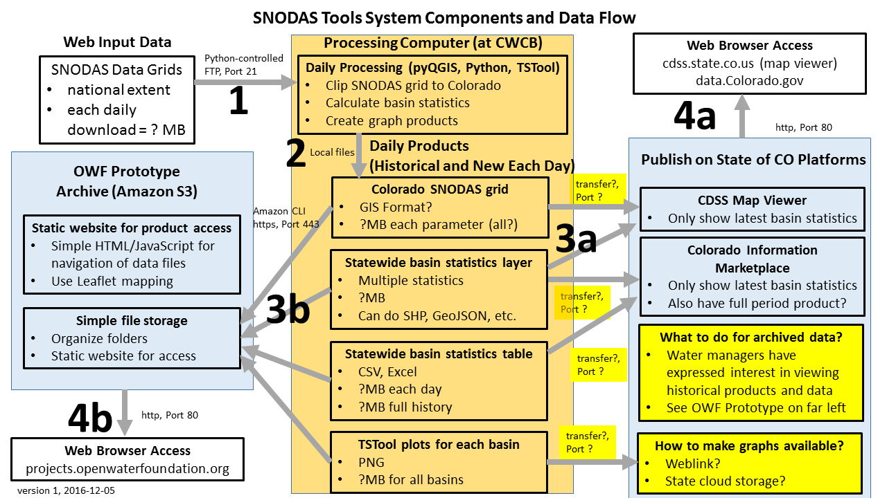

# Overview

The following topics are discussed in this section: 

1. [Development Tasks/Software Design](software-design.md#development-tasks-software-design) 
2. [Technical Approach](software-design.md#technical-approach) 
3. [SNODAS Tools Configuration](software-design.md#snodas-tools-configuration)
4. [Data Management](software-design.md#data-management)
5. [Download SNODAS Data](software-design/#download-snodas-data)
6. [Clip SNODAS National Grids to Colorado](software-design.md#clip-snodas-national-grids-to-colorado)
7. [Create the Binary Snow Cover Raster](software-design/#create-the-binary-snow-cover-raster)
8. [Intersect SNODAS Colorado Grid with Colorado Basins and Calculate Statistics](software-design/#intersect-snodas-colorado-grid-with-colorado-basins-and-calculate-statistics)
9. [Saving the Statistical Results in Local .csv Files](software-design/#saving-the-statistical-results-in-local-csv-files)
10. [Generate Time Series Products](software-design/#generate-time-series-products)
11. [Publish Results](software-design/#publish-results)
12. [Tool Utilities and Functions](software-design/#tool-utilities-and-functions)
13. [Software Troubleshooting](software-design/#software-troubleshooting)

# Development Tasks / Software Design

The SNODAS tools are divided into 3 individual scripts.  

1. [__AutomatedDaily__](software-design/#download-snodas-data): calculates today’s approximate daily SWE statistics for each basin 
2. [__UserInput__](software-design/#download-snodas-data): calculates historical approximate daily SWE statistics for each basin (the dates that are processed are dependent upon the interest and input of the user)
3. [__SNODAS_utilities__](software-design/#tool-utilities-and-functions): holds all functions called upon within the two first scripts
 
The SNODAS tools design meets the following requirements:

* Download historical and new daily SNODAS grids.
* Clip grids to Colorado basins boundary so that original SNODAS grid can be viewed as product later
(results in background layer that can be shown on maps).
* Intersect basin polygons with Colorado SNODAS grid to determine basin statistics including average snow water equivalent over basin
and areal extent of snow cover (allows color-coded basin maps to be shown).
* Create time series for a basin with daily history of statistics for individual basins and groups of basins
(allow graphs to be created for current year and past years).
* Publish the results to State of Colorado platforms to allow web access for water managers.

The above process is described for SNODAS tool users in the [SNODAS Tools User Manual](http://software.openwaterfoundation.org/cdss-app-snodas-tools-doc-user/index.html").
The following diagram illustrates the overall data flow and technologies that are used
(to view the image full size, use the web browser feature to open the image in a new tab - for example, in Chrome right click and ***Open image in new tab***):

The following sections describe the data management and processing for each step, for the benefit of software developers and maintainers of implemented systems.

## Technical Approach

The approach for meeting the above requirements is to utilize free and open source QGIS/pyQGIS/GDAL/OGR and Python software
to provide GIS processing functionality and the CDSS TSTool software to provide time series processing functionality.

**TODO smalers 2016-12-06 fill this out with more background **

## SNODAS Tools Configuration

**TODO smalers 2016-12-06 describe how the tools are configured... configuration file, driving basins layer, Excel input, etc.**

## Data Management

**TODO smalers 2016-12-06 describe file structure for data mangement**

## Download SNODAS Data

Historical SNODAS data need to be downloaded for the full historical period to allow analysis of period statistics (how the current year
compares with previous years).  SNODAS data also need to be downloaded each day to create current basin water supply products.
The management of historical and daily downloads are the same, other than scripts are run differently in both cases.
The intent of the software is to allow rerunning the entire process if necessary, such as if installing the software on a new system.

### Download SNODAS Data (Each New Day)

The automated daily SWE calculator tool is designed to download the current day’s raw SNODAS data and output SWE and snow coverage statistics for 
each watershed of the vector input. It is independent of user manipulation besides the original definition of the file locations for both the vector 
inputs and the product outputs. These user configurations must be defined within the script content before the tool is run 
(reference ‘Setting up the Tools’ in the user guide). 

The following statistics are calculated for each basin of the watershed basin vector input:

1. SWE mean (meters|inches) – *the daily average snow water equivalence of the basin*
2. SWE minimum (meters|inches) – *the minimum snow water equivalence of the basin*
3. SWE maximum (meters|inches) – *the maximum snow water equivalence of the basin*
4. SWE standard deviation (meters|inches) – *the snow water equivalence standard deviation of the basin*
5. Pixel count (pixels) – *the number of pixels representing the basin* 
6. Snow Cover (percent of area) –  *the percentage of snow-covered ground of the basin*

The functions utilized in the script are stored in the SNODAS_utilities.py. For a full description of each function, refer to the [*Tool Utilities and Functions*](software-design/#tool-utilities-and-functions)
section of the user guide. 

The automated daily script retrieves today’s date with the datetime module. With the retrieved date, the NSIDC FTP site is accessed and the 
SNODAS data for the current date is downloaded. This download is delivered in .tar format and is saved within the ‘download’ folder of the user-defined 
root folder location. The downloaded .tar file is extracted and the data of interest, SWE, is converted from .dat to .tif format. 

### Download SNODAS Data (Historical)

The User Input SWE Calculator Tool was used to process the historical SNODAS data. It also has the capability to process various dates of raw SNODAS 
data defined by the user. The only difference between this tool and the automated daily SWE calculator tool is that the user can define the dates 
of interest rather than being constricted to the current date. The processing steps are identical to the automated daily tool but instead of the current date, the user input SWE calculator tool 
can process any date of interest, given that the date is within an appropriate range. 

The following diagram illustrates the user prompt flow of the userInput script. Each box is further explained in the text below. 
(to view the image full size, use the web browser feature to open the image in a new tab - for example, in Chrome right click and ***Open image in new tab***):

The user input tool starts with a set of questions displayed on the console to gain understanding of which dates the user would like to process. 
The first question is: 

*Are you interested in one date or a range of dates? Type ‘One’ or ‘Range’.*

This tool can process one date of data or a consecutive range of dates. The tool, however, cannot process a list of multiple, inconsecutive dates. 

The second question prompts on the console after a correctly formatted answer to question 1 is inputted. The second question is:

*Do you want the results to output into a new project folder?: Type ‘Yes’ or ‘No’.*

This prompt gives the user the flexibility to add the results from a previous process to the current process. This is beneficial for users who want to 
calculate statistical outputs for dates of inconsecutive order. 

For example, let’s say the user wants to obtain the statistics for the following dates: 

 December 12th, 2010 

 
January 3rd, 2013 

 
January 4th 2013 

 
January 5th, 2013  

These dates are not consecutive so the user would have to run the script multiple times to get the results 
of interest. The first run would target 12/12/10. They would input ‘one’ for the first question because there is only one date of interest. They would then 
input ‘yes’ for the second question because they are starting a new project. The second run would target all 01/03/13, 01/04/13 and 01/05/13 dates because 
they are consecutive. The user would input ‘range’ for the first question because there are more than one dates of interest. They would then input ‘no’ for 
the second question because they want the results from this run to combine with the results from the previous run (where 12/12/10 was processed.) 

If the user wants to create a new project folder (answered YES to *Do you want the results to output into a new project folder?* ), the console displays the following prompt:

What would you like this new project folder to be named? Please do not use spaces or special characters.

This new folder is created in the root directory that the user previously configured. (See ‘Setting up the Tools’ section). 
Within the new folder, the script automatically creates the 6 project sub-folders - Download, SetEnvironment, Clip, Logging, Snow Cover and Results (See ‘Folder Structure’ section). 

If the user wants to use a previously constructed project folder (answered NO to *Do you want the results to output into a new project folder?*), the console outputs a 
list of all available project folders within the previously configured root director (See ‘Setting up the Tools’ section). The console also displays the following prompt: 

*Which existing project folder would you like to add the results?*

The user must input a valid existing project folder. The 6 project sub-folders are created because they are already existing within the folder from a previous process. 

Once the script knows which folder to store the output results, it needs to obtain the dates of interest. If the user wants to process one date of data 
(answered ONE to *Are you interested in one date or a range of dates?*) then the console displays the following prompt: 

*Which date are you interested in? The date must be of or between 01 October 2003 and today's date. (mm/dd/yy)*

The SNODAS historical data is only available on or after October 1st, 2003. The console only accepts the input date if the user types the date in the appropriate format (mm/dd/yy). 
Once complete, the script starts to process the date of data and outputs the results to the appropriate project folder. 

If the user wants to process a range of dates of data (answered RANGE to *Are you interested in one date or a range of dates?*) then the console displays the following prompt:

*What is the STARTING date of data that you are interested in? The date must be of or between 01 October 2003 and today's date. (mm/dd/yy)*

This input is the minimum bounding value for the range of interest. The console displays the following prompt:

*What is the ENDING date of data that you are interested in? The date must be of or between 01 October 2003 and today's date. (mm/dd/yy)*

The user must input the last date of data that they are interested in. This is the maximum bounding value for the range of interest. Once complete, the script starts to process 
each date of data in sequential order and outputs the results to the appropriate project folder. If you are experiencing errors after your inputs, reference the
 [Software Troubleshooting](software-design/#software-troubleshooting)section for guidance. 

## Clip SNODAS National Grids to Colorado

The downloaded masked SNODAS data is delivered with a contiguous United States extent and without projection. The script assigns the SNODAS .tif file 
with the projection of WGS84 and clips the data to the extent of the watershed boundaries shapefile input.

Note: The clip must be performed with a single-polygon shapefile of the extent of the watershed boundaries in WGS84 projection. It is the user’s responsibility 
to provide this shapefile. The script does not create it. Refer to ‘Setting up the Tools’ section of the user guide for further information. 

The clipped SNODAS data is reprojected into the final projection of NAD83 Zone 13N. 

## Create the Binary Snow Cover Raster

The script calculates percentage of land covered by snow. To calculate this statistic, a binary snow coverage raster must be created and processed. The raster is 
created by using the QGIS raster calculator tool to assign a value of ‘1’ to any pixel of the SNODAS .tif file containing a value greater than ‘0’. The created binary 
.tif file is exported and saved within the ‘snowCover’ folder of the user-defined root folder. 

## Intersect SNODAS Colorado Grid with Colorado Basins and Calculate Statistics

Zonal statistics are calculated on both the downloaded SNODAS SWE dataset and the created binary snow cover dataset to produce the output statistics. The QGIS zonal statistics 
plugin is a tool that intersects an input vector file with an input raster file. The output is a tabular set of user-defined statistics added to the attribute table of the vector 
file. The tool calculates the defined statistics of the input raster pixels contained within each individual feature of the input vector file. 

The script then exports and saves the tabular output within various .csv files in the ‘results’ folder of the user-defined root folder. 

## Saving the Statistical Results in Local .csv Files

There are two different manners in which the same daily zonal statistics are exported – by date and by basin. The statistics exported by date are beneficial for the user who wants 
to understand the *spatial aspect* of the SWE landscape. The statistics exported by basin are beneficial for the user who wants to understand the *temporal aspect* of the SWE landscape. 

The daily statistics exported by date are contained as one .csv file within the ‘results/byDate’ folder of the user-defined root folder. The .csv file is titled 
‘ResultsbyDateYYYYMMDD’ where the current date substitutes the YYYYMMDD format. Inside the .csv file, the y-axis is defined by each basin (uniquely identified by Local ID). 
The 6 daily statistics are referenced in individual columns to the right of the Local ID. 

The following image illustrates the byDate output results viewed in Excel. Notice that the date is constant and the Local_ID is unique. 
(to view the image full size, use the web browser feature to open the image in a new tab - for example, in Chrome right click and ***Open image in new tab***):

The daily statistics exported by basin are parsed between multiple .csv files in the ‘results/byBasin’ folder of the user-defined root folder.  There is one .csv file for each unique basin.
The .csv files are titled ‘ResultsbyDateLOCALID’ where the basin-specific local ID replaces the LOCALID format. Inside each .csv file, the y -axis is defined by the dates previously processed 
by the script. The 6 daily statistics are referenced in individual columns to the right of each date. 

The following image illustrates the byDate output results viewed in Excel. Notice that the date is constant and the Local_ID is unique. 
(to view the image full size, use the web browser feature to open the image in a new tab - for example, in Chrome right click and ***Open image in new tab***):

## Generate Time Series Products

**TODO smalers 2016-12-06 need to fill this in...describe how to run Python program and what it does**

## Publish Results

**TODO smalers 2016-12-06 need to fill this in...describe how to pass the results to State of Colorado platforms including CDSS Map Viewer and Socrata data.colorado.gov**

## Tool Utilities and Functions

The functions created are organized into 5 sequential processing categories to aid in troubleshooting. If the scripts are experiencing invalid results or inconsistencies, 
the user should identify the issue with respect to the following function categories. This allows the user to easily pinpoint the potentially-problematic function. The 
function categories are:

1. Downloading SNODAS data: accesses the NSIDC FTP site and downloads the original SNODAS data (2 functions)
2. Converting formats: converts data into useable formats for statistical processing (8 functions)
3. Projecting and clipping: appropriately clips and projects SNODAS raster data for statistical processing (4 functions)
4. Creating snow binary rasters: creates a new binary raster representing presence or absence of snow (1 function)
5. Calculating statistics and exporting: calculates zonal statistics and exports statistics into .csv files (2 functions)

### (1)	Downloading SNODAS data

1. __download_today_SNODAS (downloadDir)__: This function is only utilized within the automatedDaily script. It accesses the SNODAS FTP site and download today's .tar file. The 
.tar file downloadeds to the specified downloadDir folder. 
	* Arguments: *downloadDir* - this is the full path name to the location where the original SNODAS rasters are stored. For this toolset, the downloadDir is defined by the download folder 
within the root folder.   

2. __download_user_single_date_SNODAS (downloadDir, singleDate)__: This function is only called within the userInput script. It accesses the SNODAS FTP site and download the .tar 
file of the date that the user has defined as singleDate. The .tar file downloads to the specified downloadDir folder. This function also works for the user input range of dates. 
The script targets one date at a time and iterate through all the dates in the inputted range. The current targeted date is defined in the singleDate argument. The data from that date 
downloads to the specificed downloadDir.
	*  Arguments: *downloadDir* - this is the full path name to the location where the original SNODAS rasters are stored. For this toolset, the downloadDir is defined by the download folder 
within the root folder.  
*singleDate* - this is the single date of interest or the current target date of the user’s range of dates. 

### (2)	Converting formats

1.	__get_date_string (date)__: This function is called within both the automatedDaily and the userInput scripts. It takes a datetime date and converts it into a string 
date in the following format:  YYYYMMDD. This is important because the remaining functions in both scripts operate with an input string date value rather than in datetime format. 
	* Arguments: *date* - this is a date, either today’s date or a user-inputted date, developed from the imported datetime.datetime module.   
	

2.	__untar_SNODAS_file (file, folder_input, folder_output)__: This function is called within both the automatedDaily and the userInput scripts. When the SNODAS FTP site is 
accessed, the downloaded daily files are stored and saved as zipped .tar files. These files must be unzipped to access the SNODAS grids. This function untars the downloaded SNODAS .tar 
file located in the folder_input folder and extracts the files to the folder_output folder. 
	* Arguments: *file* - this is the name of the SNODAS .tar file that is to be untarred.  
*folder_input* – this is the full pathname to the folder holding the file. For this toolset, folder_input is defined by the download folder within the root folder.  
*folder_output* - this is the full pathname to the folder that stores the extracted files. For this toolset, folder_output is defined by the setEnvironment folder within the root folder.   

3. __delete_irrelevant_SNODAS_files (file)__: This function is called within both the automatedDaily and the userInput scripts. The SNODAS .tar files contain many different 
SNODAS datasets. For this project we are only interested in the SWE raster sets. The SWE rasters are named with a unique ID of '1034'. This function deletes a file if it is not 
identified by this unique ID. 
	* Arguments: *file* - this is the name of the raster extracted from the downloaded SNODAS .tar file   

4. __extract_SNODAS_gz_file (file)__: This function is called within both the automatedDaily and the userInput scripts. Each daily SNODAS raster has two files associated with it, 
a .dat file and .Hdr file. Both are zipped within a .gz file. This function extracts the .dat and .Hdr files from a SNODAS .gz file.
	* Arguments: *file* - this is the name of the .gz file that is to be extracted.   

5. __convert_SNODAS_dat_to_bil (file)__: This function is called within both the automatedDaily and the userInput scripts. The .dat and .Hdr files are not appropriate file formats 
to use with the QQS processing tools. However, the QGS tools, responsible for calculating the zonal statistics, work with .tif files.    
Unfortunately, there are settings within the SNODAS .dat files that cause issues when converting the .dat files into .tif format using the gdal_translate command. When attempted, the following 
error is displayed: “ERROR 1: Maximum number of characters allowed reached.”  The error lies in the development syntax of the SNODAS .dat file.  By opening the .dat file with a text editor, one 
can see that there is a description titled BARD codes followed by a long list of numerical values. This line of text is too long for gdal to process causing the issue.   
Therefore, a different approach must be used to convert the raster grid to a .tif file. The script must first convert the .dat file into a .bil file. A custom .Hdr file must be made and then the 
.bil file can be converted into the final .tif file. This function provides the processing for the first of these intermediary steps by converting the .dat file into a .bil file. 

	* Arguments: *file* - this is the name of the .dat file that is to be converted to .bil format.   

6. __create_SNODAS_hdr_file (file)__: This function is called within both the automatedDaily and the userInput scripts. A custom .Hdr file needs to be created in order to tell 
the computer what raster settings the .bil file holds. This function creates the .Hdr file. The settings for the custom SNODAS .Hdr file were developed using the following source 
[http://www.nohrsc.noaa.gov/archived_data/instructions.html](http://www.nohrsc.noaa.gov/archived_data/instructions.html).

	* Arguments: *file* - this is the name of the .bil file that needs an .Hdr component.   

7. __convert_SNODAS_bil_to_tif (file, folder_output)__: This function is called within both the automatedDaily and the userInput scripts. It converts the .bil file into a usable .tif 
file for future processing within the QGS environment. 

	* Arguments: *file* - this is the name of the file to be converted into a .tif file  
*folder_output*: this is the full pathname to the location where the created .tif files are stored. For this toolset, folder_output is defined by the setEnvironment folder within the root folder.   

8. __delete_SNODAS_bil_file (file)__: This function is called within both the automatedDaily and the userInput scripts. The .bil and .Hdr files are no longer important to keep in storage
 because the newly created .tif file holds the same data. This function deletes the file if the file is of .bil or .Hdr format.

	* Arguments: *file* - this is the name of the file to be checked for either .Hdr or .bil format. If the file exhibits a .Hdr or .bil extension, it will be deleted.   

### (3)	Projecting and clipping

1. __copy_and_move_SNODAS_tif_file (file, folder_output)__: This function is called within both the automatedDaily and the userInput scripts. It copies and moves the created .tif file 
from its original location to the folder_output. 

	* Arguments: *file* - the name of the .tif file to be copied and moved to another location.  
*folder_output* - the full pathname to the folder that holds the newly copied .tif file. For this toolset, folder_output is defined by the clip folder within the root folder.   

2.	__assign_SNODAS_projection_WGS84 (file, folder)__: This function is called within both the automatedDaily and the userInput scripts. The downloaded SNODAS raster does not have a 
projection. This function assigns the proper projection of WGS84 to the file so that the accurate zonal statistics can be calculated. 

	* Arguments: *file* - the name of the .tif file that is to be assigned a projection.  
*folder* - the full pathname to the folder where both the unprojected and projected raster is and will be stored. For this toolset, folder is defined by the clip folder within the root folder.   

3. __SNODAS_raster_clip_WGS84 (file, folder, vector_extent)__: This function is called within both the automatedDaily and the userInput scripts. The SNODAS grid is a national dataset. This 
function clips the national grid by the extent of vector_extent. 
	* Arguments: *file* - the name of the projected (WGS84) .tif file to be clipped.  
*folder* - the full pathname to the folder where both the unclipped and clipped raster is and will be stored. For this toolset, folder is defined by the clip folder within the root folder.  
*vector_extent* - the full pathname to the shapefile holding the extent of the watershed basin boundaries. This shapefile should be projected in WGS84 rather than NAD83 to match the projection of the .tif file. 
For this toolset, vector_extent is defined by the Colorado Watershed Basin extent (WGS84).   

4.	__SNODAS_raster_reproject_NAD83 (file, folder)__: This function is called within both the automatedDaily and the userInput scripts. It reprojects the clipped raster from WGS84 to the 
desired projection of NAD83 UTM Zone 13N.
	* Arguments: *file* - the name of the clipped .tif file with a WGS84 projection to be reprojected into NAD83.  
*folder* - the full pathname to the folder where both the WGS84 clipped raster and the NAD83 clipped raster is and will be stored. For this toolset, folder is defined by the clip folder within the root folder.   

### (4)	Creating snow binary rasters

1. __snowCoverage (file, folder_input, folder_output)__: This function is called within both the automatedDaily and the userInput scripts. It creates a binary .tif raster that displays 
snow coverage. This created raster is used to calculate the percentage of daily snow cover statistic for each basin. If a pixel in the input file, the SNODAS raster file, is greater than 0 
(there is snow on the ground) then the new raster's pixel is allocated the value of 1. If a pixel in the input raster is 0 or a null value (there is no snow on the ground or no data was collected) then the new raster's 
pixel is allocated the value of 0. The output binary .tif file is saved in folder_output. 

	* Arguments: *file* - the name of the daily SNODAS .tif raster that is to be the input of the created binary raster  
*folder_input* - the full pathname to the folder where file is stored. For this toolset, folder_input is defined by the clip folder within the root folder.  
*folder_output*: the full pathname to the folder where the newly created binary snow cover raster is stored. For this toolset, folder_input is defined by the snowCover folder within the root folder.  

### (5)	Calculating statistics and exporting

1. __create_csv_files (file, vFile, csv_byDate, csv_byBasin)__: This function is called within both the automatedDaily and the userInput scripts. It creates the required csv files to hold 
the statistical results - both by date and by basin. The csv files by date are organized with one .csv file for *each date* and are titled 'ResultsByDateYYYYMMDD.csv'. Each byDate file contains the zonal 
statistics for each basin on that date. The csv files by basin is organized with one .csv file for *each basin* and is titled 'ResultsByBasin(LOCALID)' where LOCALID is substituted with the basin’s unique 
ID. Each byBasin file contains the zonal statistics for that basin for each date that has been processed.

	* Arguments: *file* - the daily .tif SNODAS raster file that is to be processed with zonal statistics (clipped to basin extent and projected in NAD83).  
*vFile* - the shapefile of the basin boundaries (these boundaries are used as the polygons in the zonal statistics calculations). For this toolset, vFile is defined by the Colorado Watershed Basin (projected in NAD83).  
*csv_byDate* - the full pathname to the folder that holds the results by date .csv files. For this toolset, csv_byDate is defined by the results\byDate folder within the root folder.  
*csv_byBasin* - the full pathname to the folder that holds the results by basin .csv files. For this toolset, csv_byBasin is defined by the results\byBasin folder within the root folder.   

2.	__zStat_and_export (file, vFile, csv_byBasin, csv_byDate, DirClip, DirSnow)__: This function is called within both the automatedDaily and the userInput scripts. It calculates the zonal 
statistics (SWE mean, SWE minimum, SWE maximum, SWE standard deviation, pixel count and percent of land covered by snow) of the basin shapefile in respect to the current raster. The zonal statistics are
exported to both the byDate and the byBasin csv files.
	* Arguments: *file* - the daily SNODAS .tif file that is to be processed in the zonal statistics tool (clipped to basin extent and projected in NAD83)  
*vFile* - the shapefile of the basin boundaries (these boundaries are used as the polygons in the zonal statistics calculations). For this toolset, vFile is defined by the Colorado Watershed Basin (projected in NAD83). 
*csv_byDate* - the full pathname to the folder holding the results by date .csv files. For this toolset, csv_byDate is defined by the results\byDate folder within the root folder. 
*csv_byBasin* - the full pathname to the folder holding the results by basin .csv files. For this toolset, csv_byBasin is defined by the results\byBasin folder within the root folder.  
*DirClip* - the full pathname to the folder holding all the daily clipped, NAD83 .tif SNODAS rasters. For this toolset, DirClip is defined by the clip folder within the root folder. 
*DirSnow* - the full pathname to the folder holding all the binary snow coverage rasters. For this toolset, DirSnow is defined by the snowCover folder within the root folder.  

## Software Troubleshooting

### User Input Error Messages in the Console

If you are experiencing error messages when typing your input into the console while running the userinput script, it could be any of the following: 

- If you are entering a date: The date could be in the improper format. You should enter all dates in the mm/dd/yy format. For example, if you are interested in February 6th of 2005 then you will enter 02/06/05.   
	* The date could be out of appropriate range. Remember that the SNODAS data is only available on or after October 1st, 2003. If you try to enter a date before then, you will receive an error message. The SNODAS data is
	only available up until today’s date. If you try to enter a date in the future, you will receive an error message. 
	* If you are interested in a range of dates, then your end date must be after your starting date. Make sure that you are entering a date later than the starting date that you entered. Otherwise, you will receive an error. 
	* Make sure that you do not add a space before or after the entered date. After typing in the year, press enter without adding any extra spacing. These extra spaces could cause the script to produce an error.   
- If you are entering text:  
	* Make sure that you are typing one of the options that the prompt has asked you to type. If you enter text other than the preset options, you will receive an error. 
	* Make sure that you do not add a space before or after the entered text. After the last character of your input, press enter without adding any extra spacing. These extra spaces could cause the script to produce an error.   
- If you accidentally choose an option in a prompt that is not the option you wanted:  
	* If this occurs, there is no way for you to go back to the last question and fix the error. Instead you must shut down the running script and restart a new script. You will be prompted with the first question again. Go through the prompts as usual with the inputs that you want. 

### Interrupting the Script Mid-Process

It is important that once a script is running that it continues until completion without interruption. Interruption can mean two actions. First, it could mean that the script is manually terminated. Secondly, 
it could mean that the userInput  script is running at the same time as the automatedDaily  script. Both actions will most likely result in a corrupted basin boundary shapefile. 

Why does this occur? 

The zStat_and_export function creates new fields in the basin shapefile attribute table for each day of processing. The statistics store under the newly created fields only to be written to a local csv file. 
The script then deletes the newly created fields to allow space for the next day of spatial statistics to be calculated and copied over to a new .csv file.  

The script is built to temporarily edit the structure of the basin’s attribute table only to be converted back to its original structure at the end of the script. If the script is interrupted in the middle 
of a process, it is possible that the structure of the basin’s attribute table will permanently corrupt causing the entire script to break and/or the script to calculate inaccurate statistics. Another possible outcome 
of interrupting the script mid-process would be permanent deletion of basin polygon/features within the basin shapefile.   

If the script is interrupted mid-process, there is a fix. This is a semi-complicated process so it is best to avoid this troubleshooting issue altogether. If an interruption has occurred, most likely, the results 
will be inaccurate or incomplete. It is best to delete all results created from the interrupted script (this includes the created .tif files rather than just the .csv result files). The corrupted basin shapefile 
(not the basin extent shapefile) must be overwritten with an original copy. Most likely, the fields of the attribute table are not correct (either too many fields or not enough fields). As mentioned above, some 
polygons/features of the corrupted basin shapefile might also be deleted.  

