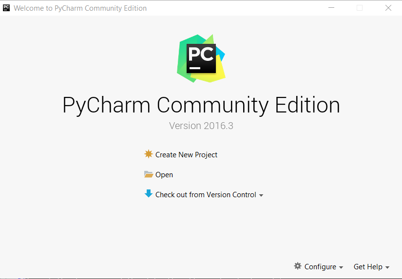
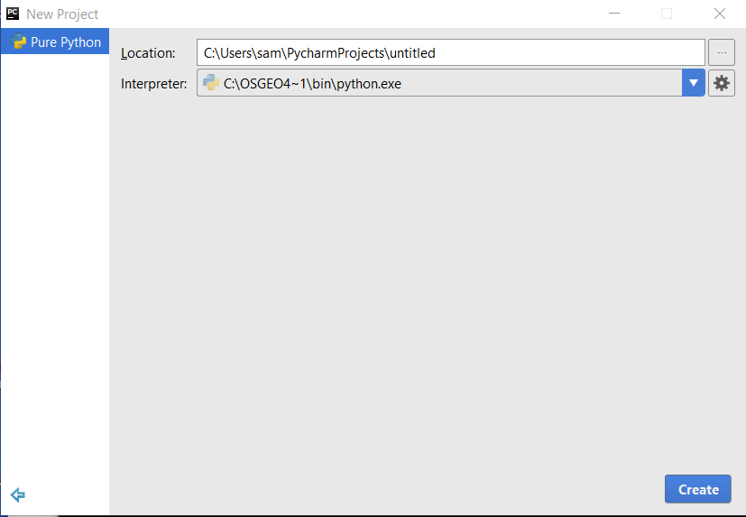
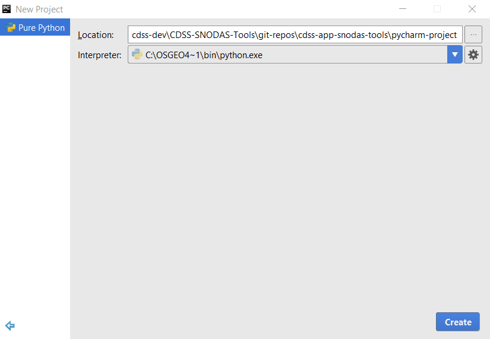
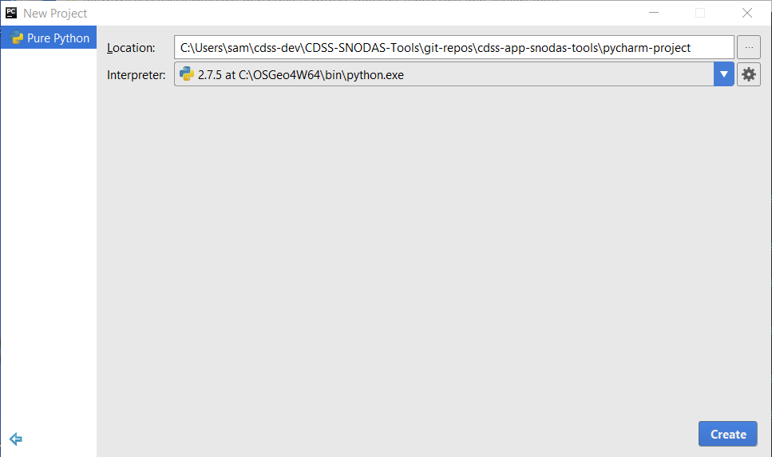
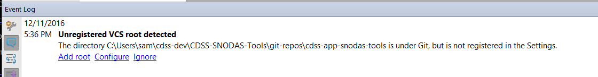

# Project Initialization / PyCharm Project

PyCharm provides extensive functionality for editing and running Python Programs.
This documentation explains how to configure a new PyCharm project that will contain the Python code.

## PyCharm and Git Integration - Part 1

This section provides background on PyCharm/Git integration.  See [PyCharm and Git Integration - Part 2](#pycharm-and-git-integration-part-2)
for specific confuration actions.

Because the SNODAS tools source code are stored in the Git repository it is necessary to make PyCharm
aware of the repository.  Resources include:

* [PyCharm - Using GitHub Integration](https://www.jetbrains.com/help/pycharm/2016.3/using-github-integration.html) - not overly relevant because are not using the PyCharm Git features yet
* [PyCharm - Directory-Based Versioning Model](https://www.jetbrains.com/help/pycharm/2016.3/directory-based-versioning-model.html) - important

Important considerations include:

* PyCharm files for a specific developer should not be stored in the Git repository because they will conflict with other developers.
Some developer files will reside with the local PyCharm software installation or other user files, which are not in the repository.
* Definitely do not want to store GitHub account password or any other security information in the public repository.
* PyCharm Git integration will likely be used for Python code, but Git BASH might be used for other files such as MkDocs markdown.

**Although PyCharm provides Git integration features, these features are not described here (yet).
The focus during initial setup was to establish a file structure and Git for Windows tools.**

## Create PyCharm Project

When PyCharm is [started using the run script](../dev-env/pycharm#configure-pycharm-to-work-with-qgis) it displays the following:

Because the [Git repository was cloned in a previous step](github/), do not use the ***Check out from Version Control*** choice.
Instead, select the ***Create New Project*** choice, which will show a dialog similar to the following:

The ***Interpreter*** should be the Python that is bundled with QGIS.
The project files are intended to be maintained in revision control.
Therefore, select the folder shown below (change the user to the current developer).
The full folder is `C:\Users\user\cdss-dev\CDSS-SNODAS-Tools\git-repos\cdss-app-snodas-tools\pycharm-project`.

Press ***Create*** to create the project.

Note that PyCharm remembers previous projects (**TODO smalers 2016-12-11 where does it save this information - hopefully in user files**).
If the above step is repeated, the dialog may be shown wider and display the full path to the project:

PyCharm will create a hidden folder `pycharm-project\.idea` under which are several project configuration files.
Some of the files, such as `misc.xml` use absolute paths, whereas some, such as `modules.xml` use paths specified relative to
a variable `like $PROJECT_DIR$`.
**TODO smalers 2016-12-11 determine if any settings are hard-coded to the user, which would be problematic because each developer has a different home folder.**

After the startup, a message is indicated in the lower right of the PyCharm interface.
Expanding shows the following:

**TODO SAM 2016-12-11 need to figure out what to do with this.  A quick review of the Configure option is unclear.
For now use the Git for Windows tools to perform Git operations**

## PyCharm and Git Integration - Part 2

The following indicates how PyCharm files should be handled in Git:

* [PyCharm - Directory-Based Versioning Model](https://www.jetbrains.com/help/pycharm/2016.3/directory-based-versioning-model.html) - important

Therefore, for the SNODAS Tools the following is done:

* Create a `.gitignore` file in the `pycharm-project\.idea` folder that ignores the `workspace.xml` file.
This `.gitignore` file will be included when a new developer starts working on the project,
and ensures that each developer's settings only apply to their local development files and not other users.

## Next Step

Now that a PyCharm project has been created in the repository files, Python files can be added to the project.

* [Configuring Project Structure](https://www.jetbrains.com/help/pycharm/2016.1/configuring-project-structure.html)
