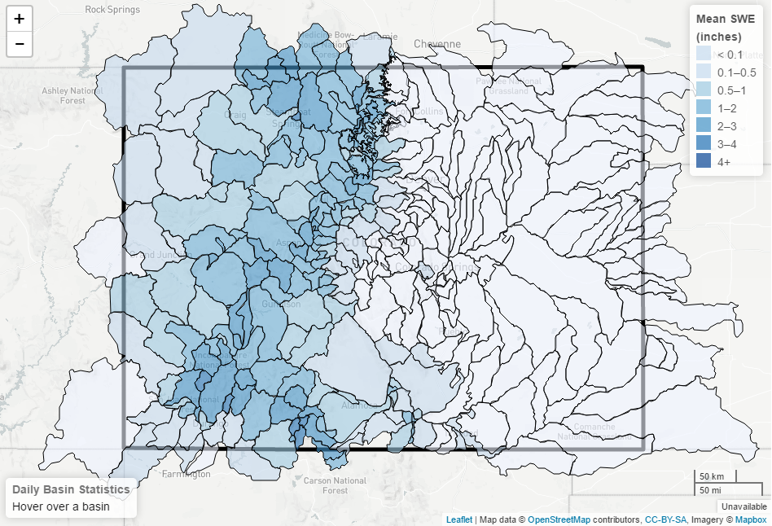
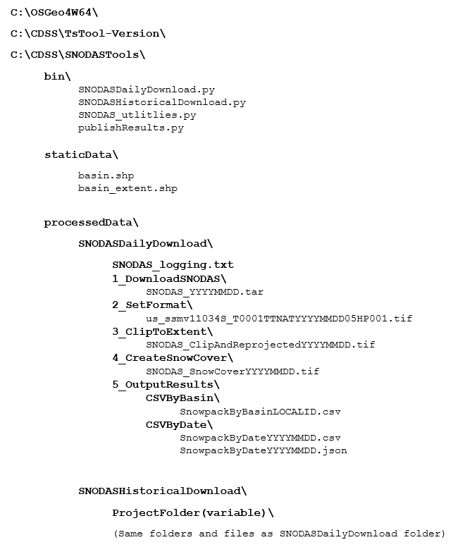
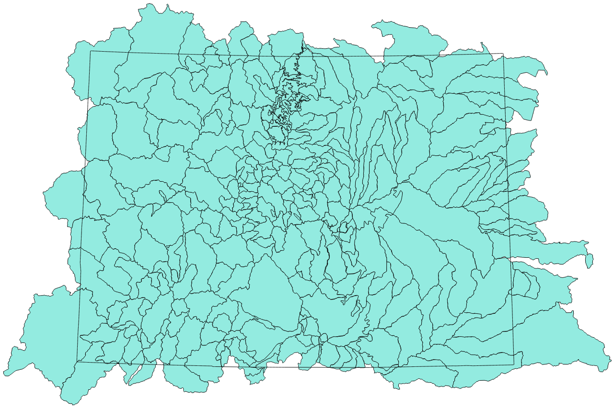
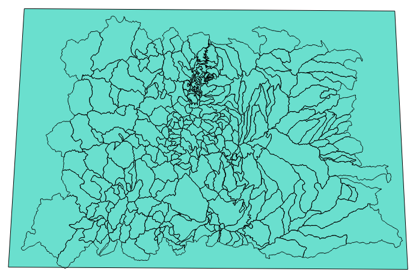
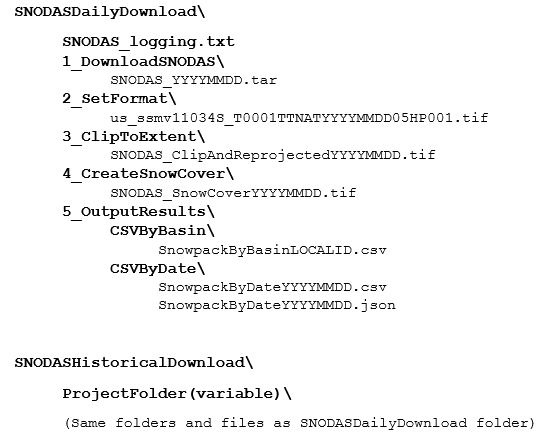

# File Structure

The following topics are discussed in this section:<br>

* [File Structure Overview](#file-structure-overview)
* [Description of Folder C:\OSGeo4W64](#folder-osgeo4w64)
* [Description of Folder C:\CDSS\TsTool-Version](#folder-tstool-version)
* [Description of Folder C:\CDSS\SNODASTools](#folder-snodastools)
	+ [Description of Folder C:\CDSS\SNODASTools\bin](#folder-snodastools_bin)
	+ [Description of Folder C:\CDSS\SNODASTools\staticData](#folder-snodastools_staticdata)
	+ [Description of Folder C:\CDSS\SNODASTools\processedData](#folder-snodastools_processeddata)
		- [Description of Subfolder 1_DownloadSNODAS](#subfolder-1_downloadsnodas)
		- [Description of Subfolder 2_SetFormat](#subfolder-2_setformat)
		- [Description of Subfolder 3_CliptoExtent](#subfolder-3_cliptoextent)
		- [Description of Subfolder 4_CreateSnowCover](#subfolder-4_createsnowcover)
		- [Description of Subfolder 5_OutputResults](#subfolder-5_outputresults)
		- [Description of Subfolder 5_OutputResults\CSVByBasin](#subfolder-5_outputresults\csvbybasin)
		- [Description of SNODAS_logging.txt](#snodas_logging-text-file)
	

## File Structure Overview

The SNODAS tools process original SNODAS data files extracted from a tar file into zonal statistics for 
watershed basins. Originally, these tools were developed for processing snowpack statistics for the state 
of Colorado. Therefore, many file examples shown below display the Colorado state extent. 

After the data is processed, final snowpack statistics can easily be viewed in a choropleth map or exported 
in tabular form. [*The Colorado’s Decision Support Systems (CDSS) SNODAS Tools*](http://projects.openwaterfoundation.org/owf-proj-co-cwcb-2016-snodas/prototype/snodas-products-home.html), available at 
shows an example of the processed Colorado SNODAS data configured in a chloropleth map. A static image of the 
web application is shown below. Right-click on the image and click *Open image in new tab* to see a larger view.



As explained in the [Processing Workflow](overview.md#processing-workflow) section, the tool iterates through various data-manipulation 
processes (ex: downloading the data, clipping the national grid to the extent of the basins, 
calculating the zonal statistics). Each data-manipulation can generate one or more output files. The 
majority of intermediate data files are currently saved to allow for process verification, troubleshooting, 
and avoiding re-downloads should the full analysis period need to be rerun due to changes in the software 
(each daily download of the SNODAS national files takes approximately 7 seconds). 

The following illustrates the overall folder structure for the SNODAS Tools, including software and data
files, for Windows. The software is configured using the system\SNODAS-Tools.cfg file, which specifies 
locations of folders and files on the operational system. 



## Folder OSGeo4W64

## Folder TsTool-Version

## Folder SNODASTools

### Folder SNODASTools_bin

The ```C:\CDSS\SNODASTools\bin\``` folder holds all SNODAS python scripts. In total there are four 
scripts:   

	1. SNODASDailyDownload.py 
	2. SNODASHistoricalDownload.py 
	3. SNODAS_utilities.py  
	4. publishResults.py  
	
The ```SNODASDailyDownload.py``` script will download the current date's SNODAS data from the SNODAS FTP site 
and will process the data to output snowpack zonal statistics. For more information regarding the 
data processing steps of ```SNODASDailyDownload.py```, refer to the [Processing Workflow](overview.md#processing-workflow) 
section. For more information about the SNODAS FTP site, refer to the [SNODAS Tools Data](../../../doc-user-mkdocs-project/docs/data/overview.md) 
of the user guide. For more infomation regarding the output snowpack products, refer to the [SNODAS Tools Products](../../../doc-user-mkdocs-project/docs/products/overview.md)
of the user guide.

 **TODO egiles 2017-01-13 fix the broken links that direct to the user manual**

The ```SNODASHistoricalDownload.py``` script will download historical SNODAS data from the SNODAS FTP site 
and will process the data to output snowpack zonal statistics. For more information regarding the 
data processing steps of ```SNODASHistoricalDownload.py```, refer to the [Processing Workflow](overview.md#processing-workflow) 
section. For more information about the SNODAS FTP site, refer to the [SNODAS Tools Data](../../../doc-user-mkdocs-project/docs/data/overview.md) 
of the user guide. For more infomation regarding the output snowpack products, refer to the [SNODAS Tools Products](../../../doc-user-mkdocs-project/docs/products/overview.md)
of the user guide.

The ```SNODAS_utilities.py``` script contains all of the functions utilized in the ```SNODASDailyDownload.py```
 and the ```SNODASHistoricalDownload.py``` scripts. For more information regarding the functions within the 
 ```SNODAS_utilities.py``` script, refer to the [Tool Utilities and Functions](overview.md#tool-utilities-and-functions)
 section.

 **TODO egiles 2017-01-13 explain this script**


### Folder SNODASTools_staticData

The SNODAS tools require the input of two static data files. These two data files should be saved 
within this folder.

(1) Watershed Basin Shapefile Input. The shapefile is a collection of basin features for the study area of interest. 
Originally the SNODAS Tools were developed to perform snowpack analysis for the state of Colorado. Below is an
image of the shapefile (displayed in the teal color) used for the watershed basin input. The black, boxed 
outline is the Colorado state boundary. 



(2) Watershed Basin Extent Shapefile Input. The single-featuere shapefile is a bounding box extent of the Watershed 
Basin Shapefile Input. Below is an image of the shapefile (displayed in the teal color) used for the Colorado watershed 
basin extent input. The Colorado watershed basin shapfile is overlaid with a transparent fill. 


 **TODO egiles 2017-01-13 update this image to be the correct watershed basin shapefile and extent**

### Folder SNODASTools_processedData

The ```C:\CDSS\SNODASTools\processedData\``` folder contains two sub-folders.

	1. SNODASDailyDownload\  
	2. SNODASHistoricalDownload\
	
All data files created and outputed from  the ```SNODASDailyDownload.py``` 
script are saved within the ```SNODASDailyDownload\``` sub-folder. All data files created and outputed from  
the ```SNODASHistoricalDownload.py``` script are saved within the ```SNODASHistoricalDownload\``` sub-folder.


As mentioned previously, both the ```SNODASDailyDownload.py``` and the ```SNODASHistoricalDownload.py``` scripts
iterate through the same functions and produce the same output files. The only differene between the two scripts is that
the ```SNODASDailyDownload.py``` downloads and processes SNODAS data for the **current** date whereas the 
```SNODASHistoricalDownload.py``` downloads and processes SNODAS data for **historical** dates. Due to the similarity in 
script processing and output files, the 5 sub-folders under the ```SNODASDailyDownload\``` and the ```SNODASHistoricalDownload\```
folders are identical. 

The file structure of the 5 sub-folders is displayed below. 



#### Subfolder 1_DownloadSNODAS
#### Subfolder 2_SetFormat
#### Subfolder 3_CliptoExtent
#### Subfolder 4_CreateSnowCover
#### Subfolder 5_OutputResults
#### Subfolder 5_OutputResults\CSVByBasin
#### Subfolder 5_OutputResults\ByDate
#### SNODAS_Logging Text File

		
		
	
		

