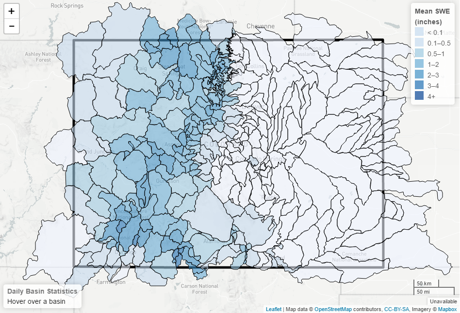
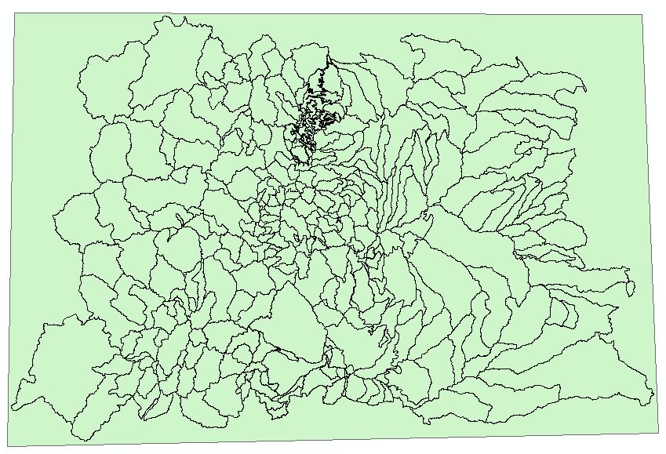

# File Structure

 **TODO egiles 2017-01-19 Edit the file structure pathnames to reflect a Linux system**  

The following topics are discussed in this section:<br>

* [File Structure Overview](#file-structure-overview)
* [OSGeo4W64\\](#osgeo4w6492)
* [CDSS\\TsTool-Version\\](#cdss92tstool-version92)
* [CDSS\\SNODASTools\\](#cdss92snodastools92)
	+ [SNODASTools\\bin\\](#snodastools92bin92)
	+ [SNODASTools\\staticData\\](#snodastools92staticdata92)
	+ [SNODASTools\\processedData\\](#snodastools92processeddata92)
		- [processedData\\1_DownloadSNODAS\\](#processeddata921_downloadsnodas92)
		- [processedData\\2_SetFormat\\](#processeddata922_setformat92)
		- [processedData\\3_CliptoExtent\\](#processeddata923_cliptoextent92)
		- [processedData\\4_CreateSnowCover\\](#processeddata924_createsnowcover92)
		- [processedData\\5_CalculateStatistics\\](#processeddata925_calculatestatistics92)
			- [5_CalculateStatistics\\StatisticsbyBasin\\](#processeddata925_calculatestatistics92statisticsbybasin92)
			- [5_CalculateStatistics\\StatisticsbyDate\\](#processeddata925_calculatestatistics92statisticsbydate92)
	

## File Structure Overview

The SNODAS tools process original SNODAS data files, extracted from a tar file, into zonal statistics for 
watershed basins. Zonal statistics are statistics calculated by zone where the zones are defined by an input 
zone dataset and the values are defined by a raster grid. For the SNODAS tools, the input zone dataset is the watershed 
basin boundary shapefile and the raster grid is the clipped and reprojected SNODAS daily grid. 
Originally, these tools were developed for processing snowpack statistics for the state of Colorado. 
Therefore, many file examples shown below display the Colorado state extent. 

After the data is processed, final snowpack statistics can easily be viewed in a choropleth map or exported 
in tabular form. Below is an image of the SNODAS tools results displayed as a choropleth map. Right-click on the image 
and click *Open image in new tab* to see a larger view.



As explained in the [Processing Workflow](overview.md#processing-workflow) section, the tool iterates through various data-manipulation 
processes (ex: downloading the data, clipping the national grid to the extent of the basins, 
calculating the zonal statistics). Each data-manipulation can generate one or more output files. The 
majority of intermediate data files are currently saved to allow for process verification, troubleshooting, 
and avoiding re-downloads should the full analysis period need to be rerun due to changes in the software 
(each daily download of the SNODAS national files takes approximately 7 seconds). 

The following illustrates the overall folder structure for the SNODAS tools, including software and data
files, for Windows. The software is configured using the system\SNODASconfig.ini file, which specifies 
locations of folders and files on the operational system.     
  
*```Nested folders``` are represented by: '---'. *  
*```Files``` are represented by: '--->'.*

 ** File Structure of SNODAS Tools**  
  **TODO egiles 2017-01-19 Add system to the folder structure**

```C:\OSGeo4W64\```  
```C:\CDSS\TsTool-Version```  
```C:\CDSS\SNODASTools\``` 
 
--- ```bin\```  
- - - - - > ```SNODASDaily_Automated.py```  
- - - - - > ```SNODASDaily_Interactive.py```  
- - - - - > ```SNODAS_utilities.py```  
- - - - - > ```SNODAS_publishResults.py```   
- - - - - > ```SNODASDaily_Automated_forTaskScheduler.bat```  

--- ```staticData\```    
- - - - - > ```watershedBasinBoundary.shp```   
- - - - - > ```watershedBasinBoundaryExtent.shp```   
- - - - - > ```watershedBasinBoundary.geojson```  
- - - - - > ```stateBoundary.geojson```
 
--- ```processedData\```  
- - - - > ```SNODAS_log.txt```  
- - - - -  ```1_DownloadSNODAS\```   
- - - - - - - - > ```SNODAS_YYYYMMDD.tar```  
- - - - -  ```2_SetFormat\```   
- - - - - - - - > ```us_ssmv11034tS__T0001TTNATSYYYYMMDD05HP001.tif```  
- - - - -  ```3_ClipToExtent\```   
- - - - - - - - > ```SNODAS_SWE_ClipAndReprojYYYYMMDD.tif```   
- - - - -  ```4_CreateSnowCover\```    
- - - - - - - - > ```SNODAS_SnowCover_ClipAndReprojYYYYMMDD.tif```   
- - - - -  ```5_CalculateStatistics\```   
- - - - - - - - - ```StatisticsbyBasin\```  
- - - - - - - - - - - > ```SnowpackByBasin_LOCALID```  
- - - - - - - - - ```StatisticsbyDate\```  
- - - - - - - - - - - > ```SnowpackByDate_YYYYMMDD```   


--> ```SNODASconfig.ini```


## OSGeo4W64\\

## CDSS\\TsTool-Version\\

## CDSS\\SNODASTools\\

### SNODASTools\\bin\\

The ```C:\CDSS\SNODASTools\bin\``` folder holds all SNODAS tools' scripts. In total there are five 
scripts:   

	1. SNODASDaily_Automated.py 
	2. SNODASDaily_Interactive.py 
	3. SNODAS_utilities.py  
	4. SNODAS_publishResults.py
	5. SNODASDaily_Automated_forTaskScheduler.bat

**SNODASDaily_Automated.py**	

The ```SNODASDaily_Automated.py``` Python script downloads _the current date's_ SNODAS data from the SNODAS FTP site 
and exports daily snowpack zonal statistics.   

This script only processes the current date's SNODAS data. 
For information on the data processing steps of ```SNODASDaily_Automated.py```, refer to the 
[Processing Workflow](overview.md#processing-workflow) section. For information on the SNODAS FTP site, refer to the
[SNODAS Data](http://software.openwaterfoundation.org/cdss-app-snodas-tools-doc-user/data/overview/) of the user guide. For information on
the output snowpack products, refer to the [SNODAS Tools Products](http://software.openwaterfoundation.org/cdss-app-snodas-tools-doc-user/products/overview/)
section of the user guide.

The ```SNODASDaily_Automated.py``` script is designed to be automatically run using a task scheduler program. Once the task is set 
up, refer to [Task Scheduler](../deployed-env/task-scheduler) section for more information, the script downloads the daily SNODAS data on a daily timer and exports 
the daily zonal statistics to the [processedData\ folder](#folder-snodastools_processeddata). 
 
 **SNODASDaily_Interactive.py**	

The ```SNODASDaily_Interactive.py``` script downloads _historical_ SNODAS data from the SNODAS FTP site 
and exports daily snowpack zonal statistics.   

The ```SNODASDaily_Interactive.py``` script is designed to be interactive. Users can specify historical dates of 
interest and the script will export the zonal statistics corresponding to those dates. The exported statistics of the 
```SNODASDaily_Interactive.py``` are saved in the [processedData\ folder](#folder-snodastools_processeddata) alongside
the exported statistics of the ```SNODAS_DailyAutomated.py``` script.


For information on the data processing steps of ```SNODASDaily_Interactive.py```, refer to the 
[Processing Workflow](overview.md#processing-workflow) section. For information on the SNODAS FTP site, refer to the
[SNODAS Data](http://software.openwaterfoundation.org/cdss-app-snodas-tools-doc-user/data/overview/) section of the user guide. For information
on the output snowpack products, refer to the [SNODAS Tools Products](http://software.openwaterfoundation.org/cdss-app-snodas-tools-doc-user/products/overview/)
section of the user guide.


The ```SNODASDaily_Interactive.py``` script is to be utilized in the following scenarios:


1. The historical SNODAS repository has not yet been processed. 
	* The temporal coverage of the SNODAS data is Septemeber 28th, 2003 to the current date. The ```SNODASDaily_Automated.py``` 
	script will automatically create an ongoing export of SNODAS zonal statistics, once the 
	```SNODASDaily_Automated_forTaskScheduler.bat``` has been set up with  a task scheduler program. The SNODAS historical repository,
	however, must be created with the ```SNODASDaily_Interactive.py``` script.
	
	
2. The ```SNODASDaily_Automated_forTaskScheduler.bat``` failed to run. 
	* The ```SNODASDaily_Automated_forTaskScheduler.bat``` is designed to automatically run ```SNODASDaily_Automated.py``` 
	everyday. There are instances, however, when the task will fail to run for a single or range of days. This could occur, for 
	example, if the task properties are set to run only when the user is signed in and the user was signed off for one or a range 
	of days. The missed days must then be manually processed with the ```SNODASDaily_Interactive.py``` script.
	
	
3. The SNODAS grid displayed incorrect information. 
	* The SNODAS products for a specific day could require an overwrite if the [National Snow & Ice Data Center](https://nsidc.org/) 
	uploaded incorrect SNODAS data and then reloaded a correct set of data. The reprocessing of SNODAS data for that date would be 
	accomplished with the ```SNODASDaily_Interactive.py``` script.

 **SNODAS_utilities.py**	

The ```SNODAS_utilities.py``` script contains all of the functions utilized in the ```SNODASDaily_Automated.py```
and the ```SNODASDaily_Interactive.py``` scripts. For descriptions of the individual ```SNODAS_utilities.py``` 
functions refer to the [Tool Utilities and Functions](overview.md#tool-utilities-and-functions) section.

**SNODAS_publishResults.py**  
**TODO egiles 2017-01-19 develop publishResults.py script and explain**  

**SNODASDaily_Automated_forTaskScheduler.bat**  

The ```SNODASDaily_Automated_forTaskScheduler.bat``` is a batch file to be called by a task scheduler program. It automatically 
runs the ```SNODASDaily_Automated.py``` script everyday. Refer to the [Task Scheduler](../deployed-env/task-scheduler) section for a tutorial on how to 
initially set up the ```SNODASDaily_Automated_forTaskScheduler.bat``` within a task scheduler program.   


### SNODASTools\\staticData\\

Two types of static data, script input data and visualization data, are stored within this folder. 

** Script Input Data**

The SNODAS tools require the input of two static data files. These two data files should be saved 
within this folder prior to running the scripts. 

1. Watershed Basin Shapefile Input (```watershedBasinBoundary.shp```). This shapefile is a collection of basin features for the 
study area of interest. Originally the SNODAS Tools were developed to perform snowpack analysis for the state of Colorado. Below
is an image of the watershed basin shapefile (displayed in green) used for the watershed basin input. The black, boxed 
outline is the Colorado state boundary. 

	- Zonal statistics are statistics calculated by zone where the zones are defined by an input zone dataset and the values 
are defined by a raster grid. This shapefile is the input zone dataset. 


2. Watershed Basin Extent Shapefile Input (```watershedBasinBoundaryExtent.shp```). This single-feature shapefile extends 
slightly beyond the extent of the watershed basin shapefile to ensure all areas of the study area are accurately represented 
by the SNODAS data. Below is an image of the watershed basin extent shapefile (displayed in green) used for the Colorado watershed
 basin extent input. The Colorado watershed basin shapefile is overlaid with a transparent fill. 

	- This shapefile decreases the processing time of the scripts by clipping the national SNODAS grid to the manageable size of the 
study area. 


 
** Visualization Data **

As previously mentioned, the output products can be displayed in tabular form or in a choropleth map. The static visulatization 
data is used in the choropleth map. The visualiztion data are .GeoJSON files. 
A [GeoJSON file](http://learn.openwaterfoundation.org/owf-learn-geojson/index.html) is " an open standard format designed for 
representing simple geographical features, along with their non-spatial attributes, based on JavaScript Object Notation." 
- [Wikipedia:GeoJSON](https://en.wikipedia.org/wiki/GeoJSON).


1. Watershed Basin Boundary (```watershedBasinBoundary.geojson```). The watershed basin boundary GeoJSON file is the watershed
basin shapefile input converted into a GeoJSON file. This file will display the individaul basin boundaries for which the zonal 
statistics are calculated. In a choropleth map, each basin of the watershed basin boundary GeoJSON file will be filled with a 
color representing a daily snowpack statistic. 

2. State Boundary (```stateBoundary.geojson```). The state boundary GeoJSON file gives viewers of the choropleth map a sense of 
location. Note that this file is defined as state boundary only becasue the SNODAS tools were originally developed for the state
of Colorado. If the study area is other than state-level, it might be more appropriate to adjust this layer to represent a location 
of corresponding scale (ex: basin exent, study area, etc.).

### SNODASTools\\processedData\\

All output products of ```SNODASDaily_Automated.py``` and ```SNODASDaily_Interactive.py``` are saved within the processedData\ folder. 
For each processed day of data, 6 output products are created. To see a larger view of the images below, right-click on the image and 
click *Open image in new tab*.

1. The originally downloaded national SNODAS .tar file  
	- ```SNODAS_YYYYMMDD.tar``` 
	  
2. The reformatted national SNODAS SWE data in .tif format  
	 - ```us_ssmv11034tS__T0001TTNATSYYYYMMDD05HP001.tif```
	 
3. The clipped and reprojected SNODAS SWE .tif file  
	- ```SNODAS_SWE_ClipAndReprojYYYYMMDD.tif```  
	
4. The clipped and reprojected snow cover binary .tif file  
	- ```SNODAS_SnowCover_ClipAndReprojYYYYMMDD.tif```  
	
5. The snowpack statistics in a .csv file organized by basin ID  
	 - ```SnowpackByBasin_LOCALID```  
	 
6. The snowpack statistics in a .csv file organized by date  
	 - ```SnowpackByDate_YYYYMMDD``` 
	 


The 6 output products are saved within subfolders of the processedData folder. Each subfolder is explained in further detail below. 
The name of each subfolder is described by the default name. However, the following folder names can be edited in the 
[configuration file](#snodastools92snodasconfigini).  

#### processedData\\1_DownloadSNODAS\\

The SNODAS tools access the [SNODAS FTP site](ftp://sidads.colorado.edu/DATASETS/NOAA/G02158/masked/) and download the daily 
SNODAS .tar file. If the ```SNODASDaily_Automated.py``` script is utilized, the daily SNODAS .tar file is the current date. If the 
```SNODASDaily_Interactive.py``` script is utilized, the daily SNODAS tar file is the date of interest defined by user input. 

The file is downloaded to the 1_DownloadSNODAS folder and is named ```SNODAS_YYYYMMDD.tar``` where ```YYYYMMDD``` represents the date of data. 
Note that the date does not represent the download date but rather the date when the SNODAS data is collected. 

	Example: 
	Downloaded SNODAS file for January 9th, 2013 -> SNODAS_20130109.tar

Refer to the [Processing Workflow](overview/#processing-workflow) section for a general description of the SNODAS tools' downloading step. 
Refer to [Tool Utilities and Functions](overview.md#tool-utilities-and-functions) for detailed information on the Python functions 
called to download the SNODAS data.

#### processedData\\2_SetFormat\\

The SNODAS tools manipulate the SNODASYYYYMMDD.tar file to produce a SNODAS Snow Water Equivalent (SWE) national grid in .tif format. 

The manipulated SNODAS SWE .tif file is saved to the 2_SetFormat folder and is named ```us_ssmv11034tS__T0001TTNATSYYYYMMDD05HP001.tif```
where ```YYYYMMDD``` represents the date of data. Note that the date does not represent the download date but rather the date when the 
SNODAS data is collected. 

	Example: 
	SNODAS SWE .tif file for January 9th, 2013 -> us_ssmv11034tS__T0001TTNATS2013010905HP001.tif

The long and cryptic name of this file can be explained with the [NSIDC SNODAS user guide](http://nsidc.org/data/docs/noaa/g02158_snodas_snow_cover_model/index.html).   
The naming convention variables are described below:

**us: region of the file**  
'us': United States  
  
**ssm: model used to generate the estimates**  
'ssm': simple snow model  
   
**v1: signifies if the file contains snow model driving data or model output**  
'v1': operational snow model output  

**1034: product code representing the snow parameter represented by the data**  
'1034': snow water equivalent  
 
**tS\__: a vertical integration code that denotes what type of snow pack data are being collected **  
'tS__': integral through all the layers of the snow pack  

**T0001: time integration code**  
'T0001': a one-hour snapshot  
  
**TTNA: detail of snow modeling operations**  
'TTNA': will always be TTNA  
  
**TS: time step code**  
TS is followed by the year, month, day, and hour of the start of the last time step of the 
integration period for which the data applies. For example, the time integration code, 
T0024, and time step code, TS2003102305, are for the time interval 2003-10-22 06 to 
2003-10-23 05.    

**YYYY: 4-digit year**  
'YYYY': dependent on date of data   
  
**MM: 2-digit month**  
'MM': dependent on date of data    

**DD: 2-digit day of month**   
'DD': dependent on date of data  
 
**05: 2-digit hour of day**  
'05': 5th hour of the day  
  
**H: time interval**  
'H': hourly  
 
**P001: offset code refering to where the data applies during a snow model time step in the snow 
model's differencing scheme**  
'P001': field represents a total flux for the entire time step such as precipitation or that a field
represents data at the end of a time step  
  
   
    
Refer to the [Processing Workflow](overview/#processing-workflow) section for a general description of the SNODAS tools' set format step. 
Refer to [Tool Utilities and Functions](overview.md#tool-utilities-and-functions) for detailed information on the Python functions 
called to set the format of the SNODAS data.

#### processedData\\3_CliptoExtent\\
#### processedData\\4_CreateSnowCover\\
#### processedData\\5_CalculateStatistics\\
#### processedData\\5_CalculateStatistics\\StatisticsbyBasin\\
#### processedData\\5_CalculateStatistics\\StatisticsbyDate\\
#### processedData\\SNODAS_log.txt


### SNODASTools\\SNODASconfig.ini		
		
	
		

