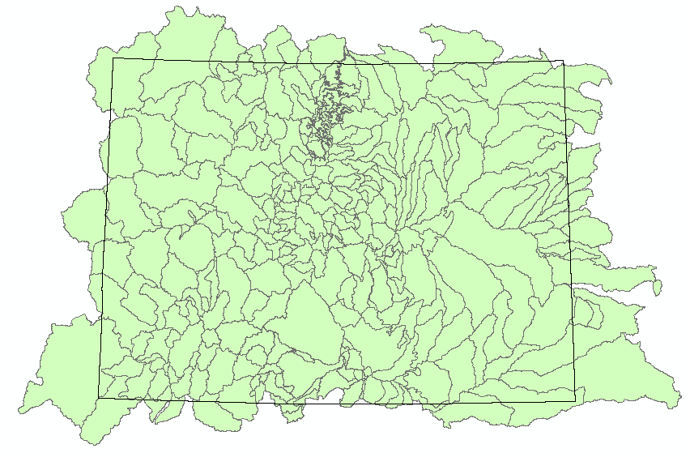

# File Structure

 **TODO egiles 2017-01-19 Edit the file structure pathnames to reflect a Linux system**  

The following topics are discussed in this section:<br>

* [File Structure Overview](#file-structure-overview)
* [OSGeo4W64\\](#osgeo4w6492)
* [CDSS\\TsTool-Version\\](#cdss92tstool-version92)
* [CDSS\\SNODASTools\\](#cdss92snodastools92)
	+ [SNODASTools\\bin\\](#snodastools92bin92)
	+ [SNODASTools\\staticData\\](#snodastools92staticdata92)
	+ [SNODASTools\\processedData\\](#snodastools92processeddata92)
		- [processedData\\1_DownloadSNODAS\\](#processeddata921_downloadsnodas92)
		- [processedData\\2_SetFormat\\](#processeddata922_setformat92)
		- [processedData\\3_CliptoExtent\\](#processeddata923_cliptoextent92)
		- [processedData\\4_CreateSnowCover\\](#processeddata924_createsnowcover92)
		- [processedData\\5_CalculateStatistics\\](#processeddata925_calculatestatistics92)
			- [5_CalculateStatistics\\StatisticsbyBasin\\](#processeddata925_calculatestatistics92statisticsbybasin92)
			- [5_CalculateStatistics\\StatisticsbyDate\\](#processeddata925_calculatestatistics92statisticsbydate92)
	

## File Structure Overview

The SNODAS tools process original SNODAS data files, extracted from a tar file, into zonal statistics for 
watershed basins. Zonal statistics are statistics calculated by zone where the zones are defined by an input 
zone dataset and the values are defined by a raster grid. For the SNODAS tools, the input zone dataset is the watershed 
basin boundary shapefile and the raster grid is the clipped and reprojected SNODAS daily grid. 
Originally, these tools were developed for processing snowpack statistics for the state of Colorado. 
Therefore, many file examples shown below display the Colorado state extent. 

After the data is processed, final snowpack statistics can easily be viewed in a choropleth map or exported 
in tabular form. Below is an image of the SNODAS tools results displayed as a choropleth map. Right-click on the image 
and click *Open image in new tab* to see a larger view.


As explained in the [Processing Workflow](overview.md#processing-workflow) section, the tool iterates through various data-manipulation 
processes (ex: downloading the data, clipping the national grid to the extent of the basins, 
calculating the zonal statistics). Each data-manipulation can generate one or more output files. The 
majority of intermediate data files are currently saved to allow for process verification, troubleshooting, 
and avoiding re-downloads should the full analysis period need to be rerun due to changes in the software 
(each daily download of the SNODAS national files takes approximately 7 seconds). 

The following illustrates the overall folder structure for the SNODAS tools, including software and data
files, for Windows. The software is configured using the system\SNODASconfig.ini file, which specifies 
locations of folders and files on the operational system.     
  
*```Nested folders``` are represented by: '---'. *  
*```Files``` are represented by: '--->'.*

 ** File Structure of SNODAS Tools**  
  **TODO egiles 2017-01-19 Add system to the folder structure**

```C:\OSGeo4W64\```  
```C:\CDSS\TsTool-Version```  
```C:\CDSS\SNODASTools\``` 
 
--- ```bin\```  
- - - - - > ```SNODASDaily_Automated.py```  
- - - - - > ```SNODASDaily_Interactive.py```  
- - - - - > ```SNODAS_utilities.py```  
- - - - - > ```SNODAS_publishResults.py```   
- - - - - > ```SNODASDaily_Automated_forTaskScheduler.bat```  

--- ```staticData\```  
- - - - - > ```stateBoundary.shp```  
- - - - - > ```stateBoundary.json```   
- - - - - > ```watershedBasinBoundary.shp```   
- - - - - > ```watershedBasinBoundary.json```  
- - - - - > ```watershedBasinBoundaryExtent.shp``` 
 
--- ```processedData\```  
- - - - > ```SNODAS_log.txt```  
- - - - -  ```1_DownloadSNODAS\```   
- - - - - - - - > ```SNODAS_YYYYMMDD.tar```  
- - - - -  ```2_SetFormat\```   
- - - - - - - - > ```us_ssmv11034tS__T0001TTNATSYYYYMMDD05HP001.tif```  
- - - - -  ```3_ClipToExtent\```   
- - - - - - - - > ```SNODAS_SWE_ClipAndReprojYYYYMMDD.tif```   
- - - - -  ```4_CreateSnowCover\```    
- - - - - - - - > ```SNODAS_SnowCover_ClipAndReprojYYYYMMDD.tif```   
- - - - -  ```5_CalculateStatistics\```   
- - - - - - - - - ```StatisticsbyBasin\```  
- - - - - - - - - - - > ```SnowpackByBasin_LOCALID```  
- - - - - - - - - ```StatisticsbyDate\```  
- - - - - - - - - - - > ```SnowpackByDate_YYYYMMDD```   


--> ```SNODASconfig.ini```


## OSGeo4W64\\

## CDSS\\TsTool-Version\\

## CDSS\\SNODASTools\\

### SNODASTools\\bin\\

The ```C:\CDSS\SNODASTools\bin\``` folder holds all SNODAS tools' scripts. In total there are five 
scripts:   

	1. SNODASDaily_Automated.py 
	2. SNODASDaily_Interactive.py 
	3. SNODAS_utilities.py  
	4. SNODAS_publishResults.py
	5. SNODASDaily_Automated_forTaskScheduler.bat

**SNODASDaily_Automated.py**	

The ```SNODASDaily_Automated.py``` Python script downloads _the current date's_ SNODAS data from the SNODAS FTP site 
and exports daily snowpack zonal statistics.   

This script only processes the current date's SNODAS data. 
For information on the data processing steps of ```SNODASDaily_Automated.py```, refer to the 
[Processing Workflow](overview.md#processing-workflow) section. For information on the SNODAS FTP site, refer to the
[SNODAS Tools Data](../../../doc-user-mkdocs-project/docs/data/overview.md) of the user guide. For information on
the output snowpack products, refer to the [SNODAS Tools Products](../../../doc-user-mkdocs-project/docs/products/overview.md)
section of the user guide.

The ```SNODASDaily_Automated.py``` script is designed to be automatically run using a task scheduler program. Once the task is set 
up, refer to [Task Scheduler](../deployed-env/task-scheduler) section for more information, the script downloads the daily SNODAS data on a daily timer and exports 
the daily zonal statistics to the [processedData\ folder](#folder-snodastools_processeddata). 

 **TODO egiles 2017-01-13 fix the broken links that direct to the user manual**  
  
 **SNODASDaily_Interactive.py**	

The ```SNODASDaily_Interactive.py``` script downloads _historical_ SNODAS data from the SNODAS FTP site 
and exports daily snowpack zonal statistics.   

The ```SNODASDaily_Interactive.py``` script is designed to be interactive. Users can specify historical dates of 
interest and the script will export the zonal statistics corresponding to those dates. The exported statistics of the 
```SNODASDaily_Interactive.py``` are saved in the [processedData\ folder](#folder-snodastools_processeddata) alongside
the exported statistics of the ```SNODAS_DailyAutomated.py``` script.


For information on the data processing steps of ```SNODASDaily_Interactive.py```, refer to the 
[Processing Workflow](overview.md#processing-workflow) section. For information on the SNODAS FTP site, refer to the
[SNODAS Tools Data](../../../doc-user-mkdocs-project/docs/data/overview.md) section of the user guide. For information
on the output snowpack products, refer to the [SNODAS Tools Products](../../../doc-user-mkdocs-project/docs/products/overview.md)
section of the user guide.


The ```SNODASDaily_Interactive.py``` script is to be utilized in the following scenarios:


1. The historical SNODAS repository has not yet been processed. 
	* The temporal coverage of the SNODAS data is Septemeber 28th, 2003 to the current date. The ```SNODASDaily_Automated.py``` 
	script will automatically create an ongoing export of SNODAS zonal statistics, once the 
	```SNODASDaily_Automated_forTaskScheduler.bat``` has been set up with  a task scheduler program. The SNODAS historical repository,
	however, must be created with the ```SNODASDaily_Interactive.py``` script.
	
	
2. The ```SNODASDaily_Automated_forTaskScheduler.bat``` failed to run. 
	* The ```SNODASDaily_Automated_forTaskScheduler.bat``` is designed to automatically run ```SNODASDaily_Automated.py``` 
	everyday. There are instances, however, when the task will fail to run for a single or range of days. This could occur, for 
	example, if the task properties are set to run only when the user is signed in and the user was signed off for one or a range 
	of days. The missed days must then be manually processed with the ```SNODASDaily_Interactive.py``` script.
	
	
3. The SNODAS grid displayed incorrect information. 
	* The SNODAS products for a specific day could require an overwrite if the [National Snow & Ice Data Center](https://nsidc.org/) 
	uploaded incorrect SNODAS data and then reloaded a correct set of data. The reprocessing of SNODAS data for that date would be 
	accomplished with the ```SNODASDaily_Interactive.py``` script.

 **SNODAS_utilities.py**	

The ```SNODAS_utilities.py``` script contains all of the functions utilized in the ```SNODASDaily_Automated.py```
and the ```SNODASDaily_Interactive.py``` scripts. For descriptions of the individual ```SNODAS_utilities.py``` 
functions refer to the [Tool Utilities and Functions](overview.md#tool-utilities-and-functions) section.

**SNODAS_publishResults.py**  
**TODO egiles 2017-01-19 develop publishResults.py script and explain**  

**SNODASDaily_Automated_forTaskScheduler.bat**  

The ```SNODASDaily_Automated_forTaskScheduler.bat``` is a batch file to be called by a task scheduler program. It automatically 
runs the ```SNODASDaily_Automated.py``` script everyday. Refer to the [Task Scheduler](../deployed-env/task-scheduler) section for a tutorial on how to 
initially set up the ```SNODASDaily_Automated_forTaskScheduler.bat``` within a task scheduler program.   


### SNODASTools\\staticData\\

Two types of static data, script input data and visualization data, are stored within this folder. 

** Script Input Data**

The SNODAS tools require the input of two static data files. These two data files should be saved 
within this folder. 

(1) Watershed Basin Shapefile Input. The shapefile is a collection of basin features for the study area of interest. 
Originally the SNODAS Tools were developed to perform snowpack analysis for the state of Colorado. Below is an
image of the shapefile (displayed in green) used for the watershed basin input. The black, boxed 
outline is the Colorado state boundary. 



(2) Watershed Basin Extent Shapefile Input. The single-feature shapefile is a bounding box extent of the Watershed 
Basin Shapefile Input. Below is an image of the shapefile (displayed in green) used for the Colorado watershed 
basin extent input. The Colorado watershed basin shapefile is overlaid with a transparent fill. 


 **TODO egiles 2017-01-13 update this image to be the correct watershed basin shapefile and extent**
 
** Visualization Data **

### SNODASTools\\processedData\\

The ```C:\CDSS\SNODASTools\processedData\``` folder contains two sub-folders.

	1. SNODASDailyDownload\  
	2. SNODASHistoricalDownload\
	
All data files created from  the ```SNODASDailyDownload.py``` 
script are saved within the ```SNODASDailyDownload\``` sub-folder. All data files created from  
the ```SNODASHistoricalDownload.py``` script are saved within the ```SNODASHistoricalDownload\``` sub-folder.


As mentioned previously, both the ```SNODASDailyDownload.py``` and the ```SNODASHistoricalDownload.py``` scripts
iterate through the same functions and produce the same output files. The only difference between the two scripts is that
the ```SNODASDailyDownload.py``` downloads and processes SNODAS data for the **current** date whereas the 
```SNODASHistoricalDownload.py``` downloads and processes SNODAS data for **historical** dates. Due to the similarity in 
script processing and output files, the 5 sub-folders under the ```SNODASDailyDownload\``` and the ```SNODASHistoricalDownload\```
folders are identical. 

The file structure of the 5 sub-folders is displayed below. 

```processedData\```  
- - > ```SNODAS_log.txt```  
- - -  ```1_DownloadSNODAS\```   
- - - - - - > ```SNODAS_YYYYMMDD.tar```  
- - -  ```2_SetFormat\```   
- - - - - - > ```us_ssmv11034tS__T0001TTNATSYYYYMMDD05HP001.tif```  
- - -  ```3_ClipToExtent\```   
- - - - - - > ```SNODAS_SWE_ClipAndReprojYYYYMMDD.tif```   
- - -  ```4_CreateSnowCover\```    
- - - - - - > ```SNODAS_SnowCover_ClipAndReprojYYYYMMDD.tif```   
- - -  ```5_CalculateStatistics\```   
- - - - - - - ```StatisticsbyBasin\```  
- - - - - - - - - > ```SnowpackByBasin_LOCALID```  
- - - - - - - ```StatisticsbyDate\```  
- - - - - - - - - > ```SnowpackByDate_YYYYMMDD``` 


#### processedData\\SNODAS_log.txt
#### processedData\\1_DownloadSNODAS\\
#### processedData\\2_SetFormat\\
#### processedData\\3_CliptoExtent\\
#### processedData\\4_CreateSnowCover\\
#### processedData\\5_CalculateStatistics\\
#### processedData\\5_CalculateStatistics\\StatisticsbyBasin\\
#### processedData\\5_CalculateStatistics\\StatisticsbyDate\\


		
		
	
		

