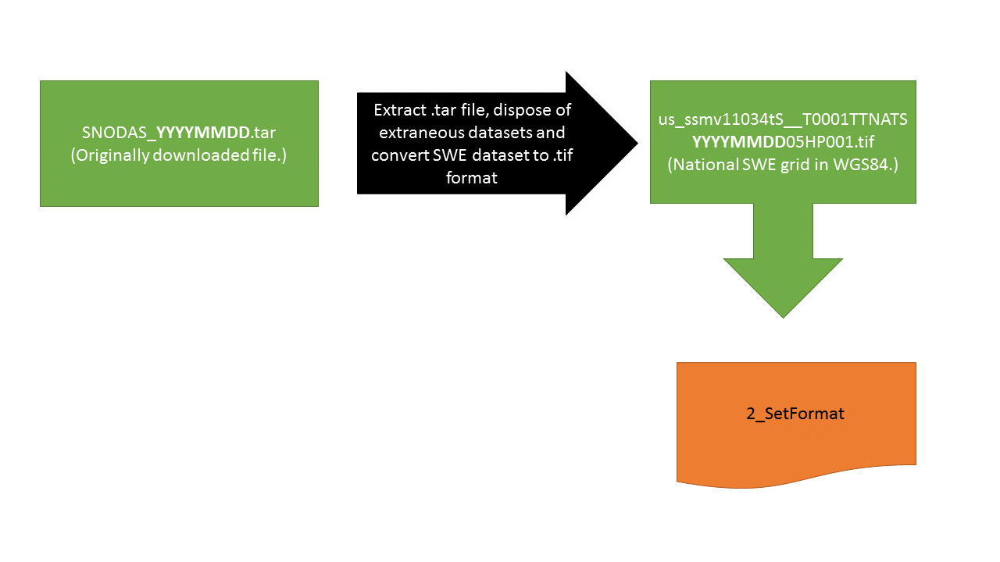
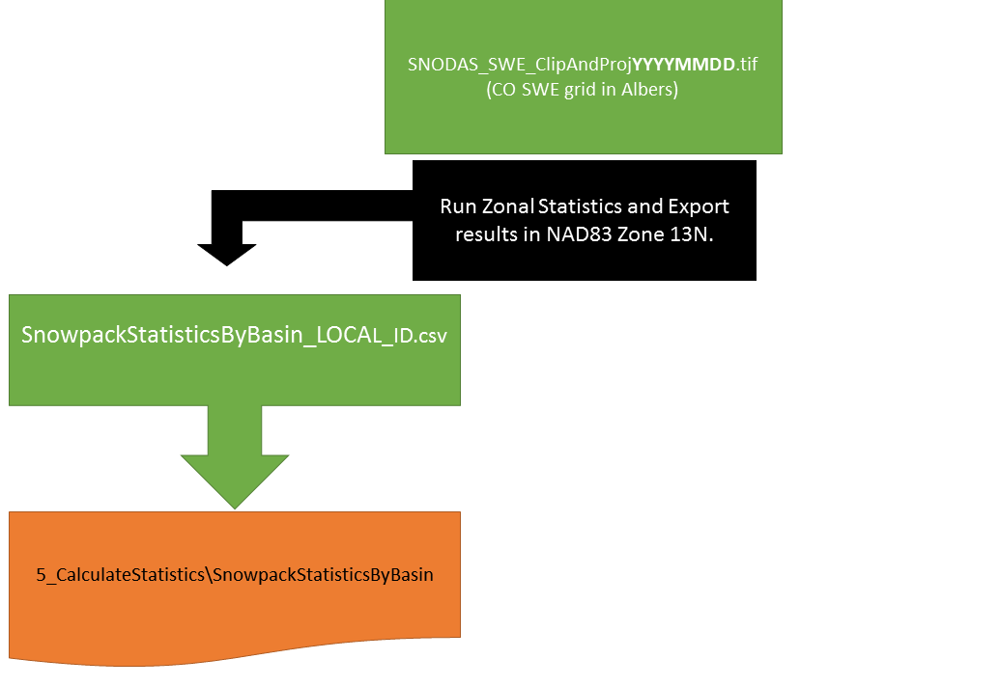
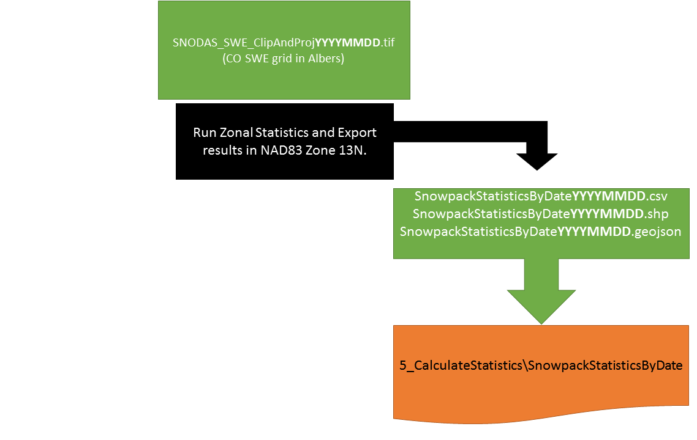
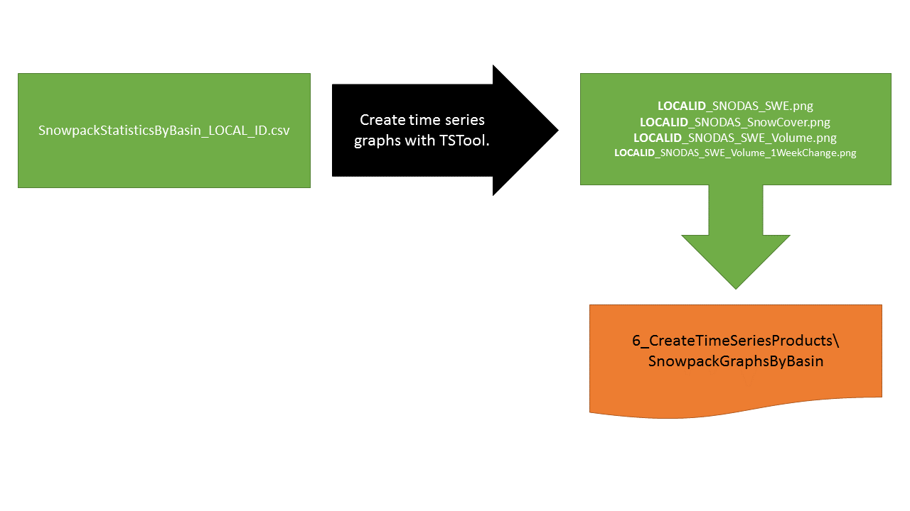
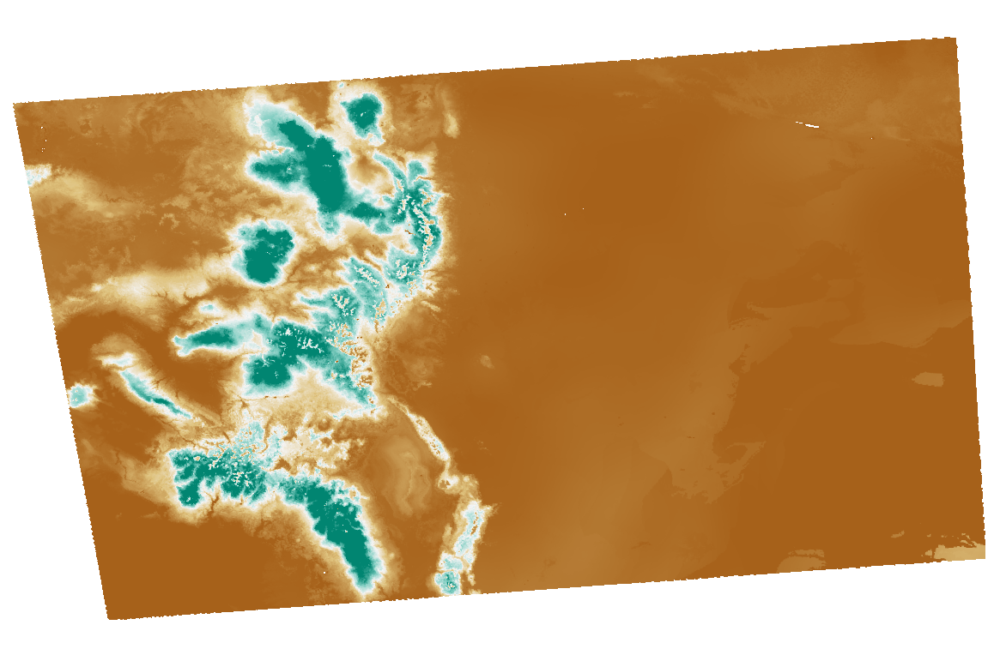
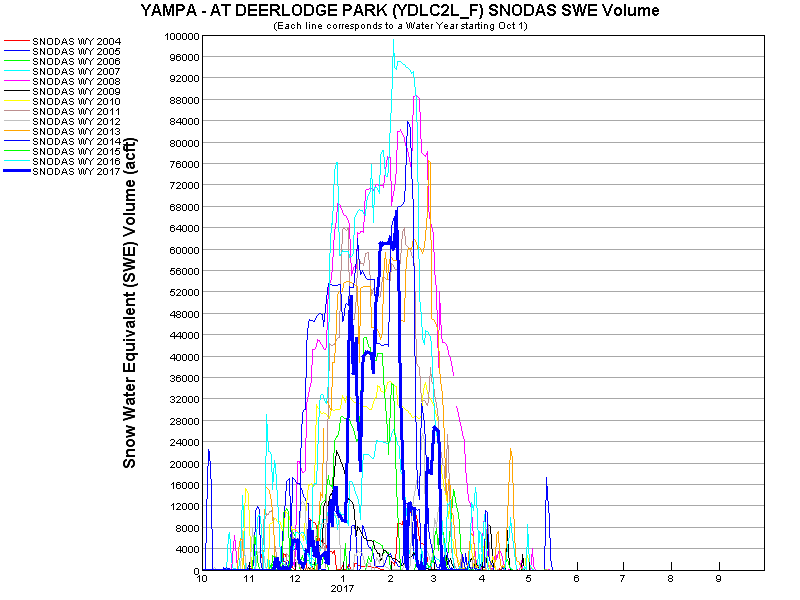
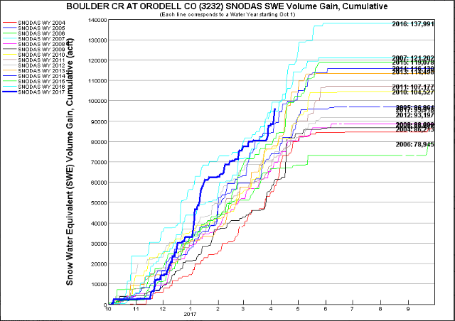

# Table of Contents

The following topics are discussed in this documentation.
A section is provided for each major folder and file in the system.

* [`Overview`](#overview)
* [`CDSS/SNODAS/`](#cdsssnodas) - main SNODAS tools installation folder
* [`SNODAS/SNODAS_Tools/`](#snodassnodas_tools)
	+ [`SNODAS_Tools/scripts/`](#snodas_toolsscripts)
	+ [`SNODAS_Tools/staticData/`](#snodas_toolsstaticdata)
		- [`Watershed Basin Shapefile Input`](#watershed-basin-shapefile-input)
		- [`Watershed Basin Extent Shapefile`](#the-watershed-basin-extent-shapefile)
		- [`Watershed Connectivity File`](#watershed-connectivity-file)
	+ [`SNODAS_Tools/processedData/`](#snodas_toolsprocesseddata)
		- [`processedData/1_DownloadSNODAS/`](#processeddata1_downloadsnodas)
		- [`processedData/2_SetFormat/`](#processeddata2_setformat)
		- [`processedData/3_CliptoExtent/`](#processeddata3_cliptoextent)
		- [`processedData/4_CreateSnowCover/`](#processeddata4_createsnowcover)
		- [`processedData/5_CalculateStatistics/`](#processeddata5_calculatestatistics)
			- [`5_CalculateStatistics/StatisticsbyBasin/`](#processeddata5_calculatestatisticsstatisticsbybasin)
			- [`5_CalculateStatistics/StatisticsbyDate/`](#processeddata5_calculatestatisticsstatisticsbydate) 
		- [`processedData/6_CreateTimeSeriesProducts/`](#processeddata6_createtimeseriesproducts)
		- [`processedData/SNODASTools.log`](#processeddatasnodastoolslog)
	+ [`SNODAS_Tools/config/`](#snodas_toolsconfig)
		 - [`Design of the Configuration File`](#design-of-the-configuration-file)
		 - [`The Sections and Options of the Configuration File`](#the-sections-and-options-of-the-configuration-file)
	+ [`SNODAS_Tools/TsTool/`](#snodas_toolststool6_createtimeseriesproducts)
		- [`create-snodas-swe-graphs.TSTool`](#create-snodas-swe-graphststool) 
		- [`Other .tsp and .txt Files`](#other-tsp-and-txt-files)  
		- [`create-snodas-swe-graphs.TSTool.log`](#create-snodas-swe-graphststoollog)
	+ [`SNODAS_Tools/aws/`](#snodas_toolsaws)		  
	
	
## Overview

The SNODAS Tools process original SNODAS data files, extracted from a tar file, into zonal snowpack statistics for 
watershed basins. [Zonal statistics](https://docs.qgis.org/2.2/en/docs/user_manual/plugins/plugins_zonal_statistics.html)
are statistics calculated by zone where the zones are defined by an input 
zone dataset and the values are defined by a raster grid. For the SNODAS Tools, the input zone dataset is the [watershed 
basin boundary shapefile](#watershed-basin-shapefile-input) and the raster grid is the
[clipped and projected SNODAS daily SWE grid](#processeddata3_cliptoextent). 
Originally, these tools were developed for processing snowpack statistics for the state of Colorado. 
Therefore, the examples throughout this documentation reference the Colorado study area. 

After the data is processed, final snowpack statistics can easily be viewed in a choropleth map or exported 
in tabular form. Below is an image of the results from the SNODAS Tools displayed as a choropleth map. Right-click on the image 
and click *Open image in new tab* to see a larger view.


As explained in the [Processing Workflow](overview.md#processing-workflow) section, the tool iterates through various data-manipulation 
processes (ex: downloading the data, clipping the national grid to the extent of the basins, 
calculating the zonal statistics). Each data-manipulation process can generate one or more output files. The 
majority of intermediate data files are currently saved to allow for process verification, troubleshooting, 
and avoiding re-downloads should the full analysis period need to be rerun due to changes in the software 
(each daily download of the SNODAS national files takes approximately 7 seconds). 

The following illustrates the overall folder structure for the SNODAS Tools for Windows. The software is configured u
sing the config/SNODAS-Tools-Config.ini file, which specifies 
locations of folders and files on the operational system. 
  
*```Nested folders``` are represented by: '---'. *  
*```Files``` are represented by: '--->'.*

 ** File Structure of SNODAS Tools**  

```
/opt/SNODAS_Tools_1/                 Version 1 of SNODAS tools (retired).
/opt/SNODAS_Tools/ 
  SNODAS_Tools/  
    aws/
	  copyAllToOWFAmazons3.bat
	config/
	  SNODAS-Tools-Config.ini
	processedData/
	SNODASTools.log
	  1_DownloadSNODAS/
	    SNODAS_YYYYMMDD.tar
	  2_SetFormat/
	    us_ssmv11034tS__T0001TTNATSYYYYMMDD05HP001.tif
	  3_ClipToExtent/
	    SNODAS_SWE_ClipAndProjYYYYMMDD.tif
	  4_CreateSnowCover/
	    SNODAS_SnowCover_ClipAndProjYYYYMMDD.tif
	  5_CalculateStatistics/
	    SnowpackStatisticsbyBasin/
		  SnowpackStatisticsByBasin_LOCALID.csv
		SnowpackStatisticsbyDate/
		  ListOfDates.txt
		  SnowpackStatisticsByDate_YYYYMMDD.csv
		  SnowpackStatisticsByDate_YYYYMMDD.geojson
		  SnowpackStatisticsByDate_YYYYMMDD.zip
		  SnowpackStatisticsByDate_LatestDate.csv
	  6_CreateTimeSeriesProducts/
	    SnowpackGraphsByBasin/
		  LOCALID_SNODAS_SWE.png
		  LOCALID_SNODAS_SnowCover.png
		  LOCALID_SNODAS_SWE_Volume.png
		  LOCALID_SNODAS_SWE_Volume_1WeekChange.png
		  LOCALID-SNODAS-SWE-Volume-Gain-Cumulative.png
	scripts/
	  SNODASDaily_Automated.py
	  SNODASDaily_Interactive.py
	  SNODAS_utilities.py
	  SNODASDaily_Automated_forTaskScheduler.bat
	staticData/
	  studyAreaExtent_prj.shp                     (created and exported by the SNODAS Tools)
	  watershedBasinBoundary.shp                  (must be added before running the SNODAS Tools)
	  WatershedConnectivity/
	    Watershed_Connectivity_v3.xlsx            (must be added before running the SNODAS Tools)
		Watershed_Connectivity_v4.xlsx
	TsTool/
	  6_CreateTimeSeriesProducts/
	    create-snodas-swe-graphs.TSTool.log
		create-snodas-swe-graphs-tstool-control.txt
		create-snodas-swe-graphs.TSTool
		snodas-localid-swe-graph-template.tsp
		snodas-localid-snowcover-graph-template.tsp
		snodas-localid-swe-volume-graph-template.tsp
		snodas-localid-swe-volume-1weekchange-graph-template.tsp
		snodas-localid-swe-volume-gain-cumulative-graph-template.tsp
		SnowpackGraphsByBasin-tsp/
		  LOCALID-SNODAS-SWE.tsp
		  LOCALID-SNODAS-SnowCover.tsp
		  LOCALID-SNODAS-SWE-Volume.tsp
		  LOCALID-SNODAS-SWE-Volume-1WeekChange.tsp
		  LOCALID-SNODAS-SWE-Volume-Cumulative.tsp
```

## `CDSS/SNODAS`
All SNODAS scripts, input data and output data are stored within the ```CDSS/SNODAS/``` folder. 

 * The SNODAS Python and batch scripts are contained within the [SNODAS/pycharm-project/](#snodas_toolsscripts) folder.

 * The [SNODAS/SNODAS_Tools/](#snodassnodas_tools) folder contains the data (both input and output), the configuration file, and the batch files
designed to create the time series graphs and upload the data to amazon web services.

## `SNODAS/SNODAS_Tools/`

 * The SNODAS scripts (Python and .bat) are contained within the [SNODAS_Tools/scripts/](#snodas_toolsscripts) folder. 

 * The SNODAS input data files are contained within the [SNODAS_Tools/staticData/](#snodas_toolsstaticdata) folder.

 * The SNODAS output data files are contained within the [SNODAS_Tools/processedData/](#snodas_toolsprocesseddata) folder.
 
 * The SNODAS configuration file is contained within the [SNODAS_Tools/config/](#snodas_toolsconfig) folder.
 
 * The input TsTool files associated with creating the output time series graphs  are contained withing the [SNODAS_Tools/TsTool/](#snodas_toolststool6_createtimeseriesproducts) folder. 
 
 * The batch file designed to upload the SNODAS output data to Amazon Web Services is contained within the [SNODAS_Tools/aws/](#snodas_toolsaws) folder. 


### SNODAS_Tools/scripts/

The ```C:/CDSS/SNODAS/SNODAS_Tools/scripts/``` folder holds all SNODAS Tools' scripts. In total there are four
scripts:   

	1. SNODASDaily_Automated.py 
	2. SNODASDaily_Interactive.py 
	3. SNODAS_utilities.py 
	4. SNODASDaily_Automated_forTaskScheduler.bat

**1. SNODASDaily_Automated.py**	

The ```SNODASDaily_Automated.py``` Python script downloads _the current date's_ SNODAS data from the SNODAS FTP site 
and exports daily snowpack zonal statistics for each basin of the [watershed basin shapefile input](#watershed-basin-shapefile-input). 

This script only processes the current date's SNODAS data. 
For information on the data processing steps of ```SNODASDaily_Automated.py```, refer to the 
[Processing Workflow](overview.md#processing-workflow) section.

The ```SNODASDaily_Automated.py``` script is designed to automatically run using a task scheduler program. Refer to 
the [Task Scheduler](../deployed-env/task-scheduler) section for more information. Once the task is set 
up, the script downloads the daily SNODAS data on a daily timer and exports 
the daily zonal statistics to the [processedData/ folder](#snodas_toolsprocesseddata). 
 
 **2. SNODASDaily_Interactive.py**	

The ```SNODASDaily_Interactive.py``` script downloads _historical_ SNODAS data from the SNODAS FTP site 
and exports daily snowpack zonal statistics.   

The ```SNODASDaily_Interactive.py``` script is designed to be interactive. Users specify historical dates of 
interest and the script exports the zonal statistics corresponding to those dates. The exported statistics of the 
```SNODASDaily_Interactive.py``` are saved in the [processedData/ folder](#snodas_toolsprocesseddata) alongside
the exported statistics of the ```SNODAS_DailyAutomated.py``` script.


For information on the data processing steps of ```SNODASDaily_Interactive.py```, refer to the 
[Processing Workflow](overview.md#processing-workflow) section.

The ```SNODASDaily_Interactive.py``` script is to be utilized in the following scenarios:


1. The historical SNODAS repository has not yet been processed. 
	* The temporal coverage of the SNODAS data is September 28th, 2003 to the current date. The ```SNODASDaily_Automated.py``` 
	script automatically creates an ongoing export of SNODAS zonal statistics, once the 
	```SNODASDaily_Automated_forTaskScheduler.bat``` has been set up with a task scheduler program. The SNODAS historical repository,
	however, must be created with the ```SNODASDaily_Interactive.py``` script.
	
	
2. The ```SNODASDaily_Automated_forTaskScheduler.bat``` failed to run. 
	* The ```SNODASDaily_Automated_forTaskScheduler.bat``` is designed to automatically run ```SNODASDaily_Automated.py``` 
	every day. There are instances, however, when the task could fail to run for a single or range of days. This could occur, for 
	example, if the task properties are set to run only when the user is signed in and the user was signed off for one or a range 
	of days. The missed days must then be manually processed with the ```SNODASDaily_Interactive.py``` script.
	
	
3. The SNODAS grid displayed incorrect information. 
	* The SNODAS products for a specific day could require an overwrite if the [National Snow & Ice Data Center](https://nsidc.org/) 
	uploads incorrect SNODAS data, only to reload the correct dataset later. The reprocessing of SNODAS data for that date would be 
	accomplished with the ```SNODASDaily_Interactive.py``` script.

**3. SNODAS_utilities.py**	

The ```SNODAS_utilities.py``` script contains all of the functions utilized in the ```SNODASDaily_Automated.py```
and the ```SNODASDaily_Interactive.py``` scripts. For descriptions of the individual ```SNODAS_utilities.py``` 
functions refer to the [Tool Utilities and Functions](overview.md#tool-utilities-and-functions) section.

**4. SNODASDaily_Automated_forTaskScheduler.bat**  

The ```SNODASDaily_Automated_forTaskScheduler.bat``` is a batch file to be called by a task scheduler program. It automatically 
runs the ```SNODASDaily_Automated.py``` script every day with the correct environment settings. Refer to the 
[Task Scheduler](../deployed-env/task-scheduler) section for a tutorial on how to 
initially set up the ```SNODASDaily_Automated_forTaskScheduler.bat``` within a task scheduler program.    
 
Components of the SNODASDaily_Automated_forTaskScheduler.bat File

|Code|Description|Defaulted to:|
|----|----|-----|
|SET OSGEO4W_ROOT=|Set the base install folder for OSGEO4W.|C:\OSGeo4W64|
|SET QGISNAME=|Set the install folder name for QGIS.|qgis|
|SET QGIS=|Set the full pathname to the install folder for QGIS.|%OSGEO4W_ROOT%\apps\%QGISNAME%|
|SET QGIS_PREFIX_PATH=|Set the QGIS prefix path to the full pathname to the install folder for QGIS.|%QGIS%|
|SET GDAL_DATA=|Set the install folder for GDAL.|%OSGEO4W_ROOT%\share\gdal\|
|SET PATH=|Set paths to OSGEO4W bin and QGIS bin.|%OSGEO4W_ROOT%\bin;%QGIS%\bin;%PATH%|
|SET PYTHONHOME=|Set the install folder for Python.|%OSGEO4W_ROOT%\apps\Python27|
|SET PYTHONPATH=|Set up the default search path for Python module files.|%QGIS%\python;%PYTHONPATH%|
|SET PYCHARM=|Set full pathname to location of PyCharm program.|"C:\Program Files (x86)\JetBrains\PyCharm Community Edition 2016.2.3\bin\pycharm.exe"|
|SET PYTHON_JOB=|Set the full pathname to the location of the Python script.|D:\SNODAS\bin\SNODASDaily_Automated.py|
|python %PYTHON_JOB%|Launch the Python program.|N/A|


 
### SNODAS_Tools/staticData/

There are three files that are contained within the ```SNODASTools/staticData/``` folder.
The first file, the watershed basin shapefile input, must be provided by the user of the SNODAS Tools before
any scripts are run. The second file, the watershed basin extent shapefile, is produced by the SNODAS Tools after
the first script of the SNODAS Tools is run. The user of the tool does not provide this shapefile - it is created automatically by the SNODAS
Tools.  

#### Watershed Basin Shapefile Input

The Watershed Basin Shapefile Input (```watershedBasinBoundary.shp```) is a shapefile of basin features for the 
study area of interest. The SNODAS Tools calculate daily snowpack statistics for each basin of the watershed basin 
shapefile input. Originally the SNODAS Tools were developed to perform snowpack analysis for the state of Colorado. Below
is an image of the watershed basin shapefile input (displayed in green) used to run the SNODAS Tools for the 
Colorado project. The black, boxed 
outline is the Colorado state boundary. 

- What is the purpose of the watershed basin shapefile input?  
	- Zonal statistics are statistics calculated by zone where the zones are defined by an input zone dataset and the values 
	are defined by a raster grid. This shapefile is the input zone dataset. 

- How is the watershed basin shapefile input projected?  
	- The projection of the watershed basin shapefile input is defaulted to USA Contiguous Albers Equal Area Conic (EPSG code: 102003). 
	If the watershed basin shapefile input has a projection other than USA Contiguous Albers Equal Area Conic, the default 
	EPSG code in the [configuration file](#the-sections-and-options-of-the-configuration-file) under **section** ```Projections``` **option** ```calcstats_proj_epsg``` must be altered.
	- The clipped SNODAS daily rasters are projected into the projection of the watershed basin shapefile input before the zonal 
	statistics are calculated to ensure that the basin boundaries "match up" with the correct SNODAS raster data. 


#### The Watershed Basin Extent Shapefile 

The Watershed Basin **Extent** Shapefile (```studyAreaExtent_prj.shp```), referred to as _extent shapefile_ from this point onward, is a single-feature bounding-box shapefile that extends 
to the extent of the watershed basin shapefile input. The extent shapefile is used within the SNODAS Tools to clip the daily SNODAS data to 
the study area. Below is an image of the extent shapefile (displayed in green) used for the Colorado project. The Colorado
watershed basin shapefile input is overlaid with a transparent fill. 

- What is the purpose of the extent shapefile?  
	- The extent shapefile decreases the processing time of the scripts by clipping the national SNODAS grid to a manageable size of the 
study area.  
	

- How is the extent shapefile projected?  
	- The extent shapefile  is defaulted to have the same datum and projection as the national SNODAS grid. 
The national SNODAS grid does not have a projection however the ["SNODAS fields are grids of point estimates of snow 
cover in latitude/longitude coordinates with the horizontal datum WGS84"](http://nsidc.org/data/docs/noaa/g02158_snodas_snow_cover_model/). Therefore, 
the extent shapefile is defaulted to have a WGS84 datum and no projection. Although highly unrecommended, the projection of the extent shapefile 
can be changed from the defaulted WGS84 projection in the [configuration file](#the-sections-and-options-of-the-configuration-file) under **section** ```Projections``` **option** ```datum_epsg```.

- How is the extent shapefile created?  
	- The SNODAS Tools create the extent shapefile by drawing a bounding box extent around the watershed basin shapefile input. The projection
of the watershed basin shapefile input is set by the user in the configuration file. The extent shapefile, therefore, is originally projected in the same
projection as the watershed basin shapefile input. However, the SNODAS Tools are designed to project the extent shapefile to the projection 
of the daily SNODAS data grids (defaulted to WGS84). 


#### Watershed Connectivity File

The watershed connectivity file is an excel file listing all basins of the watershed basin input shapefile.
It is read by the [create-snodas-swe-graphs TsTool command file](#create-snodas-swe-graphs-tstool) to create the 
[time series graphs](#processeddata6_createtimeseriesproducts). 
 

### SNODAS_Tools/processedData/

All output products of ```SNODASDaily_Automated.py``` and ```SNODASDaily_Interactive.py``` are saved within the processedData/ folder. 
For each processed day of data, 13 output products are created. To see a larger view of the images below, right-click on the image and 
click *Open image in new tab*.

1. The originally downloaded national SNODAS .tar file  
	- ```SNODAS_YYYYMMDD.tar``` 
	 	
2. The reformatted national SNODAS SWE data in .tif format  
	 - ```us_ssmv11034tS__T0001TTNATSYYYYMMDD05HP001.tif```
	 
3. The clipped and projected SNODAS SWE .tif file  
	- ```SNODAS_SWE_ClipAndProjYYYYMMDD.tif```  
	
4. The clipped and projected snow cover binary .tif file  
	- ```SNODAS_SnowCover_ClipAndProjYYYYMMDD.tif```  
	
5. The snowpack statistics organized by basin ID
	 - ```SnowpackStatisticsByBasin_LOCALID.csv``` (a .csv file)
	 
6. The snowpack statistics organized by date  
	 - ```SnowpackStatisticsByDate_YYYYMMDD.csv``` (a .csv file)
	 - ```SnowpackStatisticsByDate_YYYYMMDD.GeoJSON``` (a .GeoJSON file)
	 - ```SnowpackStatisticsByDate_YYYYMMDD.shp``` (a shapefile, with required extensions)
	   
7. The snowpack time series graphs organized by basin  
	- ```LOCALID_SNODAS_SWE.png```  
	- ```LOCALID_SNODAS_SnowCover.png```
	- ```LOCALID_SNODAS_SWE_Volume.png```  
	- ```LOCALID_SNODAS_SWE_Volume_1WeekChange.png```
	- ```LOCALID-SNODAS-SWE-Volume-Cumulative.png```
	


The 13 output products are saved within subfolders of the processedData folder. Each subfolder is explained in further detail below. 
The name of each subfolder is described by the default name. However, the following folder names can be edited in the 
[configuration file](#the-sections-and-options-of-the-configuration-file) under **section** ```Folders```. 

#### processedData/1_DownloadSNODAS/

The SNODAS Tools access the [SNODAS FTP site](ftp://sidads.colorado.edu/DATASETS/NOAA/G02158/masked/) and download the daily 
SNODAS .tar file. If the ```SNODASDaily_Automated.py``` script is utilized, the daily SNODAS .tar file is the current date. If the 
```SNODASDaily_Interactive.py``` script is utilized, the daily SNODAS .tar file is the date of interest defined by user input. 

The file is downloaded to the 1_DownloadSNODAS folder and is named ```SNODAS_YYYYMMDD.tar``` where ```YYYYMMDD``` represents the date of data. 
Note that the date does not represent the download date but rather the date when the SNODAS data is collected. 

	Example: 
	Downloaded SNODAS file for January 9th, 2013 -> SNODAS_20130109.tar

Refer to the [Processing Workflow](overview.md#download-snodas-data) section for a general description of the SNODAS Tools' downloading step. 
Refer to [Tool Utilities and Functions](overview.md#1-download-snodas-data) for detailed information on the Python functions 
called to download the SNODAS data.

#### processedData/2_SetFormat/

The SNODAS Tools manipulate the ```SNODASYYYYMMDD.tar``` file to produce a SNODAS Snow Water Equivalent (SWE) national grid in .tif format, 
shown below.


*SNODAS Snow Water Equivalent Masked Grid for January 16th, 2017*

Refer to the [Processing Workflow](overview.md#convert-snodas-data-formats) section for a general description of the SNODAS Tools' set format step. 
Refer to [Tool Utilities and Functions](overview.md#2-convert-data-formats) for detailed information on the Python functions 
called to set the format of the SNODAS data.

The manipulated SNODAS SWE .tif file is saved to the 2_SetFormat folder and is named ```us_ssmv11034tS__T0001TTNATSYYYYMMDD05HP001.tif```
where ```YYYYMMDD``` represents the date of data. Note that the date does not represent the download date but rather the date when the 
SNODAS data is collected. 

	Example: 
	SNODAS SWE .tif file for January 9th, 2013 -> us_ssmv11034tS__T0001TTNATS2013010905HP001.tif

The long and cryptic name of this file can be explained with the [NSIDC SNODAS user guide](http://nsidc.org/data/docs/noaa/g02158_snodas_snow_cover_model/index.html).   
The naming convention variables are described below:

**us: region of the file**  
'us': United States  
  
**ssm: model used to generate the estimates**  
'ssm': simple snow model  
   
**v1: signifies if the file contains snow model driving data or model output**  
'v1': operational snow model output  

**1034: product code representing the snow parameter represented by the data**  
'1034': snow water equivalent  
 
**tS/__: a vertical integration code that denotes what type of snow pack data are being collected **  
'tS__': integral through all the layers of the snow pack  

**T0001: time integration code**  
'T0001': a one-hour snapshot  
  
**TTNA: detail of snow modeling operations**  
'TTNA': will always be TTNA  
  
**TS: time step code**  
TS is followed by the year, month, day, and hour of the start of the last time step of the 
integration period for which the data applies. For example, the time integration code, 
T0024, and time step code, TS2003102305, are for the time interval 2003-10-22 06 to 
2003-10-23 05.    

**YYYY: 4-digit year**  
'YYYY': dependent on date of data   
  
**MM: 2-digit month**  
'MM': dependent on date of data    

**DD: 2-digit day of month**   
'DD': dependent on date of data  
 
**05: 2-digit hour of day**  
'05': 5th hour of the day  
  
**H: time interval**  
'H': hourly  
 
**P001: offset code referring to where the data applies during a snow model time step in the snow 
model's differencing scheme**  
'P001': field represents a total flux for the entire time step such as precipitation or that a field
represents data at the end of a time step  

-----------------------------------------------------------------------------------------------------

**2_SetFormat/OtherParameters folder**  
There are multiple SNODAS parameters that are included in the downloaded SNODAS .tar file. Those parameters are:

1. Snow Water Equivalent (SWE)
2. Snow Depth
3. Snow Melt Runoff at Base of Snow Pack
4. Sublimation from the Snow Pack
5. Sublimation of Blowing Snow
6. Solid Precipitation
7. Liquid Precipitation
8. Snow Pack Average Temperature  

The SNODAS Tools are defaulted to delete all SNODAS parameters except for the Snow Water Equivalent data. However, **section**
```SaveALLSNODASparameters``` of the [configuration file](#the-sections-and-options-of-the-configuration-file) allows for users to save all the data from the seven 
other SNODAS parameters. 
If configured, the SNODAS Tools create a new folder called ```OtherParameters``` under the
```2_SetFormat``` folder. All extracted data regarding the SNODAS parameters, other than SWE, is saved within the  ```2_SetFormat/OtherParameters``` folder.  
 
- The SNODAS data files saved in the ```2_SetFormat/OtherParameters``` folder follow the file naming convention described by 
the [NSIDC SNODAS user guide](http://nsidc.org/data/docs/noaa/g02158_snodas_snow_cover_model/index.html). 
    

#### processedData/3_CliptoExtent/

The SNODAS Tools clip the ```us_ssmv11034tS__T0001TTNATSYYYYMMDD05HP001.tif``` file to the 
[Watershed Basin Extent Shapefile](#the-watershed-basin-extent-shapefile) (```studyAreaExtent_prj.shp```).
The clipped daily SNODAS grid, shown below for the Colorado dataset, is then projected into the desired projection configured in the 
[configuration file](#the-sections-and-options-of-the-configuration-file) under **section** ```Projections``` **option** ```calcstats_proj_epsg``` (this is the 
same projection as the Watershed Basin Shapefile Input, defaulted to USA Contiguous Albers Equal Area). 

  
*Above: The SNODAS Snow Water Equivalent Masked Grid for January 16th, 2017 with the Colorado basin extent outline overlaid in black.*

*Above: The SNODAS Snow Water Equivalent Grid for January 16th, 2017 clipped to the Colorado basin extent. The skewed image is due to projections built into the SNODAS Tools.*

The clipped and projected SNODAS .tif file is saved to the 3_ClipToExtent folder and is named ```SNODAS_SWE_ClipAndProjYYYYMMDD.tif``` 
where ```YYYYMMDD``` represents the date of data. Note that the date does not represent the download date but rather the date when the SNODAS 
data is collected. 

	Example: 
	Clipped and projected SNODAS file for January 9th, 2013 -> SNODAS_SWE_ClipAndProj20130109.tif
	
Refer to the [Processing Workflow](overview.md#clip-and-project-snodas-national-grids-to-study-area) section for a general description of the SNODAS Tools' clip and projecting steps. 
Refer to [Tool Utilities and Functions](overview.md#3-clip-and-project-snodas-national-grids-to-study-area) for detailed information on the Python functions 
called to clip and project the SNODAS data.

#### processedData/4_CreateSnowCover/

The SNODAS Tools create a daily binary raster grid displaying presence and absence of snow cover. The created snow cover .tif file is saved to the 
4_CreateSnowCover folder and is named ```SNODAS_SnowCover_ClipAndProjYYYYMMDD.tif``` where ```YYYYMMDD``` represents the date of data. Note 
that the date does not represent the download date but rather the date when the SNODAS data is collected. 

	Example: 
	Clipped and projected snow cover file for January 9th, 2013 -> 
	SNODAS_SnowCover_ClipAndProj20130109.tif

```SNODAS_SnowCover_ClipAndProjYYYYMMDD.tif```, shown below for the Colorado dataset, is created by iterating through the cells of 
the ```SNODAS_SWE_ClipAndProjYYYYMMDD.tif``` file and assigning cell values dependent on the following guidelines:

|SNODAS_```SWE```_ClipAndProjYYYYMMDD|SNODAS_```SnowCover```_ClipAndProjYYYYMMDD|
| ---------------------------------- | ---------------------------------------- |
| If a cell has a value greater than 0 (there is snow on the ground)|then the corresponding cell is assigned a value of '1' (presence of snow displayed in blue)|
| If a cell has a value equal to 0 (there is no snow on the ground)|then the corresponding cell is assigned a value of '0' (absence of snow displayed in brown)|
| If a cell has a value equal to -9999 (a null value)|then the corresponding cell is assigned a value of '-9999' (a null value displayed in white)|


*Above: The binary Colorado snow cover grid for January 16th, 2017. Blue = presence of snow. Brown = absence of snow.* 

Refer to the [Processing Workflow](overview.md#create-the-binary-snow-cover-raster) section for a general description of the SNODAS Tools' Create Snow Cover step. 
Refer to [Tool Utilities and Functions](overview.md#4-create-the-binary-snow-cover-raster) for detailed information on the Python functions 
called to create the daily snow cover .tif file.

	
#### processedData/5_CalculateStatistics/

The SNODAS Tools perform zonal statistics on the ```SNODAS_SWE_ClipAndProjYYYYMMDD.tif``` file where zones are defined by the individual features of the
[Watershed Basin Shapefile Input](#watershed-basin-shapefile-input) (```watershedBasinBoundary.shp```). The statistics are exported into two types of data - snowpack
statistics organized by basin and snowpack statistics organized by date.  

**Types of Snowpack Statistics**

There are [default snowpack statistics](overview.md#overview) that are non-configurable and required inclusions in the 
output results. There are also [additional snowpack statistics](overview.md#overview)
that can be added to the output results if configured in the [configuration file](#the-sections-and-options-of-the-configuration-file) under **section** ```OptionalZonalStatistics```.

|Default Snowpack Statistics|Additional Snowpack Statistics|
|----|----|
|Mean Snow Water Equivalent|Minimum Snow Water Equivalent|
|Effective Area|Maximum Snow Water Equivalent|
|Percent Area of Snow Cover|Standard Deviation of Snow Water Equivalent|
|Total Snow Volume|-|
|One Week Change in Total Snow Volume|-|

** Snowpack Statistics organized By Basin **  

There are multiple basins in the watershed basin shapefile input. For every day of processedSNODAS data, new daily statistics
are produced for each individual basin. The output snowpack statistics organized by basin are contained within .csv files. There is one
.csv file for each basin of the watershed basin shapefile input. Each row of the byBasin .csv file represents the daily snowpack statistics.
As a new date of SNODAS data is processed by the SNODAS Tools, a new row is appended to each byBasin .csv file with the newly 
calculated statistics. 

Refer to the [processedData/5_CalculateStatistics/StatisticsbyBasin/](#processeddata5_calculatestatisticsstatisticsbybasin)
section for more information.  

** Snowpack Statistics organized By Date **

For each date of processed SNODAS data, daily statistics are calculated for every basin of the watershed basin shapefile input. The
snowpack statistics organized by date files contain all daily snowpack statistics for a specific date.   

Three different formats of byDate
data are exported each day. 

|File Format|Description|
|----|----|
|CSV file|Tabular data.|
|GeoJSON file|Spatial data with statistics stored in the attribute table.|
|Shapefile|Spatial data with statistics stored in the attribute table.|

A new file of each byDate format is created for every day of processed SNODAS data completed by the SNODAS Tools. 

Refer to the [processedData/5_CalculateStatistics/StatisticsbyDate/](#processeddata5_calculatestatisticsstatisticsbydate) 
section for more information.

Refer to the [Processing Workflow](overview#intersect-snodas-colorado-grid-with-colorado-basins-and-calculate-statistics) section for a general description of the SNODAS Tools' calculate statistics step. 
Refer to [Tool Utilities and Functions](overview.md#5-calculate-and-export-zonal-statistics) for detailed information on the Python functions called to create 
the .csv files and calculate and export the zonal statistics.


#### processedData/5_CalculateStatistics/StatisticsbyBasin/
As previously explained, the snowpack zonal statistics are organized and exported into two different groupings, by basin and by date. 
 
There is one SnowpackStatisticsByBasin_XXXX.csv file for **each** feature of the [Watershed Basin Shapefile Input](#watershed-basin-shapefile-input) (```watershedBasinBoundary.shp```).
The statistics organized by basin provide change analysis capabilities - the data displays the change in snowpack statistics for a specific basin 
throughout time.  

*'XXXX'* is the unique ID identifying each basin feature. This ID is located as a field within the attribute table of the [Watershed Basin Shapefile Input](#watershed-basin-shapefile-input)
(```watershedBasinBoundary.shp```). Before running the SNODAS Tools, it is important to assign the name of the attribute field holding the basin ID information in 
**section** ```BasinBoundaryShapefile``` **option** ```basin_id_fieldname``` of the [configuration file](#the-sections-and-options-of-the-configuration-file). 
 
	Example: 
	Zonal statistics by basin .csv file for basin 'ALAC2' on January 9th, 2013 -> 
	SnowpackStatisticsByBasin_ALAC2.csv
	
Each SnowpackStatisticsByBasin_XXXX.csv contains rows of snowpack statistics organized by processed date. Every time a new date of SNODAS data is run, each 
SnowpackStatisticsByBasin_XXXX.csv file is updated with a new row of statistics. 

An example of a SnowpackStatisticsByBasin_XXXX.csv file is shown below. You can see that the dates, January 1st through January 5th, 2017, have been 
processed by the SNODAS Tools. The red circle shows that all values under the Local_ID column (the watershed basin ID) are equivalent.
Right-click on the image and click *Open image in new tab* to see a larger view. 


	
#### processedData/5_CalculateStatistics/StatisticsbyDate/

As previously explained, the snowpack zonal statistics are organized into two different groupings, by basin and by date. The by basin data
is exported solely as a csv file. However, the by date data is exported into three different formats - a csv file, a GeoJSON file and a shapefile. 

Along with the by date data, a single text file is also stored within the ```5_CalculateStatistics/SnowpackStatisticsbyDate``` folder. The 
ListofDate.txt section below will explain further. 
 
**Statistics By Date CSV Files**  
 
There is one SnowpackStatisticsByDate_YYYYMMDD.csv file for **each** date of processed SNODAS data where ```YYYYMMDD``` represents the date of data. 
Note that the date does not represent the download date but rather the date when the SNODAS data is collected. The statistics organized by date provide 
landscape comparison capabilities - the data displays the varying daily snowpack statistics for each basin across the entire study area. 

	Example: 
	Zonal statistics by date .csv file for January 9th, 2013 -> 
	SnowpackStatisticsByDate_20130109.csv
	
Each SnowpackStatisticsByDate_YYYYMMDD.csv contains rows of snowpack statistics organized by basin ID. Each basins' statistics are saved within individual 
rows of the .csv file. 

An example of a SnowpackStatisticsByDate_YYYYMMDD.csv file is shown below. The daily statistics (October 15th, 2014) for all basins of the 
[Watershed Basin Shapefile Input](#watershed-basin-shapefile-input) (```watershedBasinBoundary.shp```) are represented. The red circle shows that all 
values under the Date_YYYYMMDD column are equivalent. Right-click on the image and click *Open image in new tab* to see a larger view. 


**The GeoJSON file and the Shapefile**  

The by date snowpack statistics are also exported in formats that can be spatially rendered. The GeoJSON and
Shapefile exports obtain the geometry from the [Watershed Basin Shapefile Input](#watershed-basin-shapefile-input) (```watershedBasinBoundary.shp```)
and append the daily snowpack statistics to the attribute table. 

A GeoJSON is [an open standard format designed for representing simple geographical features, along with their non-spatial attributes, based on JavaScript Object Notation.](https://en.wikipedia.org/wiki/GeoJSON)
A Shapefile is [a popular geospatial vector data format for GIS software developed and regulated by ESRI.](https://en.wikipedia.org/wiki/Shapefile)  

One GeoJSON file and one shapefile are produced for each date of processed SNODAS data. The exports have the same name as the by date csv
file, SnowpackSatisticsByDate_YYYYMMDD, but different extensions (GeoJSON: .geojson, Shapefile: .cpg, .dbf, .prj, .qpj, .shp, and .sgx).

A shapefile is made up of many separate files with different extensions. The SNODAS Tools, by default, will zip up all of the shapefile component files
for each day into one zipped file. Under **section** ```OutputLayers``` **option** ```shp_zip``` of the [configuration file](#the-sections-and-options-of-the-configuration-file),
the user can choose to keep the shapefile component files unzipped. If the default is true and the daily shapefile is zipped, the SNODAS Tools, by default, 
will delete the unzipped shapefile component files. Under **section** ```OutputLayers``` **option** ```shp_delete_originals``` of 
the [configuration file](#the-sections-and-options-of-the-configuration-file), the user can choose to keep both the zipped folder AND the unzipped shapefile component files. 
 
**SnowpackStatisticsByDate_LatestDate.csv**

The ```SnowpackStatisticsByDate_LatestDate.csv``` is a copy of the most recent date's ```SnowpackStatisticsByDate_YYYYMMDD.csv``` file. The contents of the file are overwritten 
when a later date of SNODAS data is processed. 

 **ListOfDates.txt**  

The ListOfDates.txt file is a text file that contains a list of all processed dates of SNODAS data. All dates in the list correspond to 
a SnowpackStatisticsByDate_YYYYMMDD.csv file in the StatisticsbyDate folder. The dates in the ListOfDates.txt file are in the YYYYMMDD format. 
This text file is used in the development of the [CDSS SNODAS Tools Map Application](http://projects.openwaterfoundation.org/owf-proj-co-cwcb-2016-snodas/prototype/index.html). 

#### processedData/6_CreateTimeSeriesProducts/

The SNODAS Tools utilize [TsTool](../dev-env/tstool) to create time series graphs of the following snowpack statistics for each basin of watershed basin shapefile input:

1. Mean Snow Water Equivalent ```LOCALID-SNODAS-SWE.png```
  

2. Percent Snow Cover ```LOCALID-SNODAS-SnowCover.png```
  

3. SWE Volume ```LOCALID-SNODAS-SWE-Volume.png```
  

4. 1-Week Change in SWE Volume ```LOCALID-SNODAS-SWE-Volume-1WeekChange.png```


5. cumulative SWE Volume ```LOCALID-SNODAS-SWE-Volume-Gain-Cumulative.png```


The time series graphs are stored in the  ```processedData/6_CreateTimeSeriesProducts/SnowpackGraphsByBasin/``` folder. 
The graphs can be configured to update daily OR weekly (default). The configurations specific to the time series graphs 
are **option** ```tsgraph_weekly_update``` and **option** ```tsgraph_weekly_update_date``` of **section** ```OutputLayers```. Refer to the 
[configuration file](#the-sections-and-options-of-the-configuration-file) section for more details about these settings. 

Refer to the [Processing Workflow](overview#generate-time-series-products) section for a general description on how the SNODAS Tools 
generate the snowpack time series products. Refer to [Tool Utilities and Functions](overview.md#5-calculate-and-export-zonal-statistics) for detailed
information on the Python function called to create the time series product.

#### processedData/SNODASTools.log

The SNODAS Tools are set to export logging messages to aid in troubleshooting. The logging setting for the SNODAS Tools are configured with the
[configuration file format](https://docs.python.org/2.7/library/logging.config.html#configuration-file-format). 

**Levels of Logging Messages**  
The SNODAS Tools are set to export logging messages to both the console and the SNODASTools.log file. Warning and error messages export to both the console and the
SNODASTools.log file. Info messages are defaulted to export *solely* to the SNODASTools.log file. The logging level of messages exported to the 
SNODASTools.log file can be changed from the defaulted ```DEBUG``` level in the [configuration file](#the-sections-and-options-of-the-configuration-file) 
under **section** ```logger_log02``` **option** ```level```.

**Formatting of Logging Messages**  
All logging messages are formatted to the default simpleFormatter. The simpleFormatter outputs the date and local time of the created log record
in the following format" ```YYYY-MM-DD  HH:MM:SS,MSS``` where: 

 |Format|Description|Example for a log message <br> created at 5:26.21,00AM <br> on 2/4/2017.|
 |----|------|--|
 |YYYY|The year when the logging message is created with century as a decimal number.|2017|
 |MM|The month, as a  zero-padded decimal number, when the logging message is created.|02|
 |DD|The day, as a  zero-padded decimal number, when the logging message is created.|04|
 |HH|The hour (24-hour clock), as a  zero-padded decimal number, when the logging message is created.|13|
 |MM|The minute, as a  zero-padded decimal number, when the logging message is created.|26|
 |SS|The second, as a  zero-padded decimal number, when the logging message is created.|21|
 |MSS|The millisecond,  as a three-digit zero-padded decimal number, when the logging message is created.|000|
 
 The logging message follows the format: ```SSSS: EEEE: MMMM``` where:
 
 |Format|Description|Example|
 |----|------|---|
 |SSSS|The name of the .py script or function for which the log message is regarding.|_SNODASDaily_Interactive.py:_|
 |EEEE|The logging level of the log message. Only present if the logging level is a warning or an error.|_WARNING:_|
 |MMMM|The logging message.| _SNODAS_20110217.tar has been untarred._|
 
 The format of the logging messages can be changed from the defaulted ```%(asctime)s %(message)s``` in the [configuration file](#the-sections-and-options-of-the-configuration-file)
 under **section** ```formatter_simpleFormatter``` **option** ```format```.


**Timed Rotating File Handler**  
If the SNODASTools.log logging level is set to default ```DEBUG```, all logging messages will be written to the SNODASTools.log file. For each processed day of SNODAS
data, the size of the SNODASTools.log file will increase by approximately 12KB. The SNODAS Tools are designed to run every day. This high frequency of processing would
quickly cause the SNODASTools.log file to become incredibly large. To address this issue, the SNODASTools.log file is configured to run on a
[Timed Rotating File Handler](https://docs.python.org/2/library/logging.handlers.html#timedrotatingfilehandler).

The timed rotating file handler creates and updates multiple versions of the SNODASTools.log file based upon a configured temporal schedule. After an allotted amount of time
(defaulted to 5 weeks), the oldest version of the SNODASTools.log is deleted and only the most recent log files are available. By default, a new SNODASTools.log 
file is created every Monday, local time. The SNODASTools.log file from the previous week is assigned a suffix of ```.YYYY-MM-DD``` and saved in the ```CDSS/SNODASTools/``` folder. The 
```.YYYY-MM-DD``` refers to the day that the log file was originally created. 

 - **Note:**   
 The timed rotating file handler defaults to adding the dated suffix as an extension. For example ```SNODASTools.log``` will become ```SNODASTools.log.YYYY-MM-DD```.
 This locks up the previous log files to be opened and viewed in *Notepad*. However, the previous log files can still be opened and viewed using [*Notepad++*](https://notepad-plus-plus.org/).
 
The default setting saves 5 versions of the 
SNODASTools.log file. This means that any processing from the past 5 weeks can be accessed. SNODASTools.log files older than 5 weeks are deleted. 
The previous 5 versions of the SNODASTools.log are saved under the ```CDSS/SNODASTools/``` folder. 

As previously mentioned, each processed SNODAS date increases the individual SNODASTools.log file by approximately 12KB. Given the default setting of the timed rotating 
file handler, each log file will be approximately 84KB (daily size of 12KB multiplied by the 7 days of the week). The total size of file space used for SNODAS Tools' 
logging will be approximately 420KB (weekly log file size of 84KB multiplied by 5 weeks of backup files).

 - **Note**:  
 The size increase of the SNODASTools.log file will be larger than 12KB for each processed date of SNODAS data if the processed date of SNODAS data is being rerun and 
 the original files are being overwritten. The file size estimates in the previous paragraph assume that the only SNODAS Tools' script that is running 
 is the ```SNODASDaily_Automated.py``` script where only one date of SNODAS data is being processed each day.

The settings of the timed rotating file handler can be changed in the [configuration file](#the-sections-and-options-of-the-configuration-file)
 under **section** ```handler_fileHandler``` **option** ```args```. There are 4 arguments (filename, type of time interval,
 interval, and backupConut) that can be altered within the **option** ```args```. These 4 editable features are explained below.
 
|Argument|Description|Defaulted to:|
|-----|----|------|
|Filename|The full pathname to the location of the log file.|'../SNODASTools.log'|
|Type of Time Interval|Time interval type when a new log file is to be created. <br> <br> Options: seconds, days, weekdays, etc.|<center>'W0' Monday|
|Interval|Time interval. <br> <br> Example (if type of time interval = 'days'): <br> 1 - every day <br> 2 - every other day <br> 5 - every five days, etc.|<center>1|
|backupCount|The number of previous SNODASTools.log files to be saved.|<center>5|


 Refer to the 
 [Python tutorial documentation on the TimedRotatingFileHandler class](https://docs.python.org/2/library/logging.handlers.html#timedrotatingfilehandler)  
 for further information regarding the argument options.

### SNODAS_Tools/TsTool/6_CreateTimeSeriesProducts/

All files inside of this folder are required inputs and outputs for the TsTool program to create the
time series graphs. 

#### create-snodas-swe-graphs.TSTool

The ```create-snodas-swe-graphs.TSTool``` command file is read by [TSTool](../dev-env/tstool.md) to 
produce the [snowpack time series graphs](#processeddata6_createtimeseriesproducts). 
The ```create-snodas-swe-graphs.TSTool``` command file is prompted in the ```SNODASDaily_Interactive.py``` script and the ```SNODASDaily_Automated.py``` script, 
under function [create_SNODAS_SWE_graphs()](overview.md#5-calculate-and-export-zonal-statistics), after all dates of data have been processed. 

Refer to the [Generate Time Series Products](overview.md#generate-time-series-products) section of the Software Design - Overview page for more information 
regarding the creation of the snowpack time series graphs

#### Other .tsp and .txt Files

The other .tsp and .txt files included in this folder are as follows:  
```create-snodas-swe-graphs-tstool-control.txt```  
```snodas-localid-snowcover-graph-template.tsp```   
```snodas-localid-swe-graph-template.tsp```  
```snodas-localid-swe-volume-1weekchange-graph-template.tsp```  
```snodas-localid-swe-volume-gain-cumulative-graph-template.tsp```  
```snodas-localid-swe-volume-graph-template.tsp```

These files are designed to aid TsTool in the drawing settings of each graph. To learn more about these files, read the TsTool software
documentation. 

#### create-snodas-swe-graphs.TSTool.log

The log file, ```create-snodas-swe-graphs.TSTool.log```, contains all logging messages developed from [TSTool](../dev-env/tstool.md) while 
creating the above time-series graphs. 


### SNODAS_Tools/aws/

The ```copyAllToOWFAmazons3.bat``` file is contained within the ```SNODAS_Tools/aws/``` folder. 
The ```copyAllToOWFAmazons3.bat``` file is designed to push the output SNODAS Tools' products to 
[Open Water Foundation's](http://openwaterfoundation.org/)
[Amazon Web Service](https://aws.amazon.com/) to update the 
[CDSS SNODAS Tools Map Viewer](http://projects.openwaterfoundation.org/owf-proj-co-cwcb-2016-snodas/prototype/index.html).  
