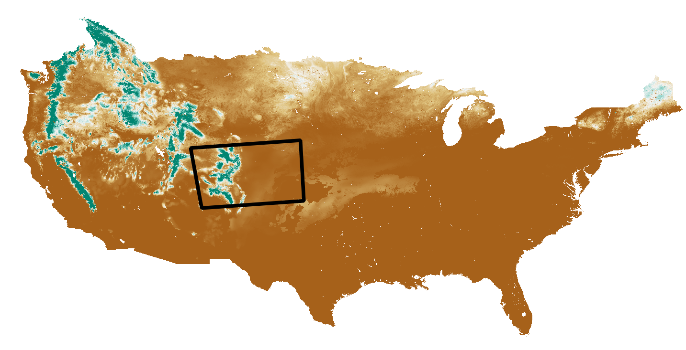

# Table of Contents

 **TODO egiles 2017-01-19 Edit the file structure pathnames to reflect a Linux system**  

The following topics are discussed in this section:<br>

* [Overview](#overview)
* [OSGeo4W64\\](#osgeo4w6492)
* [CDSS\\TsTool-Version\\](#cdss92tstool-version92)
* [CDSS\\SNODASTools\\](#cdss92snodastools92)
	+ [SNODASTools\\bin\\](#snodastools92bin92)
	+ [SNODASTools\\staticData\\](#snodastools92staticdata92)
	+ [SNODASTools\\processedData\\](#snodastools92processeddata92)
		- [processedData\\1_DownloadSNODAS\\](#processeddata921_downloadsnodas92)
		- [processedData\\2_SetFormat\\](#processeddata922_setformat92)
		- [processedData\\3_CliptoExtent\\](#processeddata923_cliptoextent92)
		- [processedData\\4_CreateSnowCover\\](#processeddata924_createsnowcover92)
		- [processedData\\5_CalculateStatistics\\](#processeddata925_calculatestatistics92)
			- [5_CalculateStatistics\\StatisticsbyBasin\\](#processeddata925_calculatestatistics92statisticsbybasin92)
			- [5_CalculateStatistics\\StatisticsbyDate\\](#processeddata925_calculatestatistics92statisticsbydate92)
		- [processedData\\SNODASTools.log\\](#processeddata92snodastoolslog)
	+ [SNODASTools\\SNODASconfig\.ini](#snodastools92snodasconfigini)
	

## Overview

The SNODAS tools process original SNODAS data files, extracted from a tar file, into zonal statistics for 
watershed basins. Zonal statistics are statistics calculated by zone where the zones are defined by an input 
zone dataset and the values are defined by a raster grid. For the SNODAS tools, the input zone dataset is the watershed 
basin boundary shapefile and the raster grid is the clipped and reprojected SNODAS daily grid. 
Originally, these tools were developed for processing snowpack statistics for the state of Colorado. 
Therefore, many file examples shown below display the Colorado state extent. 

After the data is processed, final snowpack statistics can easily be viewed in a choropleth map or exported 
in tabular form. Below is an image of the SNODAS tools results displayed as a choropleth map. Right-click on the image 
and click *Open image in new tab* to see a larger view.


As explained in the [Processing Workflow](overview.md#processing-workflow) section, the tool iterates through various data-manipulation 
processes (ex: downloading the data, clipping the national grid to the extent of the basins, 
calculating the zonal statistics). Each data-manipulation can generate one or more output files. The 
majority of intermediate data files are currently saved to allow for process verification, troubleshooting, 
and avoiding re-downloads should the full analysis period need to be rerun due to changes in the software 
(each daily download of the SNODAS national files takes approximately 7 seconds). 

The following illustrates the overall folder structure for the SNODAS tools, including software and data
files, for Windows. The software is configured using the system\SNODASconfig.ini file, which specifies 
locations of folders and files on the operational system.     
  
*```Nested folders``` are represented by: '---'. *  
*```Files``` are represented by: '--->'.*

 ** File Structure of SNODAS Tools**  
 
  **TODO egiles 2017-01-19 Add system to the folder structure**

```C:\OSGeo4W64\```  
```C:\CDSS\TsTool-Version```  
```C:\CDSS\SNODASTools\``` 
 
--- ```bin\```  
- - - - - > ```SNODASDaily_Automated.py```  
- - - - - > ```SNODASDaily_Interactive.py```  
- - - - - > ```SNODAS_utilities.py```  
- - - - - > ```SNODAS_publishResults.py```   
- - - - - > ```SNODASDaily_Automated_forTaskScheduler.bat```  

--- ```staticData\```    
- - - - - > ```watershedBasinBoundary.shp```   
- - - - - > ```watershedBasinBoundaryExtent.shp```   
- - - - - > ```watershedBasinBoundary.geojson```  
- - - - - > ```stateBoundary.geojson```
 
--- ```processedData\```  
- - - - > ```SNODASTools.log```  
- - - - -  ```1_DownloadSNODAS\```   
- - - - - - - - > ```SNODAS_YYYYMMDD.tar```  
- - - - -  ```2_SetFormat\```   
- - - - - - - - > ```us_ssmv11034tS__T0001TTNATSYYYYMMDD05HP001.tif```  
- - - - -  ```3_ClipToExtent\```   
- - - - - - - - > ```SNODAS_SWE_ClipAndReprojYYYYMMDD.tif```   
- - - - -  ```4_CreateSnowCover\```    
- - - - - - - - > ```SNODAS_SnowCover_ClipAndReprojYYYYMMDD.tif```   
- - - - -  ```5_CalculateStatistics\```   
- - - - - - - - - ```StatisticsbyBasin\```  
- - - - - - - - - - - > ```SnowpackByBasin_LOCALID```  
- - - - - - - - - ```StatisticsbyDate\```  
- - - - - - - - - - - > ```SnowpackByDate_YYYYMMDD```   


--> ```SNODASconfig.ini```


## OSGeo4W64\\

**TODO egiles 2017-01-23 need to add content to OSGeo4W64\\ **  

## CDSS\\TsTool-Version\\

**TODO egiles 2017-01-23 need to add content to CDSS\\TsTool-Version\\ **  

## CDSS\\SNODASTools\\
All SNDOAS scripts, input data and output data are stored within the ```CDSS\SNODASTools\ folder```. 

 * The SNODAS Python and batch scripts are contained within the [SNODASTools\\bin\\](#snodastools92bin92) folder. 

 * The SNODAS input data files are contained within the [SNODASTools\\staticData\\](#snodastools92staticdata92) folder.

 * The SNODAS output data files are contained within the [SNODASTools\\processedData\\](#snodastools92processeddata92) folder.

### SNODASTools\\bin\\

The ```C:\CDSS\SNODASTools\bin\``` folder holds all SNODAS tools' scripts. In total there are five 
scripts:   

	1. SNODASDaily_Automated.py 
	2. SNODASDaily_Interactive.py 
	3. SNODAS_utilities.py  
	4. SNODAS_publishResults.py
	5. SNODASDaily_Automated_forTaskScheduler.bat

**SNODASDaily_Automated.py**	

The ```SNODASDaily_Automated.py``` Python script downloads _the current date's_ SNODAS data from the SNODAS FTP site 
and exports daily snowpack zonal statistics.   

This script only processes the current date's SNODAS data. 
For information on the data processing steps of ```SNODASDaily_Automated.py```, refer to the 
[Processing Workflow](overview.md#processing-workflow) section. For information on the SNODAS FTP site, refer to the
[SNODAS Data](http://software.openwaterfoundation.org/cdss-app-snodas-tools-doc-user/data/overview/) of the user guide. For information on
the output snowpack products, refer to the [SNODAS Tools Products](http://software.openwaterfoundation.org/cdss-app-snodas-tools-doc-user/products/overview/)
section of the user guide.

The ```SNODASDaily_Automated.py``` script is designed to be automatically run using a task scheduler program. Once the task is set 
up, refer to [Task Scheduler](../deployed-env/task-scheduler) section for more information, the script downloads the daily SNODAS data on a daily timer and exports 
the daily zonal statistics to the [processedData\ folder](#folder-snodastools_processeddata). 
 
 **SNODASDaily_Interactive.py**	

The ```SNODASDaily_Interactive.py``` script downloads _historical_ SNODAS data from the SNODAS FTP site 
and exports daily snowpack zonal statistics.   

The ```SNODASDaily_Interactive.py``` script is designed to be interactive. Users can specify historical dates of 
interest and the script exports the zonal statistics corresponding to those dates. The exported statistics of the 
```SNODASDaily_Interactive.py``` are saved in the [processedData\ folder](#folder-snodastools_processeddata) alongside
the exported statistics of the ```SNODAS_DailyAutomated.py``` script.


For information on the data processing steps of ```SNODASDaily_Interactive.py```, refer to the 
[Processing Workflow](overview.md#processing-workflow) section. For information on the SNODAS FTP site, refer to the
[SNODAS Data](http://software.openwaterfoundation.org/cdss-app-snodas-tools-doc-user/data/overview/) section of the user guide. For information
on the output snowpack products, refer to the [SNODAS Tools Products](http://software.openwaterfoundation.org/cdss-app-snodas-tools-doc-user/products/overview/)
section of the user guide.


The ```SNODASDaily_Interactive.py``` script is to be utilized in the following scenarios:


1. The historical SNODAS repository has not yet been processed. 
	* The temporal coverage of the SNODAS data is Septemeber 28th, 2003 to the current date. The ```SNODASDaily_Automated.py``` 
	script automatically creates an ongoing export of SNODAS zonal statistics, once the 
	```SNODASDaily_Automated_forTaskScheduler.bat``` has been set up with  a task scheduler program. The SNODAS historical repository,
	however, must be created with the ```SNODASDaily_Interactive.py``` script.
	
	
2. The ```SNODASDaily_Automated_forTaskScheduler.bat``` failed to run. 
	* The ```SNODASDaily_Automated_forTaskScheduler.bat``` is designed to automatically run ```SNODASDaily_Automated.py``` 
	everyday. There are instances, however, when the task could fail to run for a single or range of days. This could occur, for 
	example, if the task properties are set to run only when the user is signed in and the user was signed off for one or a range 
	of days. The missed days must then be manually processed with the ```SNODASDaily_Interactive.py``` script.
	
	
3. The SNODAS grid displayed incorrect information. 
	* The SNODAS products for a specific day could require an overwrite if the [National Snow & Ice Data Center](https://nsidc.org/) 
	uploaded incorrect SNODAS data and then reloaded a correct set of data. The reprocessing of SNODAS data for that date would be 
	accomplished with the ```SNODASDaily_Interactive.py``` script.

 **SNODAS_utilities.py**	

The ```SNODAS_utilities.py``` script contains all of the functions utilized in the ```SNODASDaily_Automated.py```
and the ```SNODASDaily_Interactive.py``` scripts. For descriptions of the individual ```SNODAS_utilities.py``` 
functions refer to the [Tool Utilities and Functions](overview.md#tool-utilities-and-functions) section.

**SNODAS_publishResults.py**    

**TODO egiles 2017-01-19 develop publishResults.py script and explain**  

**SNODASDaily_Automated_forTaskScheduler.bat**  

The ```SNODASDaily_Automated_forTaskScheduler.bat``` is a batch file to be called by a task scheduler program. It automatically 
runs the ```SNODASDaily_Automated.py``` script everyday. Refer to the [Task Scheduler](../deployed-env/task-scheduler) section for a tutorial on how to 
initially set up the ```SNODASDaily_Automated_forTaskScheduler.bat``` within a task scheduler program.   


### SNODASTools\\staticData\\

Two types of static data, script input data and visualization data, are stored within this folder. 

** Script Input Data**

The SNODAS tools require the input of two static data files. These two data files should be saved 
within this folder prior to running the scripts. 

1. Watershed Basin Shapefile Input (```watershedBasinBoundary.shp```). This shapefile is a collection of basin features for the 
study area of interest. Originally the SNODAS Tools were developed to perform snowpack analysis for the state of Colorado. Below
is an image of the watershed basin shapefile (displayed in green) used for the watershed basin input. The black, boxed 
outline is the Colorado state boundary. 

	- Zonal statistics are statistics calculated by zone where the zones are defined by an input zone dataset and the values 
	are defined by a raster grid. This shapefile is the input zone dataset. 

	- The clipped SNODAS daily rasters are reprojected into the projection of the Watershed Basin Shapefile Input before the zonal 
	statistics are calculated. 
	
	- The projection of the Watershed Basin Shapefile Input is defaulted to NAD83 Zone13N (EPSG code: 26913). If the Watershed Basin
	Shapefile Input has a projection other than NAD83 Zone13N, the default EPSG code in the [configuration file](#snodastools92snodasconfigini)
	under section ```VectorInputShapefile``` option ```projection_epsg``` must be altered.


2. Watershed Basin Extent Shapefile Input (```watershedBasinBoundaryExtent.shp```). This single-feature shapefile extends 
slightly beyond the extent of the watershed basin shapefile to ensure all areas of the study area are accurately represented 
by the SNODAS data. Below is an image of the watershed basin extent shapefile (displayed in green) used for the Colorado watershed
 basin extent input. The Colorado watershed basin shapefile is overlaid with a transparent fill. 

	- This shapefile decreases the processing time of the scripts by clipping the national SNODAS grid to the manageable size of the 
	study area. The watershed basin extent shapefile should have the same projection as the natial SNODAS grid in order to create a clean 
	clip of the data.   
	

	- The downloaded SNODAS raster does not have a projection however the ["SNODAS fields are grids of point estimates of snow 
	cover in latitude/longitude coordinates with the horizontal datum WGS84."](http://nsidc.org/data/docs/noaa/g02158_snodas_snow_cover_model/)  
	
		
	- The SNODAS tools assign the SNODAS grids the same projection as the Watershed Basin Extent Shapefile Input (defined in the configuration file).
	The projection of the Watershed Basin Extent Shapefile Input is defaulted to WGS84 (EPSG code: 4326) - this is recommended given the previous bullet point. 
	However, if the Watershed Basin Extent Shapefile Input has a projection other than WGS84, the default EPSG code 
	in the [configuration file](#snodastools92snodasconfigini) under section ```VectorInputExtent``` option ```projection_epsg``` must be altered.


 
** Visualization Data **

As previously mentioned, the output products can be displayed in tabular form or in a choropleth map. The static visualization 
data is used in the choropleth map. The visualization data are .GeoJSON files. 
A [GeoJSON file](http://learn.openwaterfoundation.org/owf-learn-geojson/index.html) is " an open standard format designed for 
representing simple geographical features, along with their non-spatial attributes, based on JavaScript Object Notation." 
- [Wikipedia:GeoJSON](https://en.wikipedia.org/wiki/GeoJSON).


1. Watershed Basin Boundary (```watershedBasinBoundary.geojson```). The watershed basin boundary GeoJSON file is the watershed
basin shapefile input converted into a GeoJSON file. This file displays the individual basin boundaries for which the zonal 
statistics are calculated. In a choropleth map, each basin of the watershed basin boundary GeoJSON file is filled with a 
color representing a daily snowpack statistic. 

2. State Boundary (```stateBoundary.geojson```). The state boundary GeoJSON file gives viewers of the choropleth map a sense of 
location. Note that this file is defined as state boundary only because the SNODAS tools were originally developed for the state
of Colorado. If the study area is other than state-level, it might be more appropriate to adjust this layer to represent a location 
of corresponding scale (ex: basin extent, study area, etc.).

### SNODASTools\\processedData\\

All output products of ```SNODASDaily_Automated.py``` and ```SNODASDaily_Interactive.py``` are saved within the processedData\ folder. 
For each processed day of data, 6 output products are created. To see a larger view of the images below, right-click on the image and 
click *Open image in new tab*.

1. The originally downloaded national SNODAS .tar file  
	- ```SNODAS_YYYYMMDD.tar``` 
	  
2. The reformatted national SNODAS SWE data in .tif format  
	 - ```us_ssmv11034tS__T0001TTNATSYYYYMMDD05HP001.tif```
	 
3. The clipped and reprojected SNODAS SWE .tif file  
	- ```SNODAS_SWE_ClipAndReprojYYYYMMDD.tif```  
	
4. The clipped and reprojected snow cover binary .tif file  
	- ```SNODAS_SnowCover_ClipAndReprojYYYYMMDD.tif```  
	
5. The snowpack statistics in a .csv file organized by basin ID  
	 - ```SnowpackByBasin_LOCALID```  
	 
6. The snowpack statistics in a .csv file organized by date  
	 - ```SnowpackByDate_YYYYMMDD``` 
	 


The 6 output products are saved within subfolders of the processedData folder. Each subfolder is explained in further detail below. 
The name of each subfolder is described by the default name. However, the following folder names can be edited in the 
[configuration file](#snodastools92snodasconfigini).  

#### processedData\\1_DownloadSNODAS\\

The SNODAS tools access the [SNODAS FTP site](ftp://sidads.colorado.edu/DATASETS/NOAA/G02158/masked/) and download the daily 
SNODAS .tar file. If the ```SNODASDaily_Automated.py``` script is utilized, the daily SNODAS .tar file is the current date. If the 
```SNODASDaily_Interactive.py``` script is utilized, the daily SNODAS tar file is the date of interest defined by user input. 

The file is downloaded to the 1_DownloadSNODAS folder and is named ```SNODAS_YYYYMMDD.tar``` where ```YYYYMMDD``` represents the date of data. 
Note that the date does not represent the download date but rather the date when the SNODAS data is collected. 

	Example: 
	Downloaded SNODAS file for January 9th, 2013 -> SNODAS_20130109.tar

Refer to the [Processing Workflow](overview/#download-snodas-data) section for a general description of the SNODAS tools' downloading step. 
Refer to [Tool Utilities and Functions](overview.md#1-download-snodas-data) for detailed information on the Python functions 
called to download the SNODAS data.

#### processedData\\2_SetFormat\\

The SNODAS tools manipulate the ```SNODASYYYYMMDD.tar``` file to produce a SNODAS Snow Water Equivalent (SWE) national grid in .tif format, 
shown below.


Refer to the [Processing Workflow](overview/#convert-snodas-data-formats) section for a general description of the SNODAS tools' set format step. 
Refer to [Tool Utilities and Functions](overview.md#2-convert-data-formats) for detailed information on the Python functions 
called to set the format of the SNODAS data.

The manipulated SNODAS SWE .tif file is saved to the 2_SetFormat folder and is named ```us_ssmv11034tS__T0001TTNATSYYYYMMDD05HP001.tif```
where ```YYYYMMDD``` represents the date of data. Note that the date does not represent the download date but rather the date when the 
SNODAS data is collected. 

	Example: 
	SNODAS SWE .tif file for January 9th, 2013 -> us_ssmv11034tS__T0001TTNATS2013010905HP001.tif

The long and cryptic name of this file can be explained with the [NSIDC SNODAS user guide](http://nsidc.org/data/docs/noaa/g02158_snodas_snow_cover_model/index.html).   
The naming convention variables are described below:

**us: region of the file**  
'us': United States  
  
**ssm: model used to generate the estimates**  
'ssm': simple snow model  
   
**v1: signifies if the file contains snow model driving data or model output**  
'v1': operational snow model output  

**1034: product code representing the snow parameter represented by the data**  
'1034': snow water equivalent  
 
**tS\__: a vertical integration code that denotes what type of snow pack data are being collected **  
'tS__': integral through all the layers of the snow pack  

**T0001: time integration code**  
'T0001': a one-hour snapshot  
  
**TTNA: detail of snow modeling operations**  
'TTNA': will always be TTNA  
  
**TS: time step code**  
TS is followed by the year, month, day, and hour of the start of the last time step of the 
integration period for which the data applies. For example, the time integration code, 
T0024, and time step code, TS2003102305, are for the time interval 2003-10-22 06 to 
2003-10-23 05.    

**YYYY: 4-digit year**  
'YYYY': dependent on date of data   
  
**MM: 2-digit month**  
'MM': dependent on date of data    

**DD: 2-digit day of month**   
'DD': dependent on date of data  
 
**05: 2-digit hour of day**  
'05': 5th hour of the day  
  
**H: time interval**  
'H': hourly  
 
**P001: offset code referring to where the data applies during a snow model time step in the snow 
model's differencing scheme**  
'P001': field represents a total flux for the entire time step such as precipitation or that a field
represents data at the end of a time step  

-----------------------------------------------------------------------------------------------------

**2_SetFormat\OtherParameters folder**  
There are multiple SNODAS parameters that are included in the downloaded SNODAS .tar file. Those parameters are:

1. Snow Water Equivalent (SWE)
2. Snow Depth
3. Snow Melt Runoff at Base of Snow Pack
4. Sublimation from the Snow Pack
5. Sublimation of Blowing Snow
6. Solid Precipitation
7. Liquid Precipitation
8. Snow Pack Average Temperature  

The SNODAS tools are defaulted to delete all SNODAS parameters except for Snow Water Equivalent. However, the 
```SaveALLSNODASparameters``` section of the [configuration file](#snodastools92snodasconfigini) allows for users to save all the data from the seven 
other SNODAS parameters. 
If configured, the SNODAS tools create a new folder called ```OtherParameters``` under the
```2_SetFormat``` folder. All extracted data regarding the SNODAS parameters, other than SWE, is saved within the  ```2_SetFormat\OtherParameters``` folder.  
 
- The SNODAS data files saved in the ```2_SetFormat\OtherParameters``` folder follow the file naming convention described by 
the [NSIDC SNODAS user guide](http://nsidc.org/data/docs/noaa/g02158_snodas_snow_cover_model/index.html). 
    


#### processedData\\3_CliptoExtent\\

The SNODAS tools clip the ```us_ssmv11034tS__T0001TTNATSYYYYMMDD05HP001.tif``` file to the 
[Watershed Basin Extent Shapefile Input](#snodastools92staticdata92) (```watershedBasinBoundaryExtent.shp```).
The clipped file, shown below for the Colorado dataset, is projected into the desired projection configured in the 
[configuration file](#snodastools92snodasconfigini). The projection of the clipped .tif is defaulted to NAD83 Zone 13N. 
It is pertinent to change the desired projection if the study area is outside the appropriate Zone 13N range.

 = 

The clipped and reprojected SNODAS .tif file is saved to the 3_ClipToExtent folder and is named ```SNODAS_SWE_ClipAndReprojYYYYMMDD.tif``` 
where ```YYYYMMDD``` represents the date of data. Note that the date does not represent the download date but rather the date when the SNODAS 
data is collected. 

	Example: 
	Clipped and reprojected SNODAS file for January 9th, 2013 -> SNODAS_SWE_ClipAndReproj20130109.tif
	
Refer to the [Processing Workflow](overview/#clip-and-project-snodas-national-grids-to-study-area) section for a general description of the SNODAS tools' clip and reprojecting steps. 
Refer to [Tool Utilities and Functions](overview.md#3-clip-and-project-snodas-national-grids-to-study-area) for detailed information on the Python functions 
called to clip and reproject the SNODAS data.

#### processedData\\4_CreateSnowCover\\

The SNODAS tools create a daily binary raster grid displaying presence and absence of snow cover. The created snow cover .tif file is saved to the 
4_CreateSnowCover folder and is named ```SNODAS_SnowCover_ClipAndReprojYYYYMMDD.tif``` where ```YYYYMMDD``` represents the date of data. Note 
that the date does not represent the download date but rather the date when the SNODAS data is collected. 

	Example: 
	Clipped and reprojected snow cover file for January 9th, 2013 -> 
	SNODAS_SnowCover_ClipAndReproj20130109.tif

```SNODAS_SnowCover_ClipAndReprojYYYYMMDD.tif```, shown below for the Colorado dataset, is created by iterating through the cells of 
the ```SNODAS_SWE_ClipAndReprojYYYYMMDD.tif``` file and assigning cell values dependent on the following guidelines:

|SNODAS_```SWE```_ClipAndReprojYYYYMMDD|SNODAS_```SnowCover```_ClipAndReprojYYYYMMDD|
| ---------------------------------- | ---------------------------------------- |
| a cell has a value greater than 0 (there is snow on the ground)| the corresponding cell is assigned a value of '1' (presence of snow displayed in white)|
| a cell has a value equal to 0 (there is no snow on the ground)| the corresponding cell is assigned a value of '0' (absence of snow displayed in black)|
| a cell has a value equal to -9999 (a null value)| the corresponding cell is assigned a value of '-9999' (a null value)|


Refer to the [Processing Workflow](overview/#create-the-binary-snow-cover-raster) section for a general description of the SNODAS tools' Create Snow Cover step. 
Refer to [Tool Utilities and Functions](overview.md#4-create-the-binary-snow-cover-raster) for detailed information on the Python functions 
called to create the daily snow cover .tif file.

	

#### processedData\\5_CalculateStatistics\\

The SNODAS tools perform zonal statistics on the ```SNODAS_SWE_ClipAndReprojYYYYMMDD.tif``` file where zones are defined by the individual features of the
[Watershed Basin Shapefile Input](#snodastools92staticdata92) (```watershedBasinBoundary.shp```). The statistics are exported into two types of .csv files. 

** .CSV File Type 1: Snowpack Statistics organized By Basin **  

The zonal statistics are saved by basin where a separate .csv file is saved for each basin of the 
[Watershed Basin Shapefile Input](#snodastools92staticdata92) (```watershedBasinBoundary.shp```). Refer to the 
[processedData\\5_CalculateStatistics\\StatisticsbyBasin\\](#processeddata925_calculatestatistics92statisticsbybasin92) section for more information.  

** .CSV File Type 2: Snowpack Statistics organized By Date **

The zonal statistics are save by date where a separate .csv file is saved for each date processed by the SNODAS tools. Refer to the 
[processedData\\5_CalculateStatistics\\StatisticsbyDate\\](#processeddata925_calculatestatistics92statisticsbydate92) section for more information.


The calculated zonal statistics are:

|Statistic|Description|CSV Column Header|
|-------|------------------------|----------|
|SWE Mean (m)| The daily SWE mean in meters for each basin of the watershed basin shapefile input.|SNODAS_SWE_Mean_m|
|SWE Minimum (m)| The daily SWE minimum in meters for each basin of the watershed basin shapefile input.|SNODAS_SWE_Min_m|
|SWE Maximum (m)|The daily SWE maximum in meters for each basin of the watershed basin shapefile input.|SNODAS_SWE_Max_m|
|SWE Standard Deviation (m)|The daily SWE standard deviation in meters for each basin of the watershed basin shapefile input.|SNODAS_SWE_StdDev_m|
|cell Count| The number of cells within each basin of the watershed basin shapefile input.|SNODAS_cell_Count|
|Percent of Snow Coverage|The percentage of land within each basin of the watershed basin shapefile input covered by snow.|SNODAS_SnowCover_percent|
|SWE Mean (in)| The daily SWE mean in inches for each basin of the watershed basin shapefile input.|SNODAS_SWE_Mean_in|
|SWE Minimum (in)| The daily SWE minimum in inches for each basin of the watershed basin shapefile input.|SNODAS_SWE_Min_in|
|SWE Maximum (in)|The daily SWE maximum in inches for each basin of the watershed basin shapefile input.|SNODAS_SWE_Max_in|
|SWE Standard Deviation (in)|The daily SWE standard deviation in inches for each basin of the watershed basin shapefile input.|SNODAS_SWE_StdDev_in|

Refer to the [Processing Workflow](overview/#intersect-snodas-colorado-grid-with-colorado-basins-and-calculate-statistics) section for a general description of the SNODAS tools' calculate statistics step. 
Refer to [Tool Utilities and Functions](overview.md#5-calculate-and-export-zonal-statistics) for detailed information on the Python functions called to create 
the .csv files and calculate and export the zonal statistics.


#### processedData\\5_CalculateStatistics\\StatisticsbyBasin\\
As previously explained, the snowpack zonal statistics are organized and exported into two different types of .csv files, by basin and by date. 
 
There is one SnowpackStatisticsByBasin_XXXX.csv file for **each** feature of the [Watershed Basin Shapefile Input](#snodastools92staticdata92) (```watershedBasinBoundary.shp```).
The statistics organized by basin provide change analysis capabilities because the data show the change in snowpack statistics for a specific basin 
throughout time.  

*'XXXX'* is the unique ID identifying each basin feature. This ID is located as a field within the attribute table of the [Watershed Basin Shapefile Input](#snodastools92staticdata92)
(```watershedBasinBoundary.shp```). It is important to assign the name of the attribute field holding the basin ID information in the 
[configuration file](#snodastools92snodasconfigini) before running the scripts so that the *'XXXX'* field in the naming convention is correctly populated. 
 
	Example: 
	Zonal statistics by basin .csv file for basin 'ALAC2' on January 9th, 2013 -> 
	SnowpackStatisticsByBasin_ALAC2.csv
	
Each SnowpackStatisticsByBasin_XXXX.csv contains rows of snowpack statistics organized by processed date. Every time a new date of SNODAS data is run, each 
SnowpackStatisticsByBasin_XXXX.csv file is updated with a new row of statistics. 

An example of a SnowpackStatisticsByBasin_XXXX.csv file is shown below. You can see that the dates, January 1st through January 5th, 2017, have been 
processed by the SNODAS tools. The red circle shows that all values under the Local_ID column (the watershed basin ID) are equivalent.
Right-click on the image and click *Open image in new tab* to see a larger view. 


	
#### processedData\\5_CalculateStatistics\\StatisticsbyDate\\
As previously explained, the snowpack zonal statistics are organized and exported into two different types of .csv files, by basin and by date. 
 
There is one SnowpackStatisticsByDate_YYYYMMDD.csv file for **each** date of processed SNODAS data where ```YYYYMMDD``` represents the date of data. 
Note that the date does not represent the download date but rather the date when the SNODAS data is collected. The statistics organized by date provide 
landscape comparison capabilities because the data shows the varying daily snowpack statistics for each basin in the study area. 

	Example: 
	Zonal statistics by date .csv file for January 9th, 2013 -> 
	SnowpackStatisticsByDate_20130109.csv
	
Each SnowpackStatisticsByDate_YYYYMMDD.csv contains rows of snowpack statistics organized by basin ID. Each basins' statistics are saved within individual 
rows of the .csv file. 

An example of a SnowpackStatisticsByDate_YYYYMMDD.csv file is shown below. The daily statistics (October 15th, 2014) for all basins of the 
[Watershed Basin Shapefile Input](#snodastools92staticdata92) (```watershedBasinBoundary.shp```) are represented. The red circle shows that all 
values under the Date_YYYYMMDD column are equivalent. Right-click on the image and click *Open image in new tab* to see a larger view. 


#### processedData\\SNODASTools.log

The SNODAS Tools are set to export logging messages to aid in troubleshooting. The logging setting for the SNODAS Tools are configured with the
[configuration file format](https://docs.python.org/2.7/library/logging.config.html#configuration-file-format). 

**Levels of Logging Messages**  
The SNODAS Tools are set to export logging messages to both the console and the SNODASTools.log file. Warning and error messages export to both the console and the
SNODASTools.log file. Info messages are defaulted to export *solely* to the SNODASTools.log file. The logging level of messages exported to the 
SNODASTools.log file can be changed from the defaulted ```DEBUG``` level in the [configuration file](#snodastools92snodasconfigini) under section ```logger_log02``` option ```level```.

**Formatting of Logging Messages**  
All logging messages are formatted to the default simpleFormatter. The simpleFormatter outputs the date and local time of the created log record
 (```YYYY-MM-DD  HH:MM:SS,MSS``` where ```MSS``` refers to the three-digit millisecond value) followed by the logging message.   
 
 The logging message follows the format: ```SSSS: EEEE: MMMM``` where:
 
 |Format|Description|Example|
 |----|------|---|
 |SSSS|The name of the .py script or function for which the log message is regarding.|_SNODASDaily_Interactive.py:_|
 |EEEE|The logging level of the log message. Only present if the logging level is a warning or an error.|_WARNING:_|
 |MMMM|The logging message.| _SNODAS_20110217.tar has been untarred._|
 
 The format of the logging messages can be changed from the defaulted ```%(asctime)s %(message)s``` in the [configuration file](#snodastools92snodasconfigini)
 under section ```formatter_simpleFormatter``` option ```format```.


**Timed Rotating File Handler**  
If the SNODASTools.log logging level is set to default ```DEBUG```, all logging messages will be written to the SNODASTools.log file. For each processed day of SNODAS
data, the size of the SNODASTools.log file will increase by approximately 12KB. The SNODAS Tools are designed to run everyday. This high frequency of processing would
quickly cause the SNODASTools.log file to become incredibly large. To address this issue, the SNODASTools.log file is configured to run on a
[Timed Rotating File Handler](https://docs.python.org/2/library/logging.handlers.html#timedrotatingfilehandler).

The timed rotating file handler creates and updates multiple versions of the SNODASTools.log file based upon a configured temporal schedule. After an allotted amount of time
(defaulted to 5 weeks), the oldest version of the SNODASTools.log is deleted and only the most recent log files are available. By default, a new SNODASTools.log 
file is created every Monday, local time. The SNODASTools.log file from the previous week is assigned a numerical suffix of '1' and saved in the processedData folder. 

 - **Note**:  
 If ```SNODASTools1.log``` already exists, it is renamed to ```SNODASTools2.log```.   
 If ```SNODASTools2.log``` already exists, it is renamed to ```SNODASTools3.log```. And so on.   
 The ```SNODASTools5.log``` file is deleted and the previous ```SNODASTools4.log``` is renamed ```SNODASTools5.log```.

|Name of Log File|Included Logging Messages|
|------|------|
|SNODASTools.log|All logging messages from the current week (starting on Monday).| 
|SNODASTools1.log|All logging messages from last week.| 
|SNODASTools2.log|All logging messages from two weeks ago.| 
|SNODASTools3.log|All logging messages from three weeks ago.|  
|SNODASTools4.log|All logging messages from four weeks ago.| 
|SNODASTools5.log|All logging messages from five weeks ago.| 
 
The default setting saves 5 versions of the 
SNODASTools.log file. This means that any processing from the past 5 weeks can be accessed. SNODASTools.log files older than 5 weeks are deleted. 
The previous 5 versions of the SNODASTools.log are saved under the processedData. 

As previously mentioned, each processed SNODAS date increases the individual SNODASTools.log file by approximately 12KB. Given the default setting of the timed rotating 
file handler, each log file will be approximately 84KB (daily size of 12KB multiplied by the 7 days of the week). The total size of file space used for SNODAS Tools' 
logging will be approximately 420KB (weekly log file size of 84KB multipled by 5 weeks of backup files).

 - **Note**:  
 The size increase of the SNODASTools.log file will be larger than 12KB for each processed date of SNODAS data if the processed date of SNODAS data is being rerun and 
 the original files are being overwritten. 

The settings of the timed rotating file handler can be changed in the [configuration file](#snodastools92snodasconfigini)
 under section ```handler_fileHandler``` option ```args```. There are 4 arguments (filename, type of time interval, interval, and backupConut) that can be altered within the option ```args```.
 
|Argument|Description|Defaulted to:|
|-----|----|------|
|Filename|The full pathname to the location of the log file.|../processedData/SNODASTools.log|
|Type of Time Interval|Time interval type when a new log file is to be created. <br> <br> Options: seconds, days, weekdays, etc.|<center>'W0' Monday|
|Interval|Time interval. <br> <br> Example (if type of time interval = 'days'): <br> 1 - every day <br> 2 - every other day <br> 5 - every five days, etc.|<center>1|
|backupCount|The number of previous SNODASTools.log files to be saved.|<center>5|


 Refer to the Python tutorial documentation for further information regarding the 
 argument options of a [TimedRotatingFileHandler](https://docs.python.org/2/library/logging.handlers.html#timedrotatingfilehandler) class.


### SNODASTools\\SNODASconfig.ini		

The ```SNODASconfig.ini``` is located in the ```SNODASTools``` folder and contains Python input variables and logging settings for the SNODAS tools.   

The configuration file is divided into *sections*. The sections are the broad categories of SNODAS configurables.  

	Example: 
	
	'VectorInputExtent' is the section header for all configurables related to the  
	Watershed Basin Extent Shapefile Input.   

Under each section, there are corresponding *options* that relate to the section.  

	Example: 
	
	'pathname' and 'projection_epsg' are options under the 'VectorInputExtent' section. 
	
	'pathname' refers to the location of the Watershed Basin Extent Shapefile Input. 
	'projection_epsg' refers to the projection of the Watershed Basin Extent Shapefile Input.
	
All configuration file sections and corresponding options are explained in the table below. The defaults of each configuration option is listed in the far-right column. 
The options that are defaulted to 'N/A' are pathnames that are specific to the local computer of the deployed environment.   

Note: The table entries starting at ```loggers:keys``` and ending at ```formatter_simpleFormatter:format``` refer to the configuration of the logging file. For information regarding how
the logging file is configured, reference the [processedData\SNODASTools.log](#processeddata92snodastoolslog) section.

|Configuration File <br> **Section**<br>Option|Description|Defaulted <br> to:|
|--------------------------|------------|---|
|**RootFolder**<br> pathname|The full pathname to the folder holding the SNODAS <br> tools output data. Configurations value must end in CDSS\SNODASTools\processedData.|N/A|
|**VectorInputShapefile**<br> pathname|The full pathname to the [Watershed Basin Shapefile Input](#snodastools92staticdata92). Configurations value must end in CDSS\SNODASTools\staticData\watershedBasinBoundary.shp.|N/A|
|**VectorInputShapefile**<br> projection_epsg|The numerical EPSG code of the [Watershed Basin Shapefile Input](#snodastools92staticdata92).|26913|
|**VectorInputShapefile**<br> basin_id|The attribute field name of the [Watershed Basin Shapefile Input](#snodastools92staticdata92) defining each unique feature or basin.|LOCAL_ID|
|**VectorInputExtent**<br> pathname|The full pathname to the [Watershed Basin Extent Shapefile Input](#snodastools92staticdata92). Configurations value must end in CDSS\SNODASTools\staticData\watershedBasinBoundaryExtent.shp.|N/A|
|**VectorInputExtent**<br>projection_epsg|The numerical EPSG code of the [Watershed Basin Extent Shapefile Input](#snodastools92staticdata92).|4326|
|**QGISInstall**<br>pathname|The full pathname to the location of the [QGIS software](../dev-env/qgis.md#qgis-and-bundled-python) on the local computer.|C:/OSGeo4W/apps/qgis|
|**SaveALLSNODAS<br>parameters**<br>value|False: SNODAS tools delete all SNODAS parameters other than SWE. <br> True: SNODAS tools save ALL extracted daily SNODAS parameter files in folder [2_SetFormat\\OtherParameters](#processeddata922_setformat92)|False|
|**SNODAS_FTPSite**<br>webstite|The SNODAS FTP site url.|sidads.colorado.edu|
|**SNODAS_FTPSite**<br>username|The username used to access the SNODAS FTP site. The defaulted generic username does not need to be changed.|anonymous|
|**SNODAS_FTPSite**<br>password|The password used to access the SNODAS FTP site. The defaulted generic password does not need to be changed.|None|
|**SNODAS_FTPSite**<br>folder|The path to the folder containing the SNODAS masked data files.|/DATASETS/NOAA/G02158/masked/|
|**SNODAS_FTPSite**<br>null_value|The SNODAS data null value. This should remain at default unless NOHRSC changes the null value.|-9999|
|**FolderNames**<br>download|The name of the [download folder](#processeddata921_downloadsnodas92) located in the processedData folder.|1_DownloadSNODAS|
|**FolderNames**<br>setformat|The name of the [set format folder](#processeddata922_setformat92) located in the processedData folder.|2_SetFormat|
|**FolderNames**<br>clip|The name of the [clip folder](#processeddata923_cliptoextent92) located in the processedData folder.|3_ClipToExtent|
|**FolderNames**<br>snow_cover|The name of the [create snow cover folder](#processeddata924_createsnowcover92) located in the processedData folder.|4_CreateSnowCover|
|**FolderNames**<br>calculate_statistics|The name of the [calculate statistics folder](#processeddata925_calculatestatistics92) located in the processedData folder.|5_CalculateStatistics|
|**FolderNames**<br>by_date|The name of the [statistics by Date folder](#processeddata925_calculatestatistics92statisticsbydate92) located in the calculate statistics folder.|/StatisticsbyDate|
|**FolderNames**<br>by_basin|The name of the [statistics by Basin folder](#processeddata925_calculatestatistics92statisticsbybasin92) located in the calculate statistics folder.|/StatisticsbyBasin|
|**loggers**<br>keys|The available SNODASTools logs. This should not be changed unless a new log configration is to be created.|root, log02|
|**handlers**<br>keys|The available SNODASTools handlers. This should not be changed unless a new handler is to be created.|fileHandler, consoleHandler|
|**formatters**<br>keys|The available SNODASTools formatters. This should not be changed unless a new formatter is to be created.|simpleFormatter|
|**logger_root**<br>level|The log level of the 'root' logger.|WARNING|
|**logger_root**<br>handlers|The handler used for the 'root' logger.|consoleHandler|
|**logger_log02**<br>level|The log level of the 'log02' logger.|DEBUG|
|**logger_log02**<br>handlers|The handler used for the 'log02' logger.|fileHandler|
|**logger_log02**<br>qualname|The name used to call the log in the SNODASTools' applications.|log02|
|**logger_log02**<br>propogate|Propogation setting. <br> 1 to indicate that messages must propagate to handlers higher up the logger hierarchy from this logger, or 0 to indicate that messages are not propagated to handlers up the hierarchy.|0|
|**handler_consoleHandler**<br>class|The class type of the consoleHandler.|StreamHandler|
|**handler_consoleHandler**<br>level|The log level of the consoleHandler.|NOTSET|
|**handler_consoleHandler**<br>formatter|The formatter of the consoleHandler.|simpleFormatter|
|**handler_consoleHandler**<br>args|The location of output log messages for the consoleHandler.|(sys.stdout,)|
|**handler_fileHandler**<br>class|The class type of the fileHandler.|handlers.TimedRotatingFileHandler|
|**handler_fileHandler**<br>level|The log level of the fileHandler.|NOTSET|
|**handler_fileHandler**<br>formatter|The formatter of the fileHandler.|simpleFormatter|
|**handler_fileHandler**<br>args|The options for the TimedRotatingFileHandler (filename, when to rotate, rotation interval, backupCount) |('../processedData/SNODASTools.log', 'W1', 1, 5)|
|**formatter_simpleFormatter**<br>foramt|The format of log messages.|%(asctime)s %(message)s|
