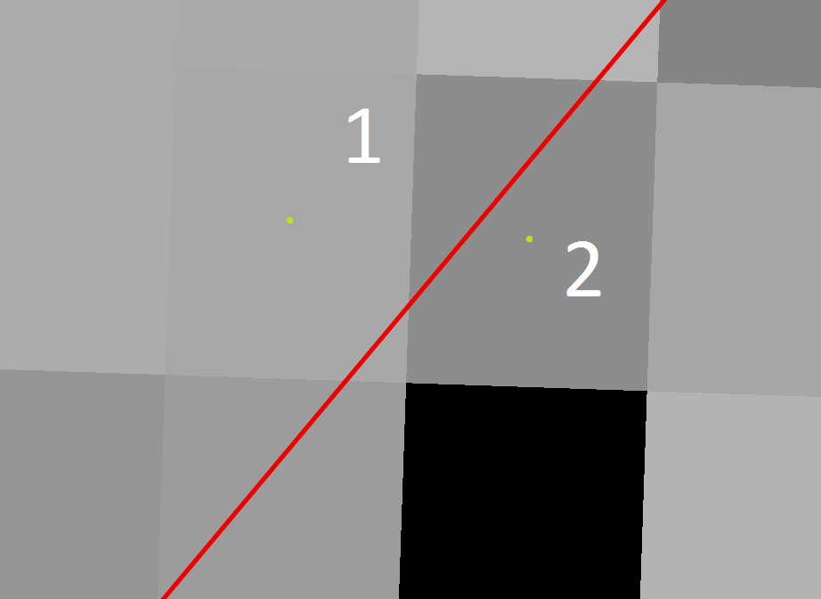
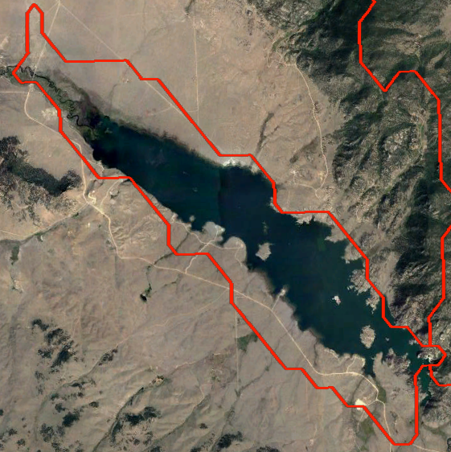
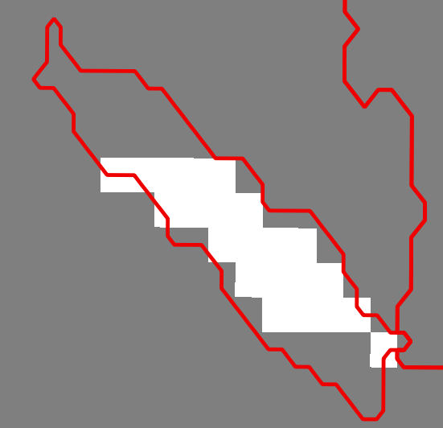
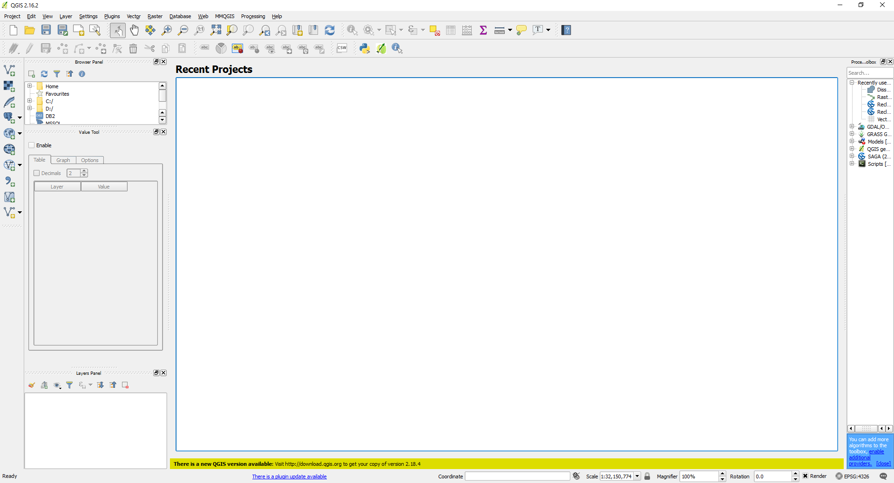
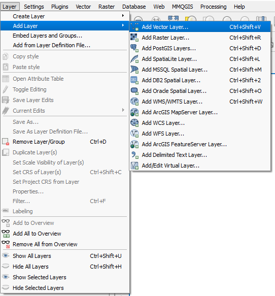
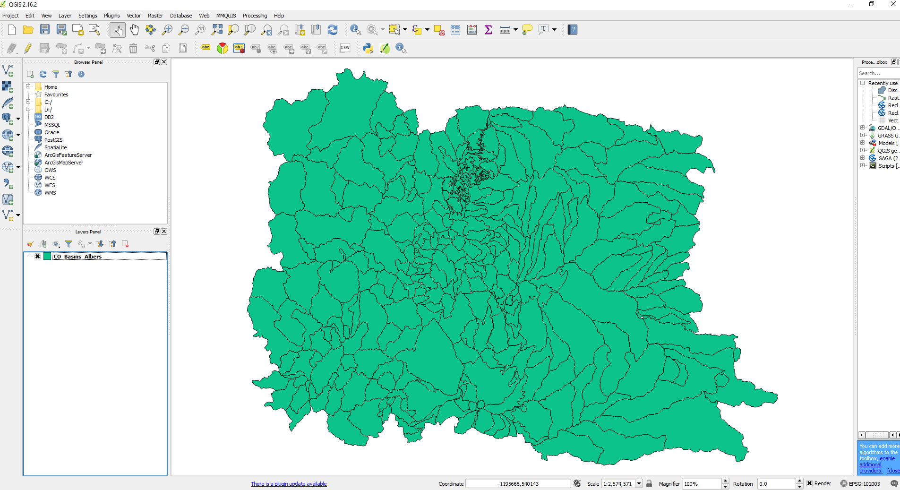
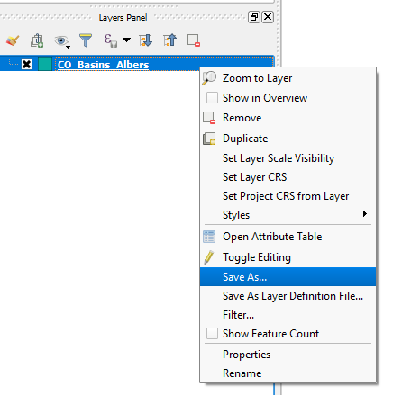
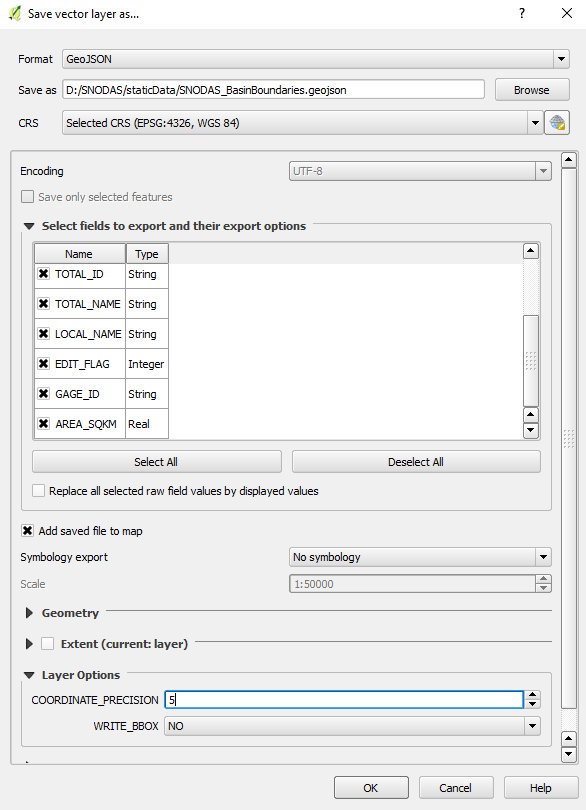

# Table of Contents 

The following topics are discussed in this section:

* [Handling Overlapping Basin Boundaries](#handling-overlapping-basin-boundaries)
* [Handling Cells Overlapped by Multiple Features](#handling-snodas-cells-overlapped-by-multiple-features)
* [Handling Large Bodies of Water](#handling-large-bodies-of-water)	
	- [Calculating SNODAS SWE Statistics](#calculating-snodas-swe-statistics)
	- [Calculating Snow Cover Statistics](#calculating-snow-cover-statistics)
* [Handling Missing Values](#handling-missing-snodas-values)
* [Handling Elevation Zones](#handling-elevation-zones)
* [Handling the One Week Change in Total Snow Volume Statistic](#handling-the-one-week-change-in-total-snow-volume-statistic)
* [Creating the basin boundary GeoJSON file for the Web Application](#creating-the-basin-boundary-geojson-file-for-the-web-application)


# Handling Overlapping Basin Boundaries

The QGIS Zonal Statistics tool produces correct statistics even if the features of the [Watershed Basin Shapefile Input](file-structure.md#snodastools92staticdata92)
are overlapping.   

Below is an example of overlapping features in a shapefile. The dark grey lines represent basin boundaries and the red circles pinpoint the areas of overlap. 

<center></center>

Often watershed basin shapefiles have overlapping polygon features due to the combining of datasets, overlaying of reservoir boundaries, etc. With the ArcGIS 
zonal statistics tool, this overlapping phenomenon creates inaccurate results. This is because the ArcGIS zonal statistics tool converts the vector input zonal dataset 
into a raster grid before processing the statistics. Raster grid cells can only be classified by one feature of the input zonal dataset. Therefore, if a SNODAS cell 
is overlapped by two or more basins of the input zonal dataset, only one of the basins will include the cell's SNODAS value. 

Fortunately, the QGIS Zonal Statistics tool iterates over each feature independently to calculate the statistics creating accurate statistics for both independent and 
overlapping polygons.  The code for the QGIS Zonal Statistics tool can be viewed 
[here](https://github.com/qgis/QGIS/blob/a2f51260db5357917e86b78f1bb2915379d670dd/src/analysis/vector/qgszonalstatistics.cpp).

The Colorado watershed basin shapefile input used for the Colorado Water Conservation Board project has many overlapping basin boundaries. 
This is due to:    

 1. The Colorado watershed basin shapefile input is a conglomeration of muliple basin boundary shapefiles. 
 2. Sections of the Colorado watershed basin shapefile are divided into elevation zones.
 
 ** TODO egiles 03/16/17 add to this section - may need input from Steve and Amy on proper wordiing **

# Handling SNODAS cells Overlapped by Multiple Features

The QGIS Zonal Statistic tool calculates statistics on the daily SNODAS raster cells inside of each basin feature. There are scenarios, however, where a SNODAS cell is 
split by a basin boundary causing the cell to be in two different polygon features at once. However, each raster cell can only be assigned to one polygon. QGIS zonal statistics
use the location of the cell's center to determine which polygon the cell "belongs".   

 - Note: The only scenario where this is not true is if the cell resolution is larger than the polygon area. In this scenario, the snowpack statistics are calculated with the *weighted proportion* 
 method. For more infomation about weighted proportions, reference [line 329](https://github.com/qgis/QGIS/blob/a2f51260db5357917e86b78f1bb2915379d670dd/src/analysis/vector/qgszonalstatistics.cpp#L329) 
 of the QGIS Zonal Statistics code. 

An example of the daily SNODAS cells overlapped by multiple features is shown below. The red line is a basin boundary. The green dots represent the center point of each SNODAS cell.
Using the cell center technique, *cell 1* is used to calculate the zonal statistics of the upper-left basin whereas *cell 2* is used to calculate the zonal statistics of the 
lower-right basin.

<center></center>

# Handling Large Bodies of Water

Snowfall on large bodies of water, like a lake or reservoir, will react considerably differently than snowfall on the ground. 

## Calculating SNODAS SWE Statistics

To mitigate data errors due to the *large bodies of water* phenomenon the SNODAS model applies an open water mask to the landscape assigning open water cells a null value. 
 The QGIS Zonal Statistics tool disregards cells with no-data values when calculating all output statisiics - count, mean, etc. 
 The SWE statistics, therefore, are only representative of non-water areas. 
 
Note that the open-water mask is dynamic. A cell that is assigned an open-water null value one day could be assigned a snow statistic the next day. For this reason, the effective 
area of each basin is calculated every day. The effective area is the approximate area of land for each basin (null cells are not represented in the areal calculation). If the open-water mask
changes, the effective area will also be changed. 

Below are two images displaying the open-water mask phenomenon. The aerial image on the top is of the Eleven Mile Reservoir in Colorado (the basin is outlined in red). 
The image on the bottom is the Eleven Mile Reservoir boundary (also in red) atop a daily SNODAS raster grid. The grid is set to color null values, cells representing open bodies of water, as white. As shown,
the open water body is not included in the SNODAS grid. Given the open-water mask, the effective area of the Eleven Mile Reservoir basin would be approximately half of the total area. 
 
 <center></center>   
  
 <center></center> 
 
## Calculating Snow Cover Statistics

For each basin, the areal snow cover statistic (a percent of land convered by some measurement of snow) is calculated by dividing:  
<center> _the sum of cells covered by snow_ in the basin  
 by  
 _the total count of cells_ in the basin.  </center>  
 
*The sum of cells covered by snow* is calculated by using the QGIS Zonal Statisitcs sum tool on the 
[binary ```SNODAS_SnowCover_ClipandPrjYYYYMMDD.tif``` raster](file-structure.md#processeddata924_createsnowcover92).
The binary snow cover raster contains the value of ```1``` for any cell with a SWE value ```greater than 0``` (there is some presence of snow on 
the ground). Therefore, the sum of the cells within each basin is indicative of how many cells within each basin are covered by snow. Cells that are
not included in the sum are those valued at ```0``` (SWE values of ```0```) and those of no-data value. 

*The total count of cells* in each basin is calculated by using the QGIS Zonal Statistics count tool on the [```SNODAS_SWE_ClipAndReprojYYYMMDD.tif``` raster](file-structure.md#processeddata923_cliptoextent92).
The QGIS Zonal Statisics tool does not count cells of no-data values. 

Cells representing large bodies of water are not included in either the *sum of cells covered by snow* or the *total count of cells*. The aeral snow cover statistic, therfore, 
describes the approximate percentage of land in each basin (non-water) covered by some value of snow. 

# Handling Missing SNODAS Values

The no-data value of SNDOAS products is set to -9999. This is set in the SNODAS Tools' [configuration file](file-structure.md#snodastools92snodasconfigini). 
If the SNODAS no-data value is changed, it is pertinent that the new value is entered in the configuration file under section ```SNODAS_FTPSite``` option ```null_value```. 
The configured null_value variable is used in the [SNODAS_raster_clip](overview.md#3-clip-and-project-snodas-national-grids-to-study-area) function and the 
[assign_SNODAS_projection](overview.md#3-clip-and-project-snodas-national-grids-to-study-area) function of the 
```SNODAS_utilities.py``` script to set the no-data value of the clipped SNODAS grid to the original no-data value of the SNODAS national dataset.

# Handling Elevation Zones

** egiles TODO 3/16/17 add information to this section. I might need help with this section from Amy and Steve**

# Handling the One Week Change in Total Snow Volume Statistic

The *One Week Change in Total Snow Volume* statistic is calculated by subtracting the current date's *total snow volume* statistic 
by the T-7 day's *total snow volume* statistic.  

If the T-7 date has not already been processed by the SNODAS Tools, then the *One
Week Change in Total Snow Volume* statistic for the current date will not be calculated because it will not have the T-7 day's 
*total snow volume* value to refer to during the calcaulation process. In turn, the csv column representing the *One Week Change in Total 
Snow Volume* will be filled with ```NULL```.

If one is using the SNODAS Tools to populate the repository of all available historical data, then the SNODAS Tools MUST be run from the 
most historical date to the most recent date. If the SNODAS Tools are run in sections starting with the most recent data, some *One Week 
Change in Total Snow Volume* statistics will not be calculated. 

# Creating the basin boundary GeoJSON file for the Web Application

The web application for the Colorado data uses Leaflet to dispaly a choropleth map of the daily snopwack statistics. In building the web application,
a GeoJSON file of the basin boundary shapefile is required. This GeoJSON file provides the geometry for the basin boundaries that are displayed in 
the web application. The snowpack statistics are imported from the daily csv files (organized by date) and are appended to the GeoJSON file by the foreign key, LOCAL_ID.

If the [watershed basin shapefile input](file-structure.md#snodastools92staticdata92) is changed, the basin boundary GeoJSON file must be recreated and 
reloaded into the web application. Below are the step-by-step instructions on how to create a GeoJSON file from an exisiting shapefile. 

1. Open QGIS Desktop. 
 <center></center>   
2. Add the basin boundary shapefile layer. Click _Layer_ in the top menu bar. Mouse-over _Add Layer >_ and click _Add Vector Layer…_. 
 <center></center>  
 Browse to the basin boundary shapefile layer and click _Open_.
3. The shapefile should display in the main screen and the layer name should appear in the Layers Panel in the left side-panel. 
 <center></center> 
4. Right-click on the layer name in the Layers Panel. A pop-up menu will appear. Click _Save As…_
 <center></center> 
5. The _Save vector layer as …_ window will appear. 
 <center></center> 

 Change the following settings and then click _OK_

|Setting|Change to:|
|-|-|
|Format|GeoJSON|
|Save as |Browse to storage location and give the GeoJSON an appropriate name.|
|CRS|Browse to desired output coordinate reference system.  Ensure CRS is WGS84 EPSG:4326 if using the GeoJSON in Leaflet application.|
|Layer Options-Coordinate_Precision|Set to 5 or other desired output coordinate precision.|
|Select fields to export and their export options |Optional. Default exports all attribute fields. Deselect attribute fields that are not be included in the final GeoJSON output.|


 