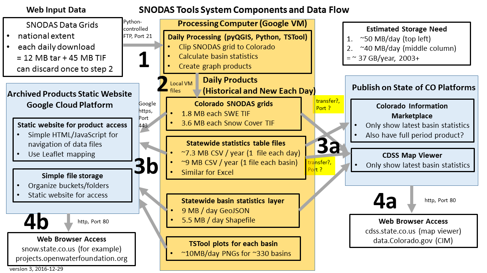

# Table of Contents

The following topics are discussed in this section:<br>

* [Overview](#overview)
* [SNODAS Tools Scripts](#snodas-tools-scripts)
* [SNODAS Tools Configuration](#snodas-tools-configuration)
* [Processing Workflow](#processing-workflow)
	+ [Download SNODAS Data](#download-snodas-data)
	+ [Convert SNODAS Data Formats](#convert-snodas-data-formats)
	+ [Clip and Project SNODAS National Grids to Study Area](#clip-and-project-snodas-national-grids-to-study-area)
	+ [Create the Binary Snow Cover Raster](#create-the-binary-snow-cover-raster)
	+ [Intersect SNODAS Colorado Grid with Colorado Basins and Calculate Statistics](#intersect-snodas-colorado-grid-with-colorado-basins-and-calculate-statistics)
	+ [Saving the Statistical Results in Local .csv Files](#saving-the-statistical-results-in-local-csv-files)
	+ [Generate Time Series Products](#generate-time-series-products)
	+ [Publish Results](#publish-results)
* [Tool Utilities and Functions](#tool-utilities-and-functions)
	+ [Download SNODAS Data](#1-download-snodas-data)
	+ [Convert Data Formats](#2-convert-data-formats)
	+ [Clip and Project SNODAS Data](#3-clip-and-project-snodas-data)
	+ [Create Snow Cover Data](#4-create-snow-cover-data)
	+ [Calculate and Export Statistics](#5-calculate-and-export-statistics)


## Overview

The SNODAS tools design meets the following requirements:

* Download historical and new daily SNODAS grids.
* Clip grids to [Watershed Basin Extent Shapefile Input](file-structure.md#snodastools92staticdata92) (```watershedBasinBoundaryExtent.shp```) 
so that original SNODAS grid can be viewed as product later (results in background layer that can be shown on maps). 
In the original design of the SNODAS tools for CDSS, the SNODAS grids are clipped to the extent of the Colorado basin boundary. 
* Intersect basin polygons with clipped SNODAS grid to determine basin statistics including average snow water equivalent over basin
and areal extent of snow cover (allows color-coded basin maps to be shown).

	 |Statistic|Units|
	 |----------|-----|
	 |Mean Snow Water Equivalent|meters|
	 |Minimum Snow Water Equivalent|meters|
	 |Maximum Snow Water Equivalent|meters|
	 |Standard Deviation of Snow Water Equivalent|meters|
	 |Mean Snow Water Equivalent|inches|
	 |Minimum Snow Water Equivalent|inches|
	 |Maximum Snow Water Equivalent|inches|
	 |Standard Deviation of Snow Water Equivalent|inches|
	 |Percent Area of Snow Cover|unitless|
	 
* Create time series for a basin with daily history of statistics for individual basins and groups of basins
(allow graphs to be created for current year and past years).
* Publish the results to State of Colorado platforms to allow web access for water managers.

The above process is described for SNODAS tool users in the [SNODAS Tools User Manual](http://software.openwaterfoundation.org/cdss-app-snodas-tools-doc-user).
The following diagram illustrates the overall data flow and technologies that are used
(to view the image full size, use the web browser feature to open the image in a new tab - for example, in Chrome right click and ***Open image in new tab***):



## SNODAS Tools Scripts

The SNODAS tools are divided into 3 individual scripts. <br>

1. ```SNODASDaily_Automated.py```: Calculates today’s approximate daily snowpack statistics for each basin of the 
[Watershed Basin Shapefile Input](file-structure.md#snodastools92staticdata92) (```watershedBasinBoundary.shp```).
	 
	 
2. ```SNODASDaily_Interactive.py```: Calculates historical approximate daily snowpack statistics for each basin of
 the [Watershed Basin Shapefile Input](file-structure.md#snodastools92staticdata92) (```watershedBasinBoundary.shp```). The historical dates 
 are dependent upon user input.
3. ```SNODAS_utilities.py```: Contains [all functions](#tool-utilities-and-functions) called within the above two scripts.
 

## SNODAS Tools Configuration

**TODO smalers 2016-12-06 describe how the tools are configured... configuration file, driving basins layer, Excel input, etc.**


## Processing Workflow

The following sections describe the processing workflow that is executed by the scripts of the SNODAS tools. Below is a flow 
diagram explaining the overview of the SNODAS tools processing workflow.

**TODO egiles 1/27/2017 create an overview workflow and place here**
**TODO egiles 1/27/2017 update step-by-step workflow images to describe 
files with less detail. The detailed filenames are included in the file 
structure workflow but are uneccesary on this overview page**


### Download SNODAS Data

Historical SNODAS data need to be downloaded for the full historical period to allow analysis of period statistics (how the current year
compares with previous years).  SNODAS data also need to be downloaded each day to create current basin water supply products.
The management of historical and daily downloads are the same, other than scripts are run differently in both cases.
The intent of the software is to allow rerunning the entire process if necessary, such as if installing the software on a new system.

**SNODASDaily_Automated.py**

The ```SNODASDaily_Automated.py``` script downloads the current date's SNODAS data from the FTP site. Only the current date's data 
can be downloaded and processed by this script. 

**SNODASDaily_Interactive.py**

The ```SNODASDaily_Interactive.py``` script downloads the historical dates of SNODAS data that are inputs defined by the user. When running the 
```SNODASDaily_Interactive.py``` script, the console will print: 

	Are you interested in one date or a range of dates? Type ‘One’ or ‘Range’.

The user inputs 'One' if only one historical date is to be processed. The user inputs 'Range' if multiple historical dates are to be processed. 

 - If the input is 'One', the console will print:

		Which date are you interested in? The date must be of or between 01 October 2003 
		and today's date.  mm/dd/yy:	

	- The user inputs a date in the correct format and that date of SNODAS data will be downloaded. 

 - If the input is 'Range', the console will print: 
 
		What is the STARTING date of data that you are interested in? The date must be of or
		between 01 October 2003 and today's date.  mm/dd/yy:
		
	- The user inputs the first date of a range of historical dates in the correct format. The console will print:

			What is the ENDING date of data that you are interested in? The date must be between
			[date entered from previous prompt] and today's date. mm/dd/yy: 
			
	- The user inputs the last date of a range of historical dates in the correct format. All SNODAS data from the dates within the range will be 
	downloaded (in sequential order).
	
 If you are experiencing errors after your inputs, reference the [Troubleshooting](..\deployed-env\troubleshooting.md#user-input-error-messages-in-the-console) section for guidance. 
	
----------------------------------------------------------------------------------------------------------------------
The default setting accesses the masked SNODAS data rather than the unmasked SNODAS data. The SNODAS tools were originally designed to analyze 
the historical snowpack statistics of Colorado. The masked data entirely covers the Colorado extent and has the largest repository of historical 
data. As mentioned above, the masked data is set as the default. This can be changed, however, in the [configuration file](file-structure.md#snodastools92snodasconfigini)
under **section**  *SNODAS_FTPSite* **option**  *folder*.

||Masked SNODAS Data|Unmasked SNODAS Data|
|-|--------------|-----------------|
|Spatial Coverage|Contiguous U.S.| Southernmost Latitude: 24.0996 ° N, Northernmost Latitude: 58.2329 ° N, Westernmost Longitude: 130.5171 ° W, Easternmost Longitude: 62.2504 ° W|
|Spatial Resolution|30 arc seconds|30 arc seconds|
|Temporal Coverage|30 September 2003 to present|09 December 2009 to present|
|Temporal Resolution|24-hour|24-hour|
|Grid size| 6,935 columns by 3,351 rows| 8,192 columns by 4,096 rows|
|Grid values|16-bit, signed integers|16-bit, signed integers|


The downloaded daily SNODAS data, whether downloaded from the ```SNODASDaily_Automated.py``` or the ```SNODASDaily_Interactive.py```, is
saved in the 1_DownloadSNODAS folder as a .tar file. Refer to the [File Structure](file-structure.md#processeddata921_downloadsnodas92) section 
for more information regarding the downloaded SNODAS .tar file and the 1_DownloadSNODAS folder. Refer to the [Tool Utilities and Functions](#1-download-snodas-data)
section for detailed information on the Python function called to download the SNODAS data.


### Convert SNODAS Data Formats

The daily downloaded SNODAS file is delivered in .tar format. To process the snowpack statistics, the .tar file is manipulated into a 
.tif file representing the daily SWE values. 

This occurs by the following steps: 

|Step|Description|Result|
|-|------|------| 
|<center>1|Extract SNODAS .tar file|7 SNODAS parameters (.gz)|
|<center>2|Delete\Move SNODAS parameters other than SWE*|SNODAS SWE file (.gz)|
|<center>3|Extract SWE .gz file|SNODAS SWE files (.dat and .Hdr)|
|<center>4|Convert SWE .dat to .bil file|SNODAS SWE files (.bil and .Hdr)|
|<center>5|Replace .Hdr file contents with custom specifications|SNODAS SWE files (.bil and .Hdr)|
|<center>6|Create SWE .tif file|SNODAS SWE files (.tif, .bil and .Hdr)|
|<center>7|Delete SWE .bil and .Hdr files| SNODAS SWE file (.tif)|

\* The SNODAS tools are defaulted to delete all parameters, other than SWE. However, the other parameters' .gz files can 
be saved if previously configured. In that case, the other parameters' .gz files are moved to a separate folder. Refer
to section [2_SetFormat\OtherParameters folder](file-structure.md#processeddata922_setformat92) of the File Structure tab for more information.

Steps 4 and 5 are NOHRSC suggestions to ingest the data into a geographic information system. In the case of the SNODAS tools, QGIS is 
utilized as the GIS. The documentation explaining these steps is located in *Appendix B: Instructions to Extract and Ingest SNODAS 
Data into GIS or Image Processing Software* (page 12) of the 
[National Operational Hydrologic Remote Sensing Center SNOw Data Assimilation System (SNODAS) Products at NSIDC Special Report #11](http://nsidc.org/pubs/documents/special/nsidc_special_report_11.pdf).

The daily SNODAS national SWE .tif grid is saved in the 2_SetFormat folder. Refer to the [File Structure](file-structure.md#processeddata922_setformat92) section 
for more information regarding the national SWE .tif file and the 2_SetFormat folder. Refer to [Tool Utilities and Functions](#2-convert-data-formats)
section for detailed information on the Python functions called to process the above 7 steps.


### Clip and Project SNODAS National Grids to Study Area

The daily national SNODAS grid files are large and take a long time to process. Therefore the SNODAS tools clip the national grid to the extent of the study area. 
The [Watershed Basin Extent Shapefile Input](file-structure.md#snodastools92staticdata92) (```watershedBasinBoundaryExtent.shp```) is the 
shapefile used to clip the SNODAS daily .tif file. 


||The SNODAS Tools:|
|-|-----------------|
|1.|Project the SNODAS daily grid to the same projection as the [Watershed Basin Extent Shapefile Input](file-structure.md#snodastools92staticdata92) (defaulted to WGS84)|
|2.|Clip the SNODAS daily grid to the [Watershed Basin Extent Shapefile Input](file-structure.md#snodastools92staticdata92)|
|3.|Reproject the clipped SNODAS daily grid to the projection of the [Watershed Basin Shapefile Input](file-structure.md#snodastools92staticdata92) (defaulted to NAD83 Zone 13N)|

The original SNODAS grids are delivered without projection however ["the SNODAS fields are grids of point estimates of snow cover in latitude/longitude coordinates
with the horizontal datum WGS 84"](http://nsidc.org/data/docs/noaa/g02158_snodas_snow_cover_model/index.html#2). The SNODAS tools project the SNODAS daily grids to 
the same projection as the [Watershed Basin Extent Shapefile Input](file-structure.md#snodastools92staticdata92). The default projection of the Watershed
Basin Extent Shapefile Input is WGS84. If the [Watershed Basin Extent Shapefile Input](file-structure.md#snodastools92staticdata92) is projected in a projection 
other than WGS84, the projection EPSG code must be changed in the [configuration file](file-structure.md#snodastools92snodasconfigini)
under **section** *VectorInputExtent* **option** *projection_epsg*.

For visualization purposes of the end product, the clipped daily SNODAS grid is reprojected into the same projection as the [Watershed Basin Shapefile Input](file-structure.md#snodastools92staticdata92).
The final reprojection is performed before the creation of the snow cover grid and the calculating of the zonal statistics to ensure correct final snowpack statistics. 
The final projection is defaulted to NAD 83 Zone 13N because the SNODAS tools were originally designed to calculate snowpack statistics for the basins of Colorado. If
the final projection is other than NAD 83 Zone 13N, the projection EPSG must be changed in the [configuration file](file-structure.md#snodastools92snodasconfigini)
under **section** *VectorInputShapefile* **option** *projection_epsg*.

The clipped and reprojected SNODAS SWE .tif grids are saved in the 3_ClipToExtent folder. Refer to the [File Structure](file-structure.md#processeddata923_cliptoextent92) section 
for more information regarding the clipped SWE .tif file and the 3_ClipToExtent folder. Refer to [Tool Utilities and Functions](#3-clip-and-project-snodas-data)
section for detailed information on the Python functions called to project, clip and reproject the national SNODAS SWE grid.


### Create the Binary Snow Cover Raster

** TODO egiles 1/27/16 change snowCoverage(file, folder_input, folder_output) function in SNODAS_utilities.py
 to have null values also equal null values**

The SNODAS tools calculate a daily percent snow cover statistic for each basin of the [Watershed Basin Shapefile Input](file-structure.md#snodastools92staticdata92).
The daily percent snow cover statistic is the percentage of land covered by snow. 

To perform this calculation a daily binary snow cover grid must be created to display which cells of each basin are covered by snow.
This grid is created by iterating through the cells of the daily clipped SNODAS SWE grid and applying the following rules:

|If any cell in the daily clipped SNODAS SWE grid is:|Then the corresponding cell of the daily binary <br> snow cover grid is assigned:|
|---------|-----------|
|greater than 0 (presence of snow)|a value of 1|
|0 (absence of snow)|a value of 0|
|-9999 (null value)|-9999 (null value)|

The daily binary snow cover .tif grids are saved in the 4_CreateSnowCover folder. Refer to the [File Structure](file-structure.md#processeddata924_createsnowcover92) section 
for more information regarding the binary snow cover .tif files and the 4_CreateSnowCover folder. Refer to [Tool Utilities and Functions](#4-create-snow-cover-data)
section for detailed information on the Python functions called to create the daily binary snow cover grids.


### Calculate and Export Zonal Statistics

**Calculate Zonal Statistics**

Zonal statistics are statistics calculated by zone where the zones are defined by an input zone dataset and the values are defined by a raster grid. 
Zonal statistics are performed on both the [daily clipped and reprojected SNODAS SWE grid](file-structure.md#processeddata923_cliptoextent92)
and the [daily clipped binary snow cover grid](file-structure.md#processeddata924_createsnowcover92). For both,
the input zone dataset is the [watershed basin boundary shapefile](file-structure.md#snodastools92staticdata92).   

|The zonal statistics performed on: |Compute the following statistics:|
|---------|-----------|
|the daily clipped and reprojected SNODAS grid|SWE mean, SWE minimum, SWE maximum, <br> SWE standard deviation, and cell count|
|the daily clipped binary snow cover grid|percent of snow coverage*|

\* The percent of snow coverage is computed by dividing the basin cell count of cells valued at '1' in the daily clipped binary snow cover grid
by the total cell count of each basin (the cell count is computed by the zonal statistics performed on the daily clipped and reprojected SNODAS
grid).

** Export Zonal Statistics**

The daily snowpack statistics computed by the QGIS Zonal Statistics tool are exported into two types of .csv files. The first .csv file
organizes the statistics by date. The second .csv file organizes the statistics by basin. Both types of .csv files are saved within
the 5_CalculateStatistics folder. For more information on the two types of exported .csv files, including examples, and the 
5_CalculateStatistics folder, refer to the [File Structure](file-structure.md#processeddata925_calculatestatistics92) section.
Refer to [Tool Utilities and Functions](#5-calculate-and-export-statistics) section for detailed information on the Python 
functions called to calculate and export the daily zonal statistics.


### Generate Time Series Products

**TODO smalers 2016-12-06 need to fill this in...describe how to run Python program and what it does**

### Publish Results

**TODO smalers 2016-12-06 need to fill this in...describe how to pass the results to State of Colorado platforms including CDSS Map Viewer and Socrata data.colorado.gov**

## Tool Utilities and Functions

The functions created are organized into 5 sequential processing categories to aid in troubleshooting. If the scripts are experiencing invalid results or inconsistencies, 
the user should identify the issue with respect to the following function categories. This allows the user to easily pinpoint the potentially-problematic function. The 
function categories are:

|<center>Function Category|<center>Description|<center>Number<br>of <br>Functions|
|-||----------|------------|
|1. Download SNODAS Data|Accesses the NSIDC FTP site and downloads the original SNODAS data.|<center>1|
|2. Convert Data Formats|Converts data into useable formats for statistical processing.|<center>9|
|3. Clip and Project SNODAS Data|Clips and projects SNODAS raster data for statistical processing.|<center>4|
|4. Create Snow Cover Data|Creates a new binary raster representing presence or absence of snow.|<center>1|
|5. Calculate and Export Statistics|Calculates zonal statistics and exports statistics into .csv files.|<center>3|


### 1. Download SNODAS Data

1. __download_SNODAS (downloadDir, singleDate)__  
	Access the SNODAS FTP site and download the .tar file of singleDate. The .tar file saves to the specified
    downloadDir folder.
	
	Arguments:  
	
			downloadDir: full path name to the location where the downloaded SNODAS rasters are stored
			singleDate: the date of interest from import datetime module


### 2. Convert Data Formats

1.	__format_date_YYYYMMDD (date)__   
	Convert datetime date to string date in format: YYYYMMDD. 

	Arguments:

		date: the date of interest from import datetime module
	

2.	__untar_SNODAS_file (file, folder_input, folder_output)__  
	Untar downloaded SNODAS .tar file and extract the contained files to the folder_output.
	
	Arguments: 
	
		file: SNODAS .tar file to untar
		folder_input: the full pathname to the folder containing 'file'
		folder_output: the full pathname to the folder containing the extracted files


3. __delete_irrelevant_SNODAS_files (file)__  
	 Delete file if not identified by the unique SWE ID. The SNODAS .tar files contain many different SNODAS datasets.
     For this project, the parameter of interest is SWE, uniquely named with ID '1034'. If the configuration file is
     set to 'False' for the value of the 'SaveAllSNODASparameters' section, then the parameters other than SWE are
     deleted.
	 
	 Arguments: 
	 
		file: file extracted from the downloaded SNODAS .tar file

4. __move_irrelevant_SNODAS_files (file, folder_output)__   
	Move file to the 'OtherParameters' folder if not identified by the unique SWE ID, '1034'. The SNODAS .tar files
    contain many different SNODAS datasets. For this project, the parameter of interest is SWE, uniquely named with ID
    '1034'. If the configuration file is set to 'True' for the value of the 'SaveAllSNODASparameters' section, then the
    parameters other than SWE are moved to 'OtherParameters' subfolder of the 2_SetEnvironment folder.
	
	Arguments

		file: file extracted from the downloaded SNODAS .tar file
		folder_output: full pathname to folder where the other-than-SWE files are 
		contained, OtherParameters

5. __extract_SNODAS_gz_file (file)__  
	Extract .dat and .Hdr files from SNODAS .gz file. Each daily SNODAS raster has 2 files associated with it
    (.dat and .Hdr) Both are zipped within a .gz file.

	Arguments: 
		
		file: .gz file to be extracted

6. __convert_SNODAS_dat_to_bil (file)__  
	Convert SNODAS .dat file into supported file format (.tif). The .dat and .Hdr files are not supported file
    formats to use with QGS processing tools. The QGS processing tools are used to calculate the daily zonal stats.

	Arguments:

		file: .dat file to be converted to .bil format

7. __create_SNODAS_hdr_file (file)__  
	Create custom .hdr file. A custom .Hdr file needs to be created to indicate the raster settings of the .bil file.
    The custom .Hdr file aids in converting the .bil file to a usable .tif file.

	Arguments: 
	
		file: .bil file that needs a custom .Hdr file

8. __convert_SNODAS_bil_to_tif(file, folder_output)__  
	Convert .bil file into .tif file for processing within the QGIS environment.

	Arguments:

		file: file to be converted into a .tif file
		folder_output: full pathname to location where the created .tif files are contained
		
9. __delete_SNODAS_bil_file(file)__  
	Delete file with .bil or .hdr extensions. The .bil and .hdr formats are no longer important to keep because the
    newly created .tif file holds the same data.

	Arguments:

		file: file to be checked for either .hdr or .bil extension (and, ultimately deleted)

### 3. Clip and Project SNODAS Data

1.	__copy_and_move_SNODAS_tif_file (file, folder_output)__   
	Copy and move created .tif file from original location to folder_output. The copied and moved file will be
    edited. To keep the file as it is, the original is saved within the original folder. 

	Arguments:

		file: .tif file to be copied and moved to folder_output
		folder_output: full pathname to the folder holding the newly copied .tif file
	

2.	__assign_SNODAS_projection (file, folder)__  
	Assign projection to file. Defaulted in configuration file to project to WGS84. The downloaded SNODAS raster
    is unprojected however the "SNODAS fields are grids of point estimates of snow cover in latitude/longitude
    coordinates with the horizontal datum WGS84." - [SNODAS Data Products at NSIDC User Guide](http://nsidc.org/data/docs/noaa/g02158_snodas_snow_cover_model/)
	
	Arguments: 
	
		file: the name of the .tif file that is to be assigned a projection
		folder: full pathname to the folder where both the unprojected and projected raster are stored


3. __SNODAS_raster_clip (file, folder, vector_extent)__  
	 Clip file by vector_extent shapefile. The output filename starts with 'Clip'.
	 
	 Arguments: 
	 
		file: the projected (defaulted to WGS84) .tif file to be clipped
		folder: full pathname to folder where both the unclipped and clipped rasters are stored
		vector_extent: full pathname to shapefile holding the extent of the basin boundaries. This 
		shapefile must be projected in projection assigned in function assign_SNODAS_projection 
		(defaulted to WGS84).

4. __SNODAS_raster_reproject_NAD83  (file, folder)__   
	Reproject clipped raster from it's original projection (defaulted to WGS84) to desired projection (defaulted
    to NAD83 UTM Zone 13N).
	
	Arguments

		file: clipped file with original projection to be reprojected into desired projection
		folder: full pathname of folder where both the originally clipped rasters and the reprojected 
		clipped rasters are contained

### 4. Create Snow Cover Data

1.	__snowCoverage (file, folder_input, folder_output)__   
	Create binary .tif raster indicating snow coverage. If a pixel in the input file is > 0 (there is snow on the
    ground) then the new raster's pixel value is assigned '1'. If a pixel in the input raster is 0 or a null value
    (there is no snow on the ground) then the new raster's pixel value is assigned '0'. The output raster is used to
    calculate the percent of daily snow coverage for each basin.

	Arguments:

		file: daily SNODAS SWE .tif raster
		folder_input: full pathname to the folder where the file is stored
		folder_output: full pathname to the folder where the newly created binary snow cover raster
		is stored

### 5. Calculate and Export Statistics

1.	__create_csv_files (file, vFile, csv_byDate, csv_byBasin)__   
	 Create empty csv files for output - both by date and by basin. The empty csv files have a header row with
     each column represented by a different field name (refer to 'fieldnames' section of the function for actual
     fieldnames). Csv files by date contain one .csv file for each date and is titled 'SnowpackByDate_YYYYMMDD.csv'.
     Each byDate file contains the zonal statistics for each basin on that date. Csv files by basin contain one .csv
     file for each watershed basin and is titled 'SnowpackByBasin_BasinId)'. Each byBasin file contains the zonal
     statistics for that basin for each date that has been processed. 

	Arguments:

		file: daily .tif file  to be processed with zonal statistics (clipped, reprojected)
		vFile: shapefile of basin boundaries (these boundaries are used as the polygons in the zonal 
		stats calculations)
		csv_byDate: full pathname of folder containing the results by date (.csv file)
		csv_byBasin: full pathname of folder containing the results by basin (.csv file)
	

2.	__delete_ByBasinCSV_repeated_rows (file, vFile, csv_byBasin)__  
	Check to see if date has already been processed. If so, iterate through by basin csv file and only write rows to new csv file 
	that do not start with the date. Ultimately, delete row of data for today's date so that new data can be overwritten without 
	producing multiple rows of the same date. 
	
	Arguments: 
	
		file: daily .tif file  to be processed with zonal statistics (clipped, reprojected)
		vFile: shapefile of basin boundaries (these boundaries are used as the polygons in the zonal 
		stats calculations)
		csv_byBasin: full pathname of folder containing the results by basin (.csv file)
		
3. __zStat_and_export (file, vFile, csv_byBasin, csv_byDate, DirClip, DirSnow)__  
	Calculate zonal statistics of basin boundary shapefile and the current file. The zonal stats export to
	both the byDate and the byBasin csv files.
    
	 
	 Arguments: 
	 
		file: daily raster .tif SNODAS file that is to be processed in the zonal statistics tool 
		(clipped, reprojected)
		vfile: the shapefile of the basin boundaries (these boundaries are used as the polygons in 
		the zonal statistics calculations)
		csv_byDate: full pathname to the folder containing results by date (.csv file)
		csv_byBasin: full pathname to the folder containing results by basin (.csv file)
		DirClip: full pathname to the folder containing all daily clipped, NAD83 .tif SNODAS rasters
		DirSnow: full pathname to the folder containing all binary snow coverage rasters