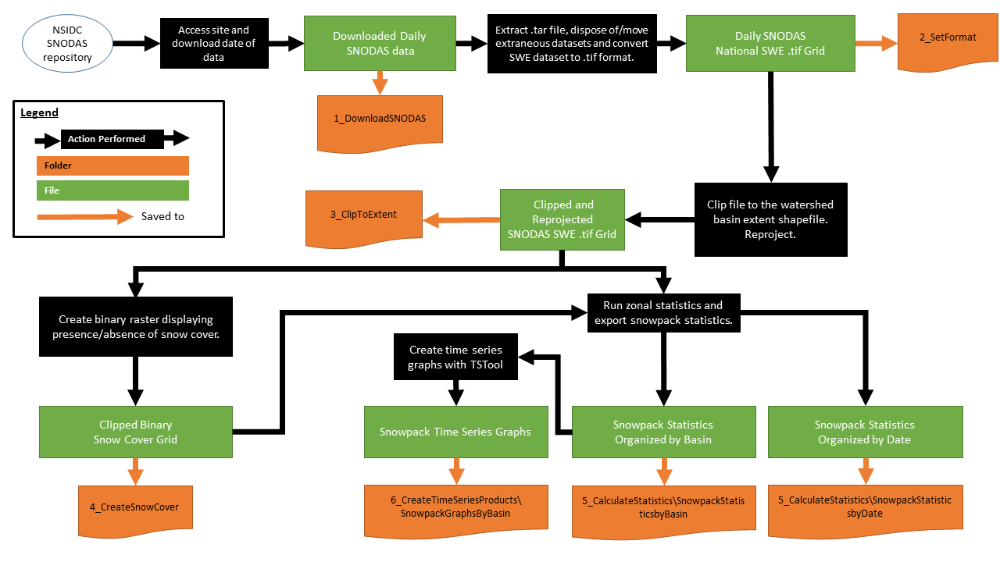
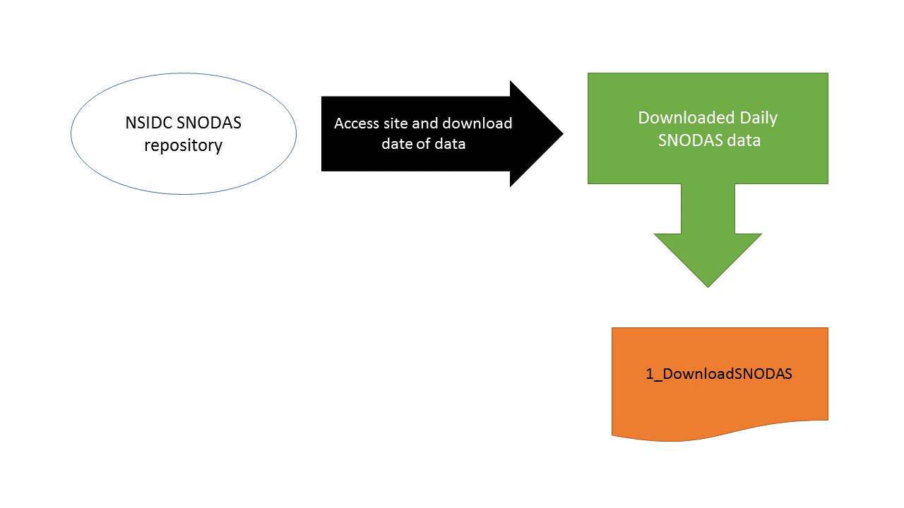
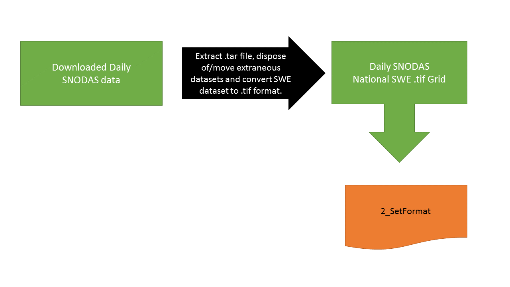
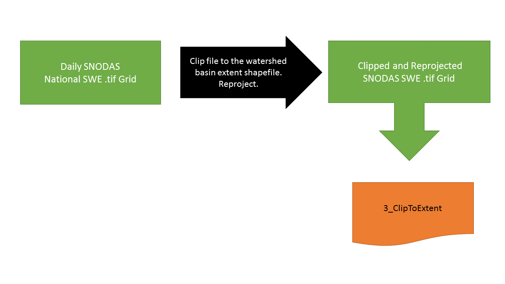
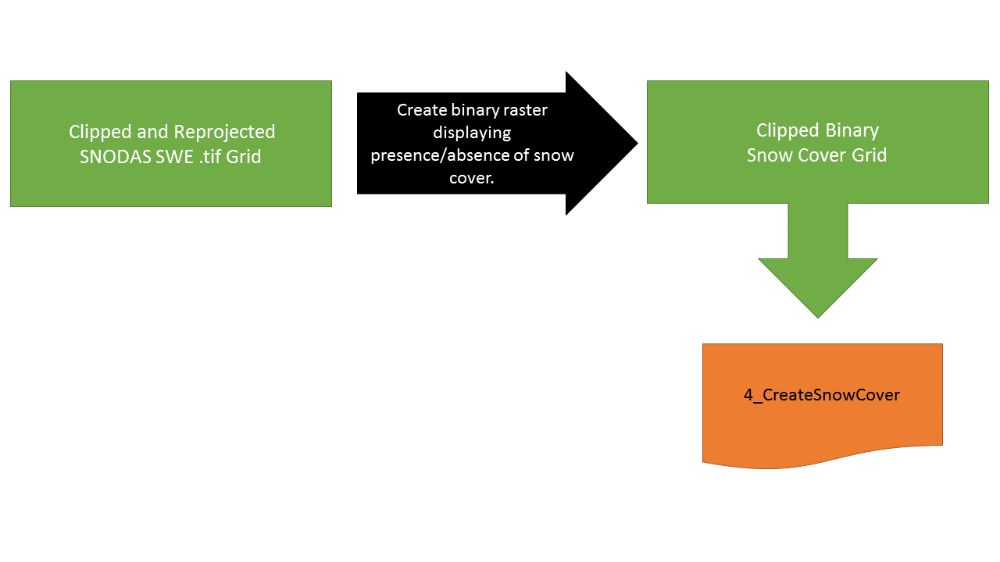
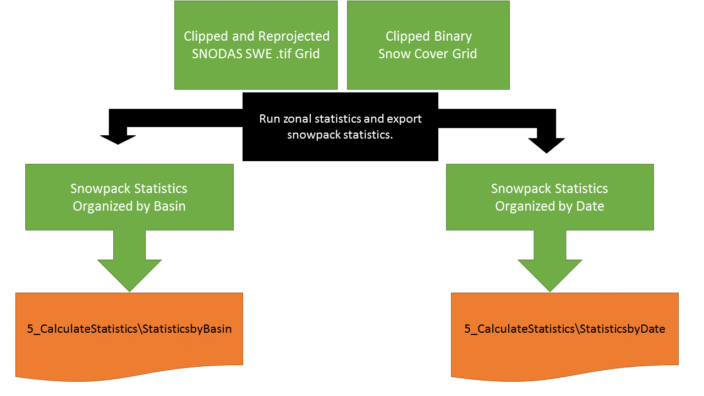
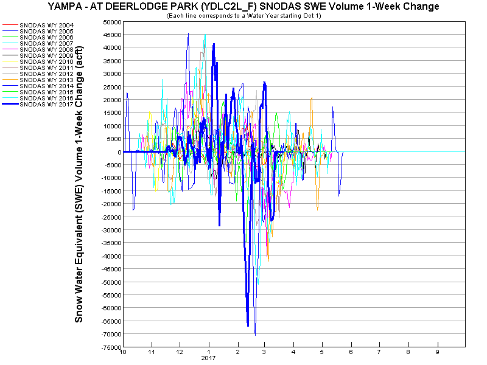
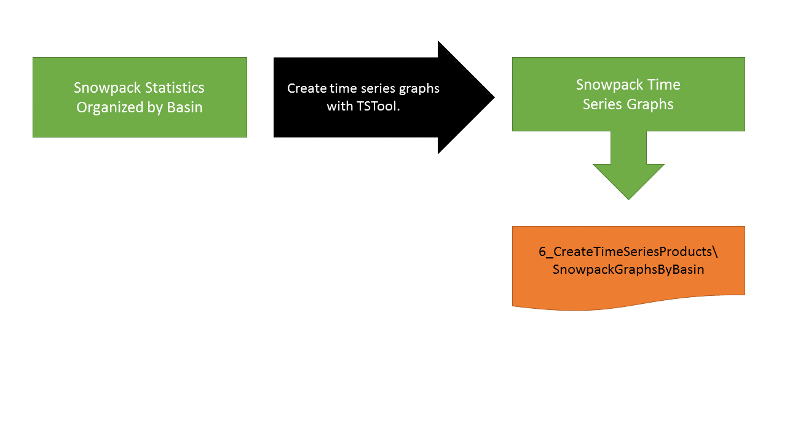

# Table of Contents

The following topics are discussed in this section:<br>

* [Overview](#overview)
* [SNODAS Tools Scripts](#snodas-tools-scripts)
* [SNODAS Tools Configuration](#snodas-tools-configuration)
* [Processing Workflow](#processing-workflow)
	+ [Download SNODAS Data](#download-snodas-data)
	+ [Convert SNODAS Data Formats](#convert-snodas-data-formats)
	+ [Clip and Project SNODAS National Grids to Study Area](#clip-and-project-snodas-national-grids-to-study-area)
	+ [Create the Binary Snow Cover Raster](#create-the-binary-snow-cover-raster)
	+ [Calculate and Export Zonal Statistics](#calculate-and-export-zonal-statistics)
	+ [Generate Time Series Products](#generate-time-series-products)
	+ [Publish Results](#publish-results)
* [Tool Utilities and Functions](#tool-utilities-and-functions)
	+ [Download SNODAS Data](#1-download-snodas-data)
	+ [Convert Data Formats](#2-convert-data-formats)
	+ [Clip and Project SNODAS National Grids to Study Area](#3-clip-and-project-snodas-national-grids-to-study-area)
	+ [Create the Binary Snow Cover Raster](#4-create-the-binary-snow-cover-raster)
	+ [Calculate and Export Zonal Statistics](#5-calculate-and-export-zonal-statistics)


## Overview

The SNODAS Tools design meets the following requirements:

* Download historical and current daily SNODAS grids from the [NSIDC FTP site](ftp://sidads.colorado.edu/).
* Clip daily SNODAS Snow Water Equivalent grids to the study area, the extent of the [Watershed Basin Shapefile Input](file-structure.md#watershed-basin-shapefile-input). 
* Intersect basin polygons of the [Watershed Basin Shapefile Input](file-structure.md#watershed-basin-shapefile-input) with the clipped daily SNODAS grid to calculate daily 
basin snowpack zonal statistics. The default and optional snowpack statistics are explained below.

	 |Default Statistics|Units|Description|
	 |----------|-----|---|
	 |Mean Snow Water Equivalent (SWE)|inches, millimeters|Mean liquid water equivalent of the snowpack across each basin, measured in depth.|
	 |Effective Area|acre|Basin land area. Calculated from SNODAS grid: no-data cells, representing large bodies of water, are excluded.|
	 |Percent Area of Snow Cover|unitless|Percent of effective area in each basin covered by some value of snow.|
	 |Total SWE Volume|acre feet|The liquid water equivalent stored in the entire basin snowpack, measured in volume. Calculated by multiplying the mean SWE by the effective area.|
	 |One Week Change in Total SWE Volume|acre feet|The change of total snow volume in the past week. Calculated by subtracting last week's (T-7days) total snow volume value from the current date's total snow volume value. The value is positive if the snow volume has increased and negative if the snow volume has decreased.|
	 
	 |Additional Optional Statistics|Units|Description|
	 |----------|-----|---|
	 |Minimum Snow Water Equivalent|inches, millimeters|The minimum SWE value of the SNODAS grid for each basin.|
	 |Maximum Snow Water Equivalent|inches, millimeters|The maximum SWE value of the SNODAS grid for each basin.|
	 |Standard Deviation of Snow Water Equivalent|inches, millimeters|A measure of SWE variation across each basin.|
	
	 
* Create time series visualizations for each basin to display change of snowpack statistics over time. 
* Publish the results to State of Colorado platforms to allow web access for water managers.

The above process is described in greater depth for SNODAS Tools users in the [SNODAS Tools User Manual](http://software.openwaterfoundation.org/cdss-app-snodas-tools-doc-user).
The following diagram illustrates the overall data flow and technologies that are used
(to view the image full size, use the web browser feature to open the image in a new tab - for example, in Chrome right click and ***Open image in new tab***):


## SNODAS Tools Scripts

The SNODAS Tools are comprised of three Python scripts.

||Script File Name|Description|
|-|---|---|
|1|SNODASDaily_Automated.py|Calculates the current date's daily snowpack statistics for each basin of the [Watershed Basin Shapefile Input](file-structure.md#watershed-basin-shapefile-input)|
|2|SNODASDaily_Interactive.py|Calculates historical daily snowpack statistics for each basin of the [Watershed Basin Shapefile Input](file-structure.md#watershed-basin-shapefile-input).|
|3|SNODAS_utilities.py|Contains [all functions](#tool-utilities-and-functions) called within the above two scripts.|
 

## SNODAS Tools Configuration

Before running the SNODAS Tools, the input file must be defined and the configuration file settings must be configured. 

### Input File

The SNODAS Tools require only one input file, a shapefile representing the watershed basins of interest. Throughout this documentation, the input file is referred to as 
the [Watershed Basin Shapefile Input](file-structure.md#watershed-basin-shapefile-input). 

Below is an example of the Watershed Basin Shapefile Input for the state of Colorado. The Watershed Basin Shapefile Input is displayed in green and the Colorado state 
boundary is represented by a black line. 


 

The SNODAS Tools require the input file to follow the specifications below:  

|Specification|Requirements|
|-|-|
|File Format|Vector data stored in shapefile format.|
|Number of Features|The shapefile can have one or multiple features. Note that the processing time of the SNODAS Tools will increase as the number of features increases.|
|File Location|Saved within the the [Static Data Folder](file-structure.md#snodas_tools92staticdata92). |
|File Name|No requirements.|
|Projection|The Watershed Basin Shapefile Input is the zone dataset used to calculate the zonal snowpack statistics. These statistics are dependent on area computations. A specific projection is not required, however, it is recommended that the shapefile is projected into a projection that preserves area to achieve most accurate statistical results.| 


### Configuration File 

The configuration file sets all parameters and options for the SNODAS Tools. Each setting is explained in detail as comments inside the configuration file, 
as well as in the [Configuration File](file-structure.md#snodas_tools92config92) section of the File Structure page. It is important to review
the [Configuration File documentation](file-structure.md#snodas_tools92config92) before running the SNODAS Tools to ensure that all settings and options are 
properly set. 


## Processing Workflow

The following sections describe the processing workflow that is executed by the scripts of the SNODAS Tools. Note that both the ```SNODASDaily_Automated.py``` 
and the ```SNODASDaily_Interactive.py``` utilize the same workflow and functions. The image below is a flow 
diagram displaying the entire SNODAS Tools processing workflow (to view the image full size, use the web browser feature to open the 
image in a new tab - for example, in Chrome right click and ***Open image in new tab***). Throughout each following section of the processing 
workflow documentation, the flow diagram is split into individual processing steps and explained in detail. 




### Download SNODAS Data

Historical SNODAS data is downloaded for the full historical period to allow analysis of period statistics (how the current year
compares with previous years). SNODAS data is also downloaded each day to create current basin water supply products.

**SNODASDaily_Automated.py**

The ```SNODASDaily_Automated.py``` script downloads the current date's SNODAS data from the FTP site. Only the current date's data 
can be downloaded and processed by this script. 

**SNODASDaily_Interactive.py**

The ```SNODASDaily_Interactive.py``` script downloads the historical dates, defined by the user, of SNODAS data. When running the 
```SNODASDaily_Interactive.py``` script, the console will first print: 

	Are you interested in one date or a range of dates? Type ‘One’ or ‘Range’.

The user inputs ```One``` if only one historical date is to be processed. The user inputs ```Range``` if multiple historical dates are to be processed. 

 - If the input is ```One```, the console will print:

		Which date are you interested in? The date must be of or between 30 September 2003 and   
		today's date. mm/dd/yy:
		
	- The user inputs a date in the correct format and that date of SNODAS data will be downloaded. 

 - If the input is ```Range```, the console will print: 
 
		What is the STARTING (earliest) date of data that you are interested in? The date must be of  
		or between 30 September 2003 and today's date. mm/dd/yy:
				
	- The user inputs the first date of a range of historical dates in the correct format. The console will print:

			What is the ENDING (most recent) date of data that you are interested in? The date must be  
			between [date entered from previous prompt] and today's date. mm/dd/yy:
			
	- The user inputs the last date of a range of historical dates in the correct format. All SNODAS data from the dates within the range will be 
	downloaded (in sequential order).
	
 If errors are occurring after input, reference the [Troubleshooting](..\deployed-env\troubleshooting.md#user-input-error-messages-in-the-console) section for guidance. 
	
----------------------------------------------------------------------------------------------------------------------
The SNODAS Tools are set by default to access the masked SNODAS data rather than the unmasked SNODAS data. The SNODAS tools were originally designed to analyze 
the historical snowpack statistics of Colorado. The masked data entirely covers the Colorado extent and has the largest repository of historical 
data. As mentioned above, the masked data is set as the default. This can be changed, however, in the [configuration file](file-structure.md#the-sections-and-options-of-the-configuration-file)
under **section**  ```SNODAS_FTPSite``` **option**  ```folder_path```. Below is a simple table explaining the main differences between the masked and unmasked SNODAS data. 

||Masked SNODAS Data|Unmasked SNODAS Data|
|-|--------------|-----------------|
|Spatial Coverage|Contiguous U.S.| Southernmost Latitude: 24.0996 ° N, Northernmost Latitude: 58.2329 ° N, Westernmost Longitude: 130.5171 ° W, Easternmost Longitude: 62.2504 ° W|
|Spatial Resolution|30 arc seconds, nominally 1 km on the ground|30 arc seconds, nominally 1 km on the ground|
|Temporal Coverage|30 September 2003 to present|09 December 2009 to present|
|Temporal Resolution|24-hour|24-hour|
|Grid size| 6,935 columns by 3,351 rows| 8,192 columns by 4,096 rows|
|Grid values|16-bit, signed integers|16-bit, signed integers|


The downloaded daily SNODAS data, whether downloaded from the ```SNODASDaily_Automated.py``` or the ```SNODASDaily_Interactive.py```, is
saved in the 1_DownloadSNODAS folder as a .tar file. Refer to the [File Structure](file-structure.md#processeddata921_downloadsnodas92) section 
for more information regarding the downloaded SNODAS .tar file and the 1_DownloadSNODAS folder. Refer to the [Tool Utilities and Functions](#1-download-snodas-data)
section for detailed information on the Python function called to download the SNODAS data.



### Convert SNODAS Data Formats

The daily downloaded SNODAS file is delivered in .tar format. To process the snowpack statistics, the .tar file is manipulated into a 
.tif file representing the daily SWE values. 

This occurs by the following steps: 

|Step|Description|Result|
|-|------|------| 
|<center>1|Extract SNODAS .tar file|8 SNODAS parameters (.gz)|
|<center>2|Delete\Move SNODAS parameters other than SWE*|SNODAS SWE file (.gz)|
|<center>3|Extract SWE .gz file|SNODAS SWE files (.dat and .Hdr)|
|<center>4|Convert SWE .dat to .bil file|SNODAS SWE files (.bil and .Hdr)|
|<center>5|Replace .Hdr file contents with custom specifications|SNODAS SWE files (.bil and .Hdr)|
|<center>6|Create SWE .tif file|SNODAS SWE files (.tif, .bil and .Hdr)|
|<center>7|Delete SWE .bil and .Hdr files| SNODAS SWE file (.tif)|

\* The SNODAS Tools are set by default to delete all parameters, other than SWE. However, the other parameters' .gz files can 
be saved if previously configured. In that case, the other parameters' .gz files are moved to a separate folder. Refer
to section [2_SetFormat\OtherParameters folder](file-structure.md#processeddata922_setformat92) of the **File Structure** tab for more information
regarding the 8 packaged SNODAS parameters.

Steps 4 and 5 are NOHRSC suggestions to ingest the data into a geographic information system. In the case of the SNODAS Tools, QGIS is 
utilized as the GIS. The documentation explaining these two steps is located in *Appendix B: Instructions to Extract and Ingest SNODAS 
Data into GIS or Image Processing Software* (page 12) of the 
[National Operational Hydrologic Remote Sensing Center SNOw Data Assimilation System (SNODAS) Products at NSIDC Special Report #11](http://nsidc.org/pubs/documents/special/nsidc_special_report_11.pdf).

The daily SNODAS national SWE .tif grid is saved in the 2_SetFormat folder. Refer to the [File Structure](file-structure.md#processeddata922_setformat92) section 
for more information regarding the national SWE .tif file and the 2_SetFormat folder. Refer to [Tool Utilities and Functions](#2-convert-data-formats)
section for detailed information on the Python functions called to process the above 7 steps.



### Clip and Project SNODAS National Grids to Study Area

The daily national SNODAS grid files are large and take an extended time to process. Therefore the SNODAS Tools clip the national grid to
the [Watershed Basin Extent Shapefile](file-structure.md#the-watershed-basin-extent-shapefile), the 
bounding box of the [Watershed Basin Shapefile Input](file-structure.md#watershed-basin-shapefile-input). 


This occurs by the following steps:

|Step|Description|Result|
|-|-----------------|----|
|1|Create a new single-feature bounding box shapefile that represents the extent of the Watershed Basin Shapefile Input.|Study area extent shapefile with datum WGS84 and undefined projection.|
|2|Assign WGS84 datum to the SNODAS grids.|Daily national SNODAS SWE grid with datum WGS84 and undefined projection.|
|3|Clip the SNODAS daily grid to the study area extent shapefile.|Daily clipped SNODAS SWE grid with datum WGS84 and undefined projection.|
|4|Project the clipped SNODAS daily grid to the projection of the [Watershed Basin Shapefile Input](file-structure.md#watershed-basin-shapefile-input) (defaulted to US Contiguous Albers Equal Area Conic). Resample the cell size, if configured in the configuration file.|Daily clipped SNODAS SWE grid with datum NAD83 and US Albers Equal Area projection (resampled, if configured).|

The original SNODAS grids are delivered without projection however ["the SNODAS fields are grids of point estimates of snow cover in latitude/longitude coordinates
with the horizontal datum WGS 84"](http://nsidc.org/data/docs/noaa/g02158_snodas_snow_cover_model/index.html#2). By default, the SNODAS Tools define the WGS84 datum to each daily national SNODAS daily grid.

The majority of snowpack statistics calculated by the SNODAS Tools are dependent on area. For this reason, the SNODAS Tools are defaulted to 
project the daily clipped SNODAS SWE grids into an equal-area projection, USA Contiguous Albers Equal Area Conic before performing the calculations. If desired, the projection can be changed
in the [configuration file](file-structure.md#the-sections-and-options-of-the-configuration-file) under **section** ```Projections``` **option** ```calcstats_proj_epsg```. 
The zonal statistics are calculated on this projected clipped SWE SNODAS grid, so it is important that the chosen projection, if other than the default, 
preserves measures of area specific to the study area. The [watershed basin shapefile input](file-structure.md#watershed-basin-shapefile-input) must also be 
projected in the same projection as the daily clipped SNODAS SWE grids because the watershed basin boundary shapefile is the zone input dataset for the zonal 
statistics. 

In step 4, the SNODAS Tools also offer flexibility to the user to resample the SNODAS grid to represent a different spatial resolution, or cell size. This flexibility would be desirable if the features 
of the Watershed Basin Boundary Shapefile are relatively small with many fine edge details. Remember that the majority of snowpack statistics are based on correct area calculations 
(the area of a basin is calculated by multiplying the number of cells within that basin by the cell size of the resampled SNODAS clipped and projected grid). If the spatial resolution of
the SNODAS daily grid is relatively large compared to the edge details of the basins in the Watershed Basin Boundary Shapefile, then large error margins could occur in the areal computations. 

The clipped and projected SNODAS SWE .tif grids are saved in the 3_ClipToExtent folder. Refer to the [File Structure](file-structure.md#processeddata923_cliptoextent92) section 
for more information regarding the clipped SWE .tif file and the 3_ClipToExtent folder. Refer to [Tool Utilities and Functions](#3-clip-and-project-snodas-national-grids-to-study-area)
section for detailed information on the Python functions called to project, clip and project the national SNODAS SWE grid.



### Create the Binary Snow Cover Raster

The SNODAS Tools calculate a daily percent snow cover statistic for each basin of the [Watershed Basin Shapefile Input](file-structure.md#watershed-basin-shapefile-input).
The daily percent snow cover statistic is the percentage of effective land covered by some value of snow. 

To perform this calculation a daily binary snow cover grid must be created to display which cells of each basin are covered by snow.
This grid is created by iterating through the cells of the daily clipped SNODAS SWE grid and applying the following rules:

|If any cell in the daily clipped SNODAS <br> SWE grid has a value:|Then the corresponding cell of the daily binary <br> snow cover grid is assigned:|
|---------|-----------|
|greater than 0 (presence of snow)|a value of 1|
|equal to 0 (absence of snow)|a value of 0|
|equal to -9999 (null value)|-9999 (null value)|

The daily binary snow cover .tif grids are saved in the 4_CreateSnowCover folder. Refer to the [File Structure](file-structure.md#processeddata924_createsnowcover92) section 
for more information regarding the binary snow cover .tif files and the 4_CreateSnowCover folder. Refer to the [Tool Utilities and Functions](#4-create-the-binary-snow-cover-raster)
section for detailed information on the Python functions called to create the daily binary snow cover grids.



### Calculate and Export Zonal Statistics

**Calculate Zonal Statistics**

Zonal statistics are statistics calculated by zone where the zones are defined by an input zone dataset and the values are defined by a raster grid. 
Zonal statistics are performed on both the [daily clipped, projected SNODAS SWE grid](file-structure.md#processeddata923_cliptoextent92)
and the [daily clipped binary snow cover grid](file-structure.md#processeddata924_createsnowcover92). For both,
the input zone dataset is the [watershed basin boundary shapefile](file-structure.md#watershed-basin-shapefile-input).   

|The zonal statistics performed on: |Compute the following statistics:|
|---------|-----------|
|the daily clipped and *projected* SNODAS grid (US Albers Equal Area Conic)|Mean SWE (mm and inches), Effective Area, Total Snow Volume, and One Week Change in Total Snow Volume|
|the daily clipped and *projected* binary snow cover grid (US Albers Equal Area Conic)|Percent Area of Snow Cover*|

\* The percent area of snow cover is computed by dividing the basin cell count of cells valued at ```1``` in the daily clipped binary snow cover grid
by the total cell count of each basin (the cell count, although not exported as a snowpack statistic, is computed by the zonal statistics performed on the daily clipped and *projected* SNODAS
grid).

** Export Zonal Statistics**

The daily snowpack statistics computed by the QGIS Zonal Statistics tool are exported into 2 types of .csv files. The first .csv file
organizes the statistics by date. The second .csv file organizes the statistics by basin. Both types of .csv files are saved within
the 5_CalculateStatistics folder. 

Along with the two .csv files, two output layers are also exported for each day of processed SNODAS data - a shapefile and a GeoJSON file. Both of these files use the geometry from the 
Watershed Basin Input Shapefile. Note that the projection of the output layers could be different from the Watershed Basin Input Shapefile. The projection of the two output products is 
configured in the [configuration file](file-structure.md#the-sections-and-options-of-the-configuration-file) under **section**  ```Projections``` **option**  ```output_proj_epsg``` (defaulted to NAD83 Zone 13N).
The statistics in the SnowpackStatisticsbyDate csv file are appended to both geometries in the attribute tables. 

For more information on the two types of exported .csv files, the two output layers, and the 
5_CalculateStatistics folder, refer to the [File Structure](file-structure.md#processeddata925_calculatestatistics92) section.
Refer to [Tool Utilities and Functions](#5-calculate-and-export-zonal-statistics) section for detailed information on the Python 
functions called to calculate and export the daily zonal statistics.



### Generate Time Series Products

Time series graphs of the snowpack statistics are created with [TSTool](../dev-env/tstool). Four snowpack time series graphs are created for each basin of the 
[watershed basin boundary shapefile](file-structure.md#watershed-basin-shapefile-input). Each time series graph displays the change in a snowpack 
statistic over time. 


|Snowpack Statistic|Range of Dates in the Time Series Graph|
|-|-|
|Mean Snow Water Equivalent (inches)|All processed historical dates.|
|Percent of Snow Cover|All processed historical dates <br> from *current water year*.|
|SWE Volume (acft)|All processed historical dates.|
|1 Week Change in SWE Volume (acft)|All processed historical dates.|


**Mean Snow Water Equivalent**  


**Percent of Snow Cover**  

The time series graph representing a basin's change in percent of snow cover is the only graph solely containg data from the current year. 


**SWE Volume**  


**1 Week Change in SWE Volume**  



**Cumulative SWE Volume**


The time series graphs take approximately 3 minutes to create/update, given the 332 basins of the Colorado [watershed basin input shapefile](file-structure.md#watershed-basin-shapefile-input).  

 - *Note:* A watershed basin input shapefile with *less* features will processes quicker. Similarily so, a watershed basin input shapefile with 
*more* features will have process slower.     

The SNODAS Tools, therefore, have a configuration setting to allow flexibilty on when the time series graphs are updated. By default,
the time series graphs are updated every Monday. The user can choose to update the time series daily or weekly (with a different update day of the week.) Refer to the 
[configuration file](file-structure.md#snodas_tools92config92) for more specifics on these settings. 

Refer to the [File Structure](file-structure.md#processeddata926_createtimeseriesproducts92) section 
for more information regarding the time series .png files and the 6_CreateTimeSeriesProducts folder. Refer to the 
[Tool Utilities and Functions](#5-calculate-and-export-zonal-statistics)
section for detailed information on the Python functions called to create the daily binary snow cover grids. Refer to the
[create-snodas-swe-graphs.TsTool](file-structure.md#create-snodas-swe-graphststool) section for information about the TsTool command file 
 used to create the time series graphs.  



### Publish Results

The resutls are published daily to [Open Water Foundation's](http://openwaterfoundation.org/)
[Amazon Web Services](https://aws.amazon.com/) to update the 
[CDSS SNODAS Tools Map Viewer](http://projects.openwaterfoundation.org/owf-proj-co-cwcb-2016-snodas/prototype/index.html).  

Refer to the [File Structure](file-structure.md#snodas_tools92aws92) 
page for more information about the batch file used to push the SNODAS Tools' products up to the AWS. 

## Tool Utilities and Functions

The functions created are organized into 5 sequential processing categories to aid in troubleshooting. If the scripts are experiencing invalid results or inconsistencies, 
the user should identify the issue with respect to the following function categories. This allows the user to easily pinpoint the potentially-problematic function. The 
function categories are:


|<center>Function Category|<center>Description|<center>Number<br>of <br>Functions|
|-||----------|------------|
|1. Download SNODAS Data|Accesses the NSIDC FTP site and downloads the original SNODAS data.|<center>1|
|2. Convert Data Formats|Converts data into useable formats for statistical processing.|<center>9|
|3. Clip and Project SNODAS Data|Clips and projects SNODAS raster data for statistical processing.|<center>5|
|4. Create Snow Cover Data|Creates a new binary raster representing presence or absence of snow.|<center>1|
|5. Calculate and Export Statistics|Calculates zonal statistics and exports statistics into .csv files, .GeoJSON files and shapefiles. Time series graphs of the snowpack statistics are also created.|<center>6|


### 1. Download SNODAS Data

1. __download_SNODAS (downloadDir, singleDate)__  
	Access the SNODAS FTP site and download the .tar file of singleDate. The .tar file saves to the specified
    downloadDir folder.
	
	Arguments:  
	
			downloadDir: full path name to the location where the downloaded SNODAS rasters are stored
			singleDate: the date of interest from import datetime module


### 2. Convert Data Formats

1.	__format_date_YYYYMMDD (date)__   
	Convert datetime date to string date in format: YYYYMMDD. 

	Arguments:

		date: the date of interest from import datetime module
	

2.	__untar_SNODAS_file (file, folder_input, folder_output)__  
	Untar downloaded SNODAS .tar file and extract the contained files to the folder_output.
	
	Arguments: 
	
		file: SNODAS .tar file to untar
		folder_input: the full pathname to the folder containing 'file'
		folder_output: the full pathname to the folder containing the extracted files


3. __delete_irrelevant_SNODAS_files (file)__  
	 Delete file if not identified by the unique SWE ID. The SNODAS .tar files contain many different SNODAS datasets.
     For this project, the parameter of interest is SWE, uniquely named with ID '1034'. If the configuration file is
     set to 'False' for the value of the 'SaveAllSNODASparameters' section, then the parameters other than SWE are
     deleted.
	 
	 Arguments: 
	 
		file: file extracted from the downloaded SNODAS .tar file

4. __move_irrelevant_SNODAS_files (file, folder_output)__   
	Move file to the 'OtherParameters' folder if not identified by the unique SWE ID, '1034'. The SNODAS .tar files
    contain many different SNODAS datasets. For this project, the parameter of interest is SWE, uniquely named with ID
    '1034'. If the configuration file is set to 'True' for the value of the 'SaveAllSNODASparameters' section, then the
    parameters other than SWE are moved to 'OtherParameters' subfolder of the 2_SetEnvironment folder.
	
	Arguments

		file: file extracted from the downloaded SNODAS .tar file
		folder_output: full pathname to folder where the other-than-SWE files are 
		contained, OtherParameters

5. __extract_SNODAS_gz_file (file)__  
	Extract .dat and .Hdr files from SNODAS .gz file. Each daily SNODAS raster has 2 files associated with it
    (.dat and .Hdr) Both are zipped within a .gz file.

	Arguments: 
		
		file: .gz file to be extracted

6. __convert_SNODAS_dat_to_bil (file)__  
	Convert SNODAS .dat file into supported file format (.tif). The .dat and .Hdr files are not supported file
    formats to use with QGS processing tools. The QGS processing tools are used to calculate the daily zonal stats.

	Arguments:

		file: .dat file to be converted to .bil format

7. __create_SNODAS_hdr_file (file)__  
	Create custom .hdr file. A custom .Hdr file needs to be created to indicate the raster settings of the .bil file.
    The custom .Hdr file aids in converting the .bil file to a usable .tif file.

	Arguments: 
	
		file: .bil file that needs a custom .Hdr file

8. __convert_SNODAS_bil_to_tif(file, folder_output)__  
	Convert .bil file into .tif file for processing within the QGIS environment.

	Arguments:

		file: file to be converted into a .tif file
		folder_output: full pathname to location where the created .tif files are contained
		
9. __delete_SNODAS_bil_file(file)__  
	Delete file with .bil or .hdr extensions. The .bil and .hdr formats are no longer important to keep because the
    newly created .tif file holds the same data.

	Arguments:

		file: file to be checked for either .hdr or .bil extension (and, ultimately deleted)

### 3. Clip and Project SNODAS National Grids to Study Area


1. 	__create_extent(basin_shp, folder_output)__  
	Create a single-feature bounding box shapefile representing the extent of the input shapefile 
	the watershed boundary input shapefile). The created extent shapefile will be used to clip the SNODAS
	daily national grid to the size of the study area.
	
	Arguments:
		
		basin_shp: the input shapefile for which to create the extent shapefile
		folder_output: full pathname to the folder that will hold the extent shapefile
	


2.	__copy_and_move_SNODAS_tif_file (file, folder_output)__   
	Copy and move created .tif file from original location to folder_output. The copied and moved file will be
    edited. To keep the file as it is, the original is saved within the original folder. 

	Arguments:

		file: .tif file to be copied and moved to folder_output
		folder_output: full pathname to the folder holding the newly copied .tif file
	

3.	__assign_SNODAS_datum (file, folder)__  
	Assign projection to file. Defaulted in configuration file to project to WGS84. The downloaded SNODAS raster
    is unprojected however the "SNODAS fields are grids of point estimates of snow cover in latitude/longitude
    coordinates with the horizontal datum WGS84." - [SNODAS Data Products at NSIDC User Guide](http://nsidc.org/data/docs/noaa/g02158_snodas_snow_cover_model/)
	
	Arguments: 
	
		file: the name of the .tif file that is to be assigned a projection
		folder: full pathname to the folder where both the unprojected and projected raster are stored


4. __SNODAS_raster_clip (file, folder, vector_extent)__  
	 Clip file by vector_extent shapefile. The output filename starts with 'Clip'.
	 
	 Arguments: 
	 
		file: the projected (defaulted to WGS84) .tif file to be clipped
		folder: full pathname to folder where both the unclipped and clipped rasters are stored
		vector_extent: full pathname to shapefile holding the extent of the basin boundaries. This 
		shapefile must be projected in projection assigned in function assign_SNODAS_projection 
		(defaulted to WGS84).

5. __assign_SNODAS_projection (file, folder)__   
	Project clipped raster from original (defaulted to WGS84 datum) to desired projection (defaulted
    to NAD83 US Contiguous Albers Equal Area).
	
	Arguments

		file: clipped file with original projection to be projected into desired projection
		folder: full pathname of folder where both the originally clipped rasters and the projected 
		clipped rasters are contained

### 4. Create the Binary Snow Cover Raster

1.	__snowCoverage (file, folder_input, folder_output)__   
	Create binary .tif raster indicating snow coverage. If a pixel in the input file is > 0 (there is snow on the
    ground) then the new raster's pixel value is assigned '1'. If a pixel in the input raster is 0 or a null value
    (there is no snow on the ground) then the new raster's pixel value is assigned '0'. The output raster is used to
    calculate the percent of daily snow coverage for each basin.

	Arguments:

		file: daily SNODAS SWE .tif raster
		folder_input: full pathname to the folder where the file is stored
		folder_output: full pathname to the folder where the newly created binary snow cover raster
		is stored

### 5. Calculate and Export Zonal Statistics

1.	__create_csv_files (file, vFile, csv_byDate, csv_byBasin)__   
	 Create empty csv files for output - both by date and by basin. The empty csv files have a header row with
     each column represented by a different field name (refer to 'fieldnames' section of the function for actual
     fieldnames). Csv files by date contain one .csv file for each date and is titled 'SnowpackStatisiticsByDate_YYYYMMDD.csv'.
     Each byDate file contains the zonal statistics for each basin on that date. Csv files by basin contain one .csv
     file for each watershed basin and is titled 'SnowpackStatisticsByBasin_LOCALID)'. Each byBasin file contains the zonal
     statistics for that basin for each date that has been processed. 

	Arguments:

		file: daily .tif file  to be processed with zonal statistics (clipped, projected)
		vFile: shapefile of basin boundaries (these boundaries are used as the polygons in the zonal 
		stats calculations)
		csv_byDate: full pathname of folder containing the results by date (.csv file)
		csv_byBasin: full pathname of folder containing the results by basin (.csv file)
	

2.	__delete_ByBasinCSV_repeated_rows (file, vFile, csv_byBasin)__  
	Check to see if date has already been processed. If so, iterate through by basin csv file and only write rows to new csv file 
	that do not start with the date. Ultimately, delete row of data for today's date so that new data can be overwritten without 
	producing multiple rows of the same date. 
	
	Arguments: 
	
		file: daily .tif file  to be processed with zonal statistics (clipped, projected)
		vFile: shapefile of basin boundaries (these boundaries are used as the polygons in the zonal 
		stats calculations)
		csv_byBasin: full pathname of folder containing the results by basin (.csv file)
		
3. __zStat_and_export (file, vFile, csv_byBasin, csv_byDate, DirClip, DirSnow, today_date, timestamp, output_CRS_EPSG)__  
	Calculate zonal statistics of basin boundary shapefile and the current file. The zonal stats export to
	both the byDate and the byBasin csv files. Statistics are also exported as spatial data in GeoJSON and shapefile format. 
    
	 
	 Arguments: 
	 
		file: daily raster .tif SNODAS file that is to be processed in the zonal statistics tool 
		(clipped, projected)
		vfile: the shapefile of the basin boundaries (these boundaries are used as the polygons in 
		the zonal statistics calculations)
		csv_byDate: full pathname to the folder containing results by date (.csv file)
		csv_byBasin: full pathname to the folder containing results by basin (.csv file)
		DirClip: full pathname to the folder containing all daily clipped, Albers Equal Area .tif 
		SNODAS rasters
		DirSnow: full pathname to the folder containing all binary snow coverage rasters
		today_date: date of processed SNODAS data in datetime format
		timestamp: the download timestamp in datetime format (returned in download_SNODAS function)
		output_CRS_EPSG: the desired projection of the output shapefile and geoJSON
		(configured in configuration file)

		
4. __zipShapefile(file, csv_byDate, delete_original)__  
	Zip output shapefile files by date. If configured, delete the remaining unzipped shapefile files. 
	
	Arguments: 
	
		file: the output shapefile (any extension). All other extensions will be included by means of the
		function.
		csv_byDate: full pathname of folder containing the results by date (.csv files, GeoJSON,
		and shapefiles)
		delete_original: boolean string to determine if the original unzipped shapefile files
		should be deleted  
		
		
5. __create_SNODAS_SWE_graphs()__  
	Create, or update, the snowpack time series graphs from the by basin data. Option to update 
	daily or weekly depending on the settings of the configuration file.   
	
	Arguments: 
	
		None
		
6. __push_to_AWS()__  
	Run batch file to push the newly-updated files to Amazon Web Services. The specifics are configured within the
    batch file, AWS_batch_file.
	
	Arguments:
	
		None