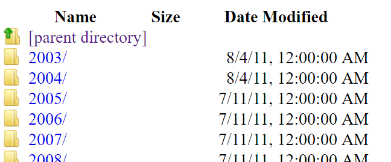
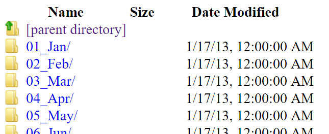
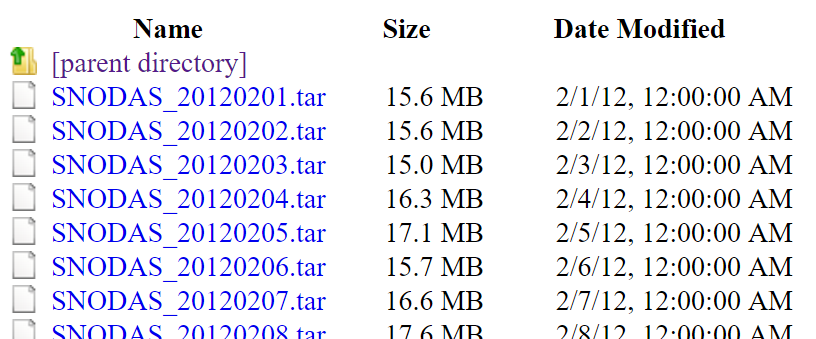

# Table of Contents

This page describes the SNODAS Tools input data in detail. 

 - [SNODAS Data Grids](#snodas-data-grids)  
 		- [Difference between SNODAS and SNOTEL Data](#difference-between-snodas-and-snotel-data)
 - [Input Zone Dataset: Watershed Basins](#input-zone-dataset-watershed-basins)  
 		- [Colorado Basins](#colorado-basins)
		
# SNODAS Data Grids

The Snow Data Assimilation System (SNODAS) Data Products are hosted by the National Snow and Ice Data Center (NSIDC) and 
developed by the NOAA National Weather Service’s National Operational Hydrologic Remote Sensing Center (NOHRSC). [SNODAS is
a modeling and assimilation system providing estimates of snow cover variables for the purpose of hydrological modeling and 
analysis.](http://nsidc.org/data/docs/noaa/g02158_snodas_snow_cover_model/) For the purpose of this documentation, the 
relevant information regarding this specific project will be explained. All this information and more is described 
in detail at
[http://nsidc.org/data/docs/noaa/g02158_snodas_snow_cover_model/](http://nsidc.org/data/docs/noaa/g02158_snodas_snow_cover_model/).

NOHRSC creates multiple national SNODAS raster grids each day.  

|<center>The 8 parameters of SNODAS data <br> that are produced daily:|
|-----|
|Snow Water Equivalent (SWE)|
|Snow Depth|
|Snow Melt Runoff at the Base of snowpack|
|Sublimation from the snowpack|
|Sublimation of Blowing Snow|
|Solid Precipitation|
|Liquid Precipitation|
|snowpack Average Temperature|

For the purpose of this project, the only parameter of interest is Snow Water Equivalent (SWE). The daily SWE grid values are
snapshots of SWE for a specific date at *6:00 AM UTC* (*11:00 PM previous day MST*). Below is an image of a daily SNODAS grid
representing SWE values across the nation. The areas of higher SWE are represented by blue while the areas with lower or no SWE
values are represented by brown. 


*SNODAS Snow Water Equivalent Masked Grid for January 16th, 2017 (6:00 AM UTC)*

The SNODAS data is available in 2 spatial coverages: masked and unmasked data. The masked data is clipped to the contiguous US
while the unmasked data extends to cover a larger area (see the table below). For the purpose of this project, the masked data is the 
more appropriate size and is the chosen avenue for data assimilation. 

||Masked SNODAS Data|Unmasked SNODAS Data|
|-|--------------|-----------------|
|Spatial Coverage|Contiguous U.S.| Southernmost Latitude: 24.0996 ° N, Northernmost Latitude: 58.2329 ° N, Westernmost Longitude: 130.5171 ° W, Easternmost Longitude: 62.2504 ° W|
|Spatial Resolution|30 arc seconds, nominally 1 km on the ground|30 arc seconds, nominally 1 km on the ground|
|Temporal Coverage|30 September 2003 to present|09 December 2009 to present|
|Temporal Resolution|24-hour, snapshot at 6:00 AM UTC|24-hour, snapshot at 6:00 AM UTC|
|Grid size| 6,935 columns by 3,351 rows| 8,192 columns by 4,096 rows|
|Grid values|16-bit, signed integers|16-bit, signed integers|

The temporal coverage of the masked data begins on September 30, 2003 and extends to the 
current date. For the purpose of this project, all available data files are downloaded starting on September 30, 2003. 

The daily SNODAS datasets are stored in the following FTP site: [ftp://sidads.colorado.edu](ftp://sidads.colorado.edu) under the pathname 
```/DATASETS/NOAA/G02158/masked/```. 
This directory contains folders indicating the years of which the data temporally covers. 



In each year’s folder, there are folders indicating 
each month of the year. 



The [8 daily rasters representing each unique snowpack parameter](#snodas-data-grids) are stored within zipped daily .tar files located in each specific month.  The .tar files follow the 
naming convention of ```SNODAS_YYYYMMDD.tar``` where YYYYMMDD represents the date of SNODAS data.



**Difference between SNODAS and SNOTEL Data**

**TODO smalers 2016-12-10 explain the difference between SNODAS and SNOTEL data**  

  - **provide SNODAS resources and links and explain generally what SNODAS is,
as well as benefits and limitations, mention that SNODAS is distributed whereas SNOTEL and snow course are measurements at sites.
Note that people want to correlate SNOTEL with SNODAS but that can be difficult.
Explain how SNODAS model and data file format has changed over time and this project converts to consistent format.
This project does the intersection with basin data because the SNODAS basins changed over time - see original proposal language.
Split into sections as appropriate.**


# Input Zone Dataset: Watershed Basins

The SNODAS Tools calculate zonal snowpack statistics on the SNODAS SWE daily grids. 
Zonal statistics are statistics calculated by zone where the zones are defined by an input zone dataset 
and the values are defined by a raster grid. The raster grid is [the daily
SNODAS SWE grid](#snodas-data-grids). The input zone dataset is a watershed basin boundary shapefile where each
feature represents a basin area of interest. One set of daily
snowpack statistics is calculated for each feature of the watershed basin boundary shapefile. 

The SNODAS Tools were originally designed to calculate snowpack statistics of Colorado basins. The
next section explains the specifications of the original Colorado watershed basin boundary shapefile. 

Although specifically designed for the state of Colorado, the SNODAS Tools can calculate snowpack statistics 
for any watershed basin(s) as long as the extent of the watershed basin boundary shapefile is contained within the 
bounds of the unmasked [SNODAS grids](#snodas-data-grids). 

## Colorado Basins

The Colorado watershed basin boundary shapefile was developed by merging basin shapefiles provided by the following four
[National Weather Service (NWS) River Forecast Centers](http://water.weather.gov/ahps/rfc/rfc.php), as well as data from 
[Northern Colorado Water Conservancy District](http://www.northernwater.org/default.aspx).  

1. [Missouri Basin](http://www.weather.gov/mbrfc/) (MBRFC)  
2. [Colorado Basin](http://www.weather.gov/cbrfc) (CBRFC)  
3. [West Gulf](http://www.crh.noaa.gov/wgrfc/) (WGRFC)  
4. [Arkansas-Red Basin](http://www.weather.gov/abrfc/) (ABRFC)  

Displayed below in green, the Colorado watershed basin boundary shapefile contains a total of 322 basins each with a unique id (LOCAL_ID). 
Right-click on the image and click *Open image in new tab* to see a larger view. 


*The Colorado watershed basin boundary shapefile displayed in green. The Colorado state boundary is drawn with a thick, black border.*

### Additional Details about the Colorado Basins

**Local versus Total Basins**

TODO smalers 2016-12-11 
Smaller basins are aggregated to larger totals. Elevation zones are used in the basins included in the Northern Colorado Water Conservancy District boundary (Upper Colorado and Poudre Basins),
and are also accumulated to produce a total for a basin.  Provide a screen shot.
Include information about watershed connectivity file and about the elevation zones. 

**Edits made to the Original Data Sources**

As mentioned above, the Colorado watershed basin boundary shapefile was developed by merging basins from multiple
sources. The field ```POLY_SOURC``` within the attribute table of the downloadable ```Final Colorado Watershed Basin Input Shapefile```
is designed to inform the user the originating source of each feature. 

The majority of features within the Colorado watershed basin boundary shapefile were unchanged for
the SNODAS Tools project. However, in the rare case, the boundary of a feature was edited to maintain integrity of the 
output products. 

** TODO egiles 03/27/17 Explain why the edits were made.**

The field ```EDIT_FLAG``` within the attribute table of the downloadable ```Final Colorado Watershed Basin Input Shapefile``` is designed to 
track the basin features that have been edited from their original source for the SNODAS Tools project. A feature has been edited 
from its original source if the value '1' is assigned to the ```EDIT_FLAG``` attribute. 

### Available Colorado Basin Boundary Layers for Download

The Colorado watershed basin shapefile, as well as the original source data files, are available for download below:

|Layer|File Format|Download Link|
|-|-|-|
|Final Colorado Watershed Basin Input|Shapefile (.zip)|[Final CCO Watershed Basin Shapefile](http://projects.openwaterfoundation.org/owf-proj-co-cwcb-2016-snodas/prototype/StaticData/SNODAS_CO_BasinBoundaries.zip)|
|Final Colorado Watershed Basin Input|.GeoJSON|[Final CO Watershed Basin GeoJSON](http://projects.openwaterfoundation.org/owf-proj-co-cwcb-2016-snodas/prototype/json/SNODAS_geometry.geojson)|
|Original Basin Layer - ABRFC|Shapefile (.tar.gz)|[Original Basin Layer - ABRFC](https://www.nohrsc.noaa.gov/data/vector/master/b_abrfc.tar.gz)|
|Original Basin Layer - CBRFC|Shapefile (.tar.gz)|[Original Basin Layer - CBRFC](http://www.cbrfc.noaa.gov/downloads/files/gis/cbrfcBasins20110601.tar.gz)|
|Original Basin Layer - MBRFC|Shapefile (.tar.gz)|[Original Basin Layer - MBRFC](https://www.nohrsc.noaa.gov/data/vector/master/b_mbrfc.tar.gz)|
|Original Basin Layer - WGRFC|-|-|
|Original Basin Layer - Northern Water|-|-|
|Input CO Basin Connectivity|.xlsx|[Input CO Basin Connectivity .xlsx](http://projects.openwaterfoundation.org/owf-proj-co-cwcb-2016-snodas/prototype/StaticData/Watershed_Connectivity_v3.xlsx)|

** TODO egiles 03/27/17 ask Steve what to include about basin connectivity worksheet/basin list Excel file** 
 
**TODO egiles 03/27/17 ask Steve if we should host the emailed shapefiles (Northern Water and WGRFC) on amazon services for download**


