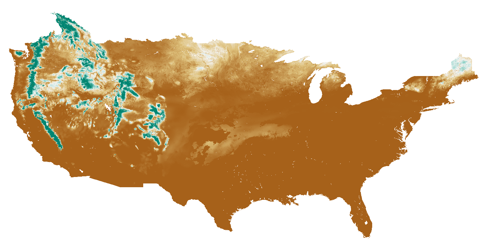
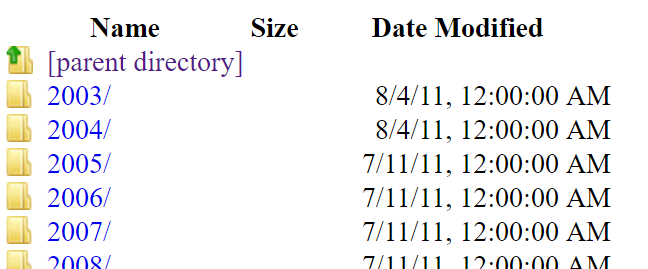
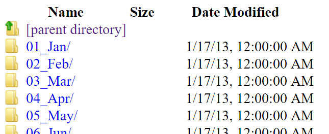
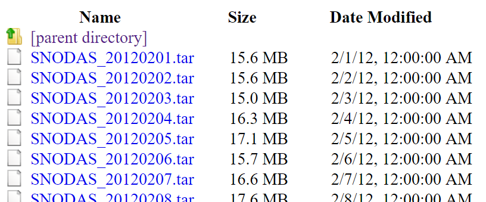

# Table of Contents

The following topics are discussed in this section:

 - [Overview](#overview)
 - [SNODAS Data Grids](#snodas-data-grids)
 - [Input Zone Dataset: Watershed Basins](#input-zone-dataset-watershed-basins)
	- [Colorado Basins](#colorado-basins)


# Overview

The SNODAS Tools calculate snow pack statistics based on the published values of the SNOw Data Assimilation System 
(SNODAS) national data grids. 

## SNODAS Data Grids

The Snow Data Assimilation System (SNODAS) Data Products are hosted by the National Snow and Ice Data Center (NSIDC) and 
developed by the NOAA National Weather Service’s National Operational Hydrologic Remote Sensing Center (NOHRSC). [SNODAS is
a modeling and assimilation system providing estimates of snow cover variables for the purpose of hydrological modeling and 
analysis.](http://nsidc.org/data/docs/noaa/g02158_snodas_snow_cover_model/) For the purpose of this documentation, the 
relevant information regarding this specific project will be explained. All of this information and more is described 
in detail at
[http://nsidc.org/data/docs/noaa/g02158_snodas_snow_cover_model/](http://nsidc.org/data/docs/noaa/g02158_snodas_snow_cover_model/).

Multiple national raster grids have been and continue to be created for each day. 

|<center>The 8 parameters of SNODAS data <br> that are produced daily:|
|-----|
|Snow Water Equivalent (SWE)|
|Snow Depth|
|Snow Melt Runoff at the Base of Snow Pack|
|Sublimation from the Snow Pack|
|Sublimation of Blowing Snow|
|Solid Precipitation|
|Liquid Precipitation|
|Snow Pack Average Temperature|

For the purpose of this project, the only parameter of interest is Snow Water Equivalent (SWE). The daily SWE grid values are
snapshots of SWE for a specific date at *6:00 AM UTC* (*11:00 PM previous day MST*). Below is an image of a daily SNODAS grid
representing SWE values across the nation. The areas of higher SWE are represented by blue while the areas with lower or no SWE
values are represented by brown. 


*SNODAS Snow Water Equivalent Masked Grid for January 16th, 2017 (6:00 AM UTC)*


The SNODAS data is available in 2 spatial coverages: masked and unmasked data. The masked data is clipped to the contiguous US
while the unmasked data extends to cover a larger area (see below). For the purpose of this project, the unmasked data is the 
more appropriate size and is the chosen avenue for data assimilation. 


||Masked SNODAS Data|Unmasked SNODAS Data|
|-|--------------|-----------------|
|Spatial Coverage|Contiguous U.S.| Southernmost Latitude: 24.0996 ° N, Northernmost Latitude: 58.2329 ° N, Westernmost Longitude: 130.5171 ° W, Easternmost Longitude: 62.2504 ° W|
|Spatial Resolution|30 arc seconds, nominally 1 km on the ground|30 arc seconds, nominally 1 km on the ground|
|Temporal Coverage|30 September 2003 to present|09 December 2009 to present|
|Temporal Resolution|24-hour, snapshot at 6:00 AM UTC|24-hour, snapshot at 6:00 AM UTC|
|Grid size| 6,935 columns by 3,351 rows| 8,192 columns by 4,096 rows|
|Grid values|16-bit, signed integers|16-bit, signed integers|

The temporal coverage of the masked data begins on September 30, 2003 and extends to the 
current date. For the purpose of this project, all available data files are downloaded starting on September 30, 2003. 

The daily SNODAS datasets are stored in the following FTP site: [ftp://sidads.colorado.edu](ftp://sidads.colorado.edu) under the pathname 
```/DATASETS/NOAA/G02158/masked/```. 
This directory contains folders indicating the years of which the data temporally covers. 



In each year’s folder, there are folders indicating 
each month of the year. 



The [8 daily rasters representing each unique snowpack parameter](#snodas-data-grids) store within zipped daily .tar files located in each specific month.  The .tar files follow the 
naming convention of ```SNODAS_YYYYMMDD.tar``` where YYYYMMDD represents the date of data.



**TODO smalers 2016-12-10 provide SNODAS resources and links and explain generally what SNODAS is,
as well as benefits and limitations, mention that SNODAS is distributed whereas SNOTEL and snow course are measurements at sites.
Note that people want to correlate SNOTEL with SNODAS but that can be difficult.
Explain how SNODAS model and data file format has changed over time and this project converts to consistent format.
This project does the intersection with basin data because the SNODAS basins changed over time - see original proposal language.
Split into sections as appropriate.**


## Input Zone Dataset: Watershed Basins

The SNODAS Tools calculate zonal snowpack statistics on the SNODAS SWE daily grids. 
Zonal statistics are statistics calculated by zone where the zones are defined by an input zone dataset 
and the values are defined by a raster grid. The raster grid is [the daily
SNODAS SWE grid](#snodas-data-grids). The input zone dataset is a watershed basin boundary shapefile. One set of daily
snowpack statistics is calculated for each basin, or feature, of the watershed basin boundary shapefile. 

The SNODAS tools were originally designed to calculate snowpack statistics of the basins of Colorado. The
next section explains the specifications of the original Colorado watershed basin boundary shapefile. 

### Colorado Basins


**TODO smalers 2016-12-11 explain that basins are small HUC-?? and align with National Weather Service (NWS) forecast basins.
Smaller basins are aggregated to larger totals.
Elevation zones are used in the basins included in the Northern Colorado Water Conservancy District boundary (Upper Colorado and Poudre Basins),
and are also accumulated to produce a total for a basin.  Provide a screen shot and ability to download.**
The basin boundaries for Colorado were defined using input from four NWS River Forecast Centers.
The separate boundary spatial data layers were adjusted to ensure that basin boundaries did not overlap or have gaps.
This ensures that SNODAS values are not under or over-counted.
Where adjustments were made, edits were documented in the **TODO smalers need to indicate how the edits are tracked**.

The basin boundary layers are available from the following links:

* **TODO smalers 2016-12-11 Include URL for the Colorado basins layer**
* **TODO smalers 2016-12-11 Include URL for the basin list Excel file and CSV file if available**
* **TODO smalers 2016-12-11 Include URL for each RFC's original layer**
