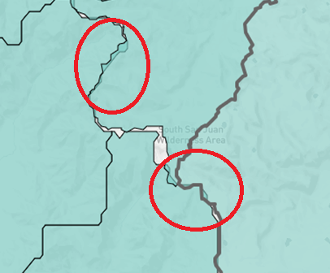
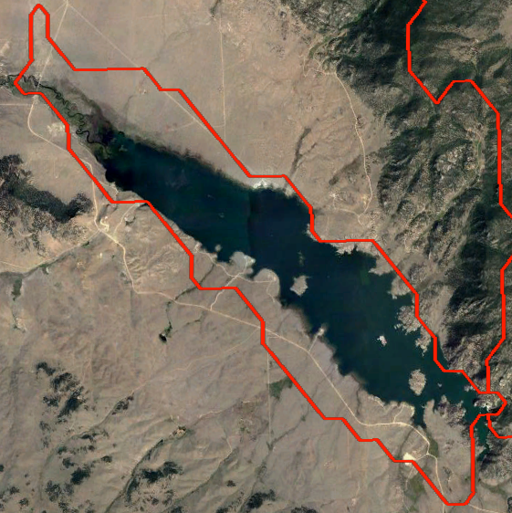
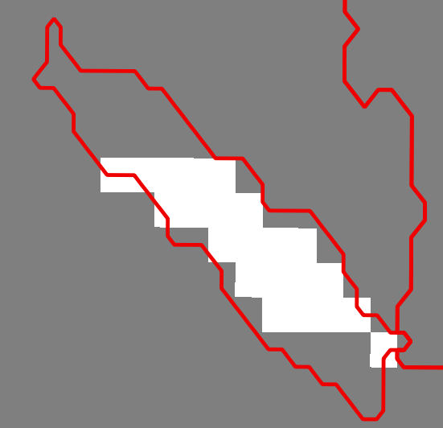

# Table of Contents

 - [Overview](#overview)
 - [Alignment of Basin Boundaries](#alignment-of-basin-boundaries)
 - [Handling of Water Bodies](#handling-of-water-bodies)
 - [Handling Elevation Zones](#handling-elevation-zones)
 - [Calculating Totals for Basin Groups](#calculating-totals-for-basin-groups)
 - [Calculating Percent of Melt-Out](#calculating-percent-of-melt-out)

## Overview
 
Details of calculations are not presented in this User Manual but are documented in the software code.
In most cases the calculations involve standard GIS features.  However, the following processing steps require more explanation.

## Alignment of Basin Boundaries

As mentioned in the [Input Data](../data/data/#additional-details-about-the-colorado-basins) section, the Colorado watershed 
basin input shapefile was developed by combining multiple basin boundary shapefiles. Therefore, there are overlaps and gaps
between features of the shapefile. 

The SNODAS Tools utilize the [QGIS Zonal Statistics tool](https://docs.qgis.org/2.2/en/docs/user_manual/plugins/plugins_zonal_statistics.html) 
to calculate the zonal statistics of each basin in the Colorado watershed basin input shapefile. The QGIS tool calculates the zonal statistics iteratively stepping
through each basin one at a time. Given this technique, there are SNODAS cells of data that are double-counted and included in the zonal statistics of multiple 
features/basins. Similarly, there are SNODAS cells (in the Colorado basin boundary extent) that are not included in the zonal statistics of any basin due to 
the gaps in the Colorado watershed basin input shapefile. 

## Handling of Water Bodies

Snowfall on large bodies of water, like a lake or reservoir, will react considerably differently than snowfall on the ground. 

To mitigate data errors due to the *large bodies of water* phenomenon the SNODAS model applies an open water mask to the landscape assigning open water cells a null value. 
 The QGIS Zonal Statistics tool disregards cells with no-data values when calculating all output statistics - count, mean, etc. 
 The SWE statistics, therefore, are only representative of non-water areas. 
 
Note that the open-water mask is dynamic. A cell that is assigned an open-water null value one day could be assigned a snow statistic the next day. For this reason, the effective 
area of each basin is calculated every day. The effective area is the approximate area of land for each basin (null cells are not represented in the areal calculation). If the open-water mask
changes, the effective area will also be changed. 

Below are two images displaying the open-water mask phenomenon. The aerial image on the top is of the Eleven Mile Reservoir in Colorado (the basin is outlined in red). 
The image on the bottom is the Eleven Mile Reservoir boundary (also in red) atop a daily SNODAS raster grid. The grid is set to color null values, cells representing open bodies of water, as white. As shown,
the open water body is not included in the SNODAS grid. Given the open-water mask, the effective area of the Eleven Mile Reservoir basin would be approximately half of the total area. 
 
 

   
  
 

 
 
** SNODAS Tools' Snowpack Statistics Significantly Affected by the Handling of Water Bodies **

 - The percent snow cover statistic represents the percent of *land* area covered by snow. 
 - The effective area statistic only accounts for the *land* area. This means that a basin's effective area could be much smaller than its total area if it contains many or significant water bodies. 
 Also note that the open water mask is a dynamic layer so the effective area could change over time whereas the total area will remain the same. 

## Handling Elevation Zones

Elevation zones are used for basins in the Northern Colorado Water Conservancy District area because these zones are used
in streamflow forecast models. The boundaries of the elevation zones do not overlap each other. Therefore, each elevation 
zone can be considered as if a separate sub-basin within the larger basin.

**The Colorado Basins with Elevation Zones**

|LOCAL_ID|LOCAL_NAME|TOTAL_ID|TOTAL_NAME|
|-|-|-|-|
|BTNFDRLO|BTNFDRCO <8000ft|BTNFDRCO|NORTH FORK BIG THOMPSON RIVER AT DRAKE, CO.|
|BTNFDRM|BTNFDRCO >8000ft - <10,250ft|BTNFDRM|NORTH FORK BIG THOMPSON RIVER AT DRAKE, CO. (MID ELEV)|
|BTNFDRUP|BTNFDRCO >10,250ft|BTNFDRUP|NORTH FORK BIG THOMPSON RIVER AT DRAKE, CO. (UP ELEV)|
|BTCANYLO|BTCANYCO <8000ft|BTCANYCO|BIG THOMPSON R AT MOUTH OF CANYON, NR DRAKE, CO.|
|BTCANYUP|BTCANYCO >10,250ft|BTCANYUP|BIG THOMPSON R AT MOUTH OF CANYON, NR DRAKE, CO. (UPPER)|
|BTABESLO|BTABESCO <8000ft|BTABESCO|BIG THOMPSON RIVER AT ESTES PARK, CO.|
|BTABESM|BTABESCO >8000ft - <10,250ft|BTABESM|BIG THOMPSON RIVER AT ESTES PARK, CO. (MID ELEV)|
|BTABESUP|BTABESCO >10,250ft|BTABESUP|BIG THOMPSON RIVER AT ESTES PARK, CO. (UPPER ELEV)|
|CLANSELO|CLANSECO <8000ft|CLANSECO|NORTH FORK CACHE LA POUDRE RIVER BELOW SEAMAN RESE|
|CLANSEM|CLANSECO >8000ft - <10,250ft|CLANSEM|NORTH FORK CACHE LA POUDRE RIVER BELOW SEAMAN RESE (MID)|
|CLANSEUP|CLANSECO >10,250ft|CLANSEUP|NORTH FORK CACHE LA POUDRE RIVER BELOW SEAMAN RESE (UP)|
|CLAFTCLO|CLAFTCCO <8000ft|CLAFTCCO|CACHE LA POUDRE RIV AT MO OF CN, NR FT COLLINS, CO|
|CLAFTCM|CLAFTCCO >8000ft - <10,250ft|CLAFTCM|CACHE LA POUDRE RIV AT MO OF CN, NR FT COLLINS, CO (MID)|
|CLAFTCUP|CLAFTCCO >10,250ft|CLAFTCUP|CACHE LA POUDRE RIV AT MO OF CN, NR FT COLLINS, CO (UP)|

**TODO egiles 03-28-17 explain how the elevation zones will be handled when calculating the total snowpack statistics**

## Calculating Totals for Basin Groups

Each smaller basin polygon (and elevation zones) in the basin layer is used to calculate snowpack statistics.
These statistics are used to visualize snowpack conditions in maps and graphs.
However, it is also useful to calculate totals for a group of basins, in order to align with streamflow forecast points that are used for water supply planning and decisions.

**TODO smalers 2016-12-11 need to describe how the data are configured to control these calculations and how the calculations occur.
Are the same statistics represented in the totals or are additional calculations done, such as converting SWE depth to ACFT volume?**

## Calculating Percent of Melt-Out

**TODO smalers 2016-12-11 Joe Busto indicated an interest in a graph showing percent of melt-out.  Steve needs to discuss with him to get an example.**

