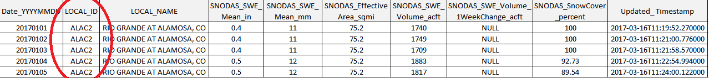

# Table of Contents

The following topics are discussed in this section:

 - [Overview](#overview)
 - [Download National SNODAS Data](#download-snodas-data)
	- [Download Historical Data](#download-snodas-data-historical)
	- [Download Current Date's Data](#download-snodas-data-each-new-day)
 - [Clip National SNODAS Grid to Colorado](#clip-national-snodas-grid-to-colorado)
 - [Intersect SNODAS Colorado Grid with Colorado Basins and Calculate Statistics](#intersect-snodas-colorado-grid-with-colorado-basins-and-calculate-statistics)
 - [Generate Time Series Snowpack Products](#generate-time-series-snowpack-products)
	- [Snowpack Statistics in Tables](#snowpack-statistics-in-tables)
	- [Snowpack Statistics in Choropleth Maps](#snowpack-statistics-in-choropleth-maps)
 - [Additional Process Details](#additional-process-details)
	- [Alignment of Basin Boundaries](#alignment-of-basin-boundaries)
	- [Handling of Water Bodies](#handling-of-water-bodies)
	- [Handling Elevation Zones](#handling-elevation-zones)
	- [Calculating Totals for Basin Groups](#calculating-totals-for-basin-groups)
	- [Calculating Percent of Melt-Out](#calculating-percent-of-melt-out)

# Overview

This documentation is provided to explain the process implemented by the SNODAS Tools,
to allow users of the data products to better understand features and limitations of the data and processes.
Note that the SNODAS Tools can be used to calculate snowpack statistics for study areas other than Colorado. For 
the purpose of this documentation, however, the process of the SNODAS Tools is explained using Colorado, the study area 
for which the SNODAS Tools were originally designed. Refer to the 
[SNODAS Tools Developer Manual](http://software.openwaterfoundation.org/cdss-app-snodas-tools-doc-dev/)
for information regarding how to use the SNODAS Tools to calculate snowpack statistics for other study areas. 

In broad terms, the SNODAS Tools perform the following steps:

1. [Download Daily SNODAS Data](#download-snodas-data)
2. [Clip National SNODAS Grid to Colorado](#clip-national-snodas-grid-to-colorado)
3. [Intersect SNODAS Colorado Grid with Colorado Basins and Calculate Snowpack Statistics](#intersect-snodas-colorado-grid-with-colorado-basins-and-calculate-statistics)
4. [Generate Time Series Snowpack Products](#generate-time-series-snowpack-products)

These steps are performed using the free and open source Geographic Information System (GIS) software [QGIS/pyQGIS/GDAS/OGR software](http://www.qgis.org/en/site/).
Detailed information about the SNODAS Tools software can be found in the [SNODAS Tools Developer Manual](http://software.openwaterfoundation.org/cdss-app-snodas-tools-doc-dev/).

The following sections summarize each processing step.

## Download SNODAS Data

National SNODAS grids are downloaded to the SNODAS Tools computer for processing into products that are relevant to Colorado.
 

[Daily SNODAS data grids](../data/overview.md#snodas-data-grids) are national grids representing a variety of snowpack parameters. They are developed 
by NOAA National Weather Service’s National Operational Hydrologic Remote Sensing Center (NOHRSC) and hosted by the National Snow and 
Ice Data Center (NSIDC). NSIDC stores the daily grids, dating back to September 30th,  2003, in a public FTP site 
[( ftp://sidads.colorado.edu)](ftp://sidads.colorado.edu) that is updated every day. Although, as mentioned before, the SNODAS products 
contain many grids of snowpack parameters, the SNODAS Tools are designed to specifically calculate snowpack statistics in regards to the Snow
Water Equivalent (SWE) grid. Below is an image of a daily SNODAS grid representing SWE values across the nation. The areas of higher SWE are represented 
by blue while the areas with lower, or no SWE values, are represented by brown. 


*SNODAS Snow Water Equivalent Masked Grid for January 16th, 2017*


The SNODAS Tools are designed to process all available daily SNODAS SWE grids from September 30th, 2003 to the current date. 
A full historical repository of daily snowpack statistics gives insight into how the Colorado snowpack has changed over the years. 
It also allows review of the snowpack conditions for a specific year in comparison to the historical average. 

To obtain this vast repository, the SNODAS Tools are designed to download and process both [historical](#download-snodas-data-historical)
and [present dates](#download-snodas-data-each-new-day) of SNODAS daily data.

### Download SNODAS Data (Historical)

The organization of SNODAS files has changed over time. Therefore, the tools perform clean-up to put data into a common format and 
naming convention for additional processing. Because the national grids are relatively large, they are 
[clipped to Colorado boundary in the next step](#clip-national-snodas-grid-to-colorado).

### Download SNODAS Data (Each New Day)

Similar to historical data download, SNODAS grids are downloaded each day to update the current snowpack products.
The current date's grid, along with the historical grids, is made available in the following locations:

* [CDSS Map Viewer](http://cdss.state.co.us/onlineTools/Pages/MapViewer.aspx) - **TODO smalers 2016-12-11 need to confirm that State is loading it and give directions for how to find**
* [Data Archive at CWCB](http://cwcb.state.co.us) - **TODO smalers 2016-12-11 location being determined via conversations with State**
* [Data Archive in Open Water Foundation Project](http://projects.openwaterfoundation.org/owf-proj-co-cwcb-2016-snodas/index.html) - this archive may only
be available during SNODAS Tools development depending on ongoing costs

## Clip National SNODAS Grid to Colorado

The masked [SNODAS data grids](../data/overview.md#snodas-data-grids) cover the contiguous United States. To facilitate processing, the national grid is clipped to 
a boundary that contains the extent of all basins in Colorado. *Note:* Some Colorado basins extend beyond the Colorado state boundary so 
the Colorado basin extent extends partially into other states.  


*Above: The Colorado basins displayed in green. The outline of the Colorado state boundary is overlaid in balck.*


*Above: The Colorado basin extent displayed in green. The outline of the Colorado basins are overlaid in black.*


*Above: The SNODAS Snow Water Equivalent Masked Grid for January 16th, 2017 with the Colorado basin extent outline overlaid in black.*


*Above: The SNODAS Snow Water Equivalent Grid for January 16th, 2017 clipped to the Colorado basin extent. The skewed image is due to reprojections built into the SNODAS Tools. 
Reference the [SNODAS Tools Developer Manual](http://software.openwaterfoundation.org/cdss-app-snodas-tools-doc-dev/software-design/overview/#clip-and-project-snodas-national-grids-to-study-area) for information about the reprojections.*

For a more detailed description on the clipping of the SNODAS daily grids 
to the extent of the study area, refer to the 
[Processing Workflow](http://software.openwaterfoundation.org/cdss-app-snodas-tools-doc-dev/software-design/overview/#clip-and-project-snodas-national-grids-to-study-area) 
section of the SNODAS Tools Developer Manual.

The Colorado basins map layer is used in later steps to produce basin-specific snow statistics such as mean snow water equivalent (SWE) 
and percent snow coverage.

**TODO smalers 2016-12-09 
This would also be a good place to link to the list of basins (Excel).
We can add links to download for the products and basin layer once that is in place**

## Intersect SNODAS Colorado Grid with Colorado Basins and Calculate Statistics

The output daily snowpack statistics are specific to each basin of the Colorado basins layer. Using 
[the QGIS Zonal Statistics Plugin](https://docs.qgis.org/2.2/en/docs/user_manual/plugins/plugins_zonal_statistics.html),
the clipped SNODAS daily grid is intersected with the Colorado basin layer and the following statistics are calculated for each basin:

|Statistic (by Basin)|Units|Description|
|---------|-----|----------|
|Snow Water Equivalent (SWE) average|inches and meters|a measure of how much water is available to melt out|
|Snow Water Equivalent (SWE) minimum|inches and meters|a measure of the smallest daily observation of SWE|
|Snow Water Equivalent (SWE) maximum|inches and meters|a measure of the largest daily observation of SWE|
|Snow Water Equivalent (SWE) standard deviation|inches and meters|a measure of SWE variation across the basin|
|Areal Extent of Snow Cover (percent)|unitless|indicates how much of the basin has some level of snow cover|

### Snowpack Statistics in Tables

The statistics are written to comma-separated-value (CSV) files. The current date's statistics are compiled with the historical 
statistics to create two large repositories of Colorado snowpack statistics, statistics organized ```by date``` and statistics 
organized ```by basin```. 

**Colorado Snowpack Statistics organized By Date**  
In this repository a separate csv file is created for each 
date of processed SNODAS data. Each csv file contains the snowpack statistics for every Colorado basin specific to that date. 
This repository is useful when analyzing the differences in snowpack statistics across the entire landscape for a given day.
Below is an example of the Colorado snowpack statistics organized by date CSV file. Right-click on the image and click *Open image 
in new tab* to see a larger view. The red circle indicates the date column. Note that the date is unchanging throughout the entire CSV file. 


**Colorado Snowapack Statistics organized By Basin**  
In this repository a separate csv file is 
created for each Colorado basin. Each csv file contains the snowpack statistics for all historical dates of processed SNODAS 
data specific to that Colorado basin. This repository is useful when analyzing the differences in snowpack statistics over time 
given a specific basin. Below is an example of the Colorado snowpack statistics organized by basin CSV file. Right-click on the 
image and click *Open image in new tab* to see a larger view. The red circle indicates the 
unique Colorado basin ID (LOCAL_ID). Note that the LOCAL_ID is unchanging throughout the entire CSV file. 



### Snowpack Statistics in Choropleth Maps

The daily snowpack statistics can also be viewed via a [choropleth map](http://www.datavizcatalogue.com/methods/choropleth.html). 

**TODO smalers 2016-12-11 include links to products**

## Generate Time Series Snowpack Products

The basin statistics for each basin, for each day of the historical period, as saved in the tabular output described in the previous section,
can be used to create a time series of the statistic and displayed in graphical form.
The [CDSS TSTool Software](http://software.openwaterfoundation.org/) is used to automate processing the tabular data into graphs,
which are made available on the web.

TSTool is also used to accumulate smaller basin statistics into larger basin statistics, to provide data at streamflow forecast points that are used
for water management.

**TODO egiles 2017-02-06 insert screen shot of TSTool-produced SNODAS graph**

## Additional Process Details

Details of calculations are not presented in this User Manual but are documented in the software code.
In most cases the calculations involve standard GIS features.  However, the following processing steps require more explanation.

### Alignment of Basin Boundaries

The alignment of basin boundaries is discussed in the [SNODAS Tools Data](../data/overview/) documentation.
Basin boundaries were adjusted to prevent double-counting and under-counting in snowpack statistics due to overlapping boundaries.

### Handling of Water Bodies

Some basin boundaries represent water body areas within basins.  Statistic calculations for these sub-basins are handled as follows:

* **TODO smalers 2016-12-11 need to describe**

### Handling Elevation Zones

Elevation zones are used for basins in the Northern Colorado Water Conservancy District area because these zones are used
in streamflow forecast models.
The boundaries of the elevation zones do not overlap each other.
Therefore, each elevation zone can be considered as if a separate sub-basin within the larger basin.
The totals for the larger basin are calculated first by adding up elevations zones for a basin, and then basins are added to provide totals for a basin group.

### Calculating Totals for Basin Groups

Each smaller basin polygon (and elevation zones) in the basin layer is used to calculate snowpack statistics.
These statistics are used to visualize snowpack conditions in maps and graphs.
However, it is also useful to calculate totals for a group of basins, in order to align with streamflow forecast points that are used for water supply planning and decisions.

**TODO smalers 2016-12-11 need to describe how the data are configured to control these calculations and how the calculations occur.
Are the same statistics represented in the totals or are additional calculations done, such as converting SWE depth to ACFT volume?**

### Calculating Percent of Melt-Out

**TODO smalers 2016-12-11 Joe Busto indicated an interest in a graph showing percent of melt-out.  Steve needs to discuss with him to get an example.**


** Questions for Steve (from Emma) 2016-02-06: Should we include the above key processing steps here even though they are explained in the developer 
documentation under section "software design: key processing steps"? Should we include any information about the creation of the snow cover grid in 
the process section of the user documentation?**
