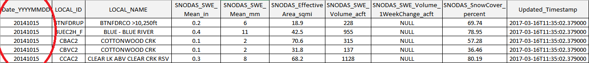

# Table of Contents

The following topics are discussed in this section:

 - [1. Download National SNODAS Data](#1-download-snodas-data)
	- [Download Historical Data](#download-snodas-data-historical)
	- [Download Current Date's Data](#download-snodas-data-each-new-day)
 - [2. Clip National SNODAS Grid to Colorado](#2-clip-national-snodas-grid-to-colorado)
 - [3. Intersect SNODAS Colorado Grid with Colorado Basins and Calculate Statistics](#3-intersect-snodas-colorado-grid-with-colorado-basins-and-calculate-statistics)
 - [4. Generate Time Series Snowpack Products](#4-generate-time-series-snowpack-products)
	- [Snowpack Statistics Exported as Tabular Data](#snowpack-statistics-exported-as-tabular-data)
	- [Snowpack Statistics Exported as Spatial Data](#snowpack-statistics-exported-as-spatial-data)
	
# 1. Download SNODAS Data

National SNODAS grids are downloaded to the SNODAS Tools computer for processing into products that are relevant to Colorado.
 

[Daily SNODAS data grids](../data/overview.md#snodas-data-grids) are national grids representing a variety of snowpack parameters. They are developed 
by NOAA National Weather Service’s National Operational Hydrologic Remote Sensing Center (NOHRSC) and hosted by the National Snow and 
Ice Data Center (NSIDC). NSIDC stores the daily grids, dating back to September 30th,  2003, in a public [FTP site]( ftp://sidads.colorado.edu)
that is updated every day. Although, as mentioned before, the SNODAS products 
contain many grids of snowpack parameters, the SNODAS Tools are designed to specifically calculate snowpack statistics in regards to the Snow
Water Equivalent (SWE) grid. Below is an image of a daily SNODAS grid representing SWE values across the nation. The areas of higher SWE are represented 
by blue while the areas with lower, or no SWE values, are represented by brown. 


*SNODAS Snow Water Equivalent Masked Grid for January 16th, 2017*


The SNODAS Tools are designed to process all available daily SNODAS SWE grids from September 30th, 2003 to the current date. 
A full historical repository of daily snowpack statistics gives insight into how the Colorado snowpack has changed over the years. 
It also allows review of the snowpack conditions for a specific year in comparison to the historical average. 

To obtain this vast repository, the SNODAS Tools are designed to download and process both [historical](#download-snodas-data-historical)
and [present dates](#download-snodas-data-each-new-day) of SNODAS daily data.

## Download SNODAS Data (Historical)

The SNODAS Tools contain a script to download and process all available **historical** dates of SNODAS data. Refer to the
[SNODAS Tools' Scripts](http://software.openwaterfoundation.org/cdss-app-snodas-tools-doc-dev/software-design/overview/#snodas-tools-scripts) 
section of the Developer Manual for further details on the historical processing script. 


## Download SNODAS Data (Each New Day)

Similar to historical data download, the **current daily** SNODAS grid is downloaded each day to update the snowpack products. 
The SNODAS Tool script responsible for the daily download is designed to be processed automatically on a task scheduler 
program. Refer to the
[SNODAS Tools' Scripts](http://software.openwaterfoundation.org/cdss-app-snodas-tools-doc-dev/software-design/overview/#snodas-tools-scripts) 
section of the Developer Manual for further details on the automatic daily processing script. The current date's grid, 
along with the historical grids, is made available in the following locations:

* [CDSS Map Viewer](http://cdss.state.co.us/onlineTools/Pages/MapViewer.aspx) - **TODO smalers 2016-12-11 need to confirm that State is loading it and give directions for how to find**
* [Data Archive at CWCB](http://cwcb.state.co.us) - **TODO smalers 2016-12-11 location being determined via conversations with State**
* [Data Archive in Open Water Foundation Project](http://projects.openwaterfoundation.org/owf-proj-co-cwcb-2016-snodas/index.html) - this archive may only
be available during SNODAS Tools development depending on ongoing costs


# 2. Clip National SNODAS Grid to Colorado

The masked [SNODAS data grids](../data/overview.md#snodas-data-grids) cover the contiguous United States. To facilitate processing, the
downloaded daily national grids are clipped to a boundary that contains the extent of all basins in Colorado. 
 
Note that some of the Colorado basins extend beyond the Colorado state boundary. Therefore,
the Colorado basin extent extends partially into other states. 


*Above: The Colorado basins displayed in green. The outline of the Colorado state boundary is overlaid in balck.*


*Above: The Colorado basin extent displayed in green. The outline of the Colorado basins are overlaid in black.*


*Above: The SNODAS Snow Water Equivalent Masked Grid for January 16th, 2017 with the Colorado basin extent outline overlaid in black.*


*Above: The SNODAS Snow Water Equivalent Grid for January 16th, 2017 clipped to the Colorado basin extent. 

For a more detailed description on the clipping of the SNODAS daily grids 
to the extent of the study area, refer to the 
[Processing Workflow](http://software.openwaterfoundation.org/cdss-app-snodas-tools-doc-dev/software-design/overview/#clip-and-project-snodas-national-grids-to-study-area) 
section of the SNODAS Tools Developer Manual.

Both the Colorado basins layer ([the watershed basin input shapefile](../data/data.md#input-zone-dataset-watershed-basins)) and the daily clipped SNODAS grids are used in later steps to produce basin-specific snow statistics such as mean snow water equivalent (SWE) 
and percent snow coverage.

# 3. Intersect SNODAS Colorado Grid with Colorado Basins and Calculate Statistics

The output daily snowpack statistics are specific to each basin of the Colorado basins layer. Using 
[the QGIS Zonal Statistics Plugin](https://docs.qgis.org/2.2/en/docs/user_manual/plugins/plugins_zonal_statistics.html),
the clipped SNODAS daily grid is intersected with the Colorado basin layer and the following statistics are calculated for each basin:

|<center>Daily Statistic|<center>Default <br> or <br> Optional</center>|<center>Description|<center>Units|
|-|-|-|-|
|Mean Snow Water Equivalent (SWE)|Default|The mean amount of water contained within the snowpack.|Inches and Millimeters|
|Effective Area|Default|The approximate area excluding large bodies of water.|Square Miles|
|Percent of Snow Cover|Default|The percent of effective area covered by snow.|unitless|
|SWE Volume|Default|The amount of water contained in the entire basin's snowpack. Calculated by multiplying the daily mean SWE value by the daily effective area value.|Acre Feet|
|1 Week Change in SWE Volume|Default|The difference in the current SWE Volume value from the SWE Volume value calculated 7 days prior. If positive, the snowpack volume has increased. If negative, the snowpack volume has decreased.| Acre Feet|
|Minimum SWE|Optional|The daily minimum SWE value.| Inches and Millimeters|
|Maximum SWE|Optional|The daily maximum SWE value.|Inches and Millimeters|
|Standard Deviation of SWE|Optional|A measurement of variation in the basin's daily SWE values.|Inches and Millimeters|

*Note* - *The optional statistics will not be calculated unless they are configured in the [configuration file](http://software.openwaterfoundation.org/cdss-app-snodas-tools-doc-dev/software-design/file-structure/#snodastools92snodasconfigini)
prior to utilizing the SNODAS Tools.*

The daily statistics are exported in both tabular and spatial formats. 

## Snowpack Statistics Exported as Tabular Data

The daily snowpack statistics are written to comma-separated-value (CSV) files. The current date's statistics are compiled with the historical 
statistics to create two large repositories of Colorado snowpack statistics, statistics organized ```by date``` and statistics 
organized ```by basin```. 

**Colorado Snowpack Statistics organized By Date**  
In this repository a separate csv file is created for *each*
date of processed SNODAS data. Each csv file contains the snowpack statistics for every Colorado basin specific to that date. 
The number of available ```by date``` csv files will be the same as the number of dates of SNODAS data previously processed by the SNODAS Tools.

This repository is useful when analyzing the differences in snowpack statistics across the entire landscape for a given day.
Below is an example of the Colorado snowpack statistics organized by date CSV file. 

Right-click on the image and click *Open image 
in new tab* to see a larger view. The red circle indicates the date column. Note that the date is unchanging throughout the entire CSV file. 



**Colorado Snowpack Statistics organized By Basin**  
In this repository a separate csv file is 
created for each Colorado basin. Each csv file contains the snowpack statistics for all historical dates of processed SNODAS 
data specific to that Colorado basin. The number of available ```by basin``` csv files will be the same as the number of features/basins in
the [watershed basin input shapefile](../data/data.md#input-zone-dataset-watershed-basins).

This repository is useful when analyzing the differences in snowpack statistics over time 
given a specific basin. Below is an example of the Colorado snowpack statistics organized by basin CSV file.  
 
Right-click on the 
image and click *Open image in new tab* to see a larger view. The red circle indicates the 
unique Colorado basin ID (LOCAL_ID). Note that the LOCAL_ID is unchanging throughout the entire CSV file. 


## Snowpack Statistics Exported as Spatial Data

Along with the tabular data, the SNODAS Tools export the daily statistics as spatial data that 
can be displayed in a geographic information system or a web mapping application. Both a geoJSON file and a shapefile, 
with the daily snowpack statistics contained in the attribute tables, are produced for every day of SNODAS data that is processed. 

# 4. Generate Time Series Snowpack Products

The SNODAS Tools utilize the [CDSS TSTool Software](http://openwaterfoundation.org/software-tools/tstool) to produce time series 
graphs of the snowpack statistics for each basin. Four time series graphs, examples below, are created for each basin (one graph 
per default snowpack statistic).


1. Mean Snow Water Equivalent (SWE), inches

2. Snow Coverage, percent - This time series graph is the only graph that excludes past years of snowpack data.  

3. SWE Volume, acre feet

4. 1 Week Change in SWE Volume, acre feet
