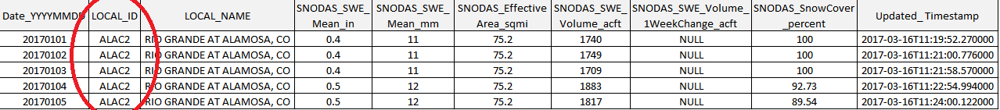
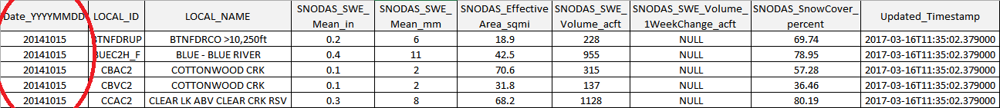
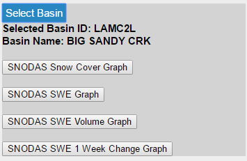

# Table of Contents 

The following topics are discussed in this section:

- [Statistics as Tabular Data](#statistics-as-tabular-data)
	- [Download the Snowpack Statistics by Basin .CSV File](#download-the-snowpack-statistics-by-basin-csv-file)
	- [Download the Snowpack Statistics by Date .CSV File](#download-the-snowpack-statistics-by-date-csv-file)
	- [Metadata](#metadata)
- [Statistics as Spatial Data](#statistics-as-spatial-data)
	- [Download the Snowpack Statistics by Date .GeoJSON File](#download-the-snowpack-statistics-by-date-geojson-file)
	- [Download the Snowpack Statistics by Date Zipped Shapefile](#download-the-snowpack-statistics-by-date-zipped-shapefile)
	- [Metadata](#metadata)
- [Statistics as Time Series Graphs](#statistics-as-time-series-graphs)
	- [Download the Snowpack Statistics Time Series Graphs](#download-the-snowpack-statistics-time-series-graphs)


#SNODAS Tools Products: Snowpack Statistics

The zonal snowpack statistics for each basin of the watershed basin shapefile input
are calculated, exported and made available for download every day. As explained in 
the [SNODAS Tools Process](../process/overview.md#intersect-snodas-colorado-grid-with-colorado-basins-and-calculate-statistics) 
section, the daily snowpack statistics are exported as both tabular and spatial data. 

## Statistics as Tabular Data

The daily snowpack statistics are written to comma-separated-value (CSV) files. The current date's statistics are compiled with 
the historical statistics to create two large repositories of Colorado snowpack statistics, statistics organized ```by date``` and statistics organized ```by basin```.
Both the ```by date``` and ```by basin``` daily csv files are available for download. 

The daily csv files are available for download by accessing the following URL resources. 

### Download the Snowpack Statistics ```by Basin``` .CSV File



|To access the snowpack statistics by Basin csv file, follow the link below. <br>Replace ```Local_ID``` with the 'Local_ID' of the basin of interest.|
|-|
|http://projects.openwaterfoundation.org/owf-proj-co-cwcb-2016-snodas/prototype/SnowpackStatisticsByBasin/SnowpackStatisticsByBasin_Local_ID.csv|

### Download the Snowpack Statistics ```by Date``` .CSV File



|To access the snowpack statistics by Date csv file, follow the link below. <br>Replace ```YYYYMMDD``` with the date of interest.|
|-|
|http://projects.openwaterfoundation.org/owf-proj-co-cwcb-2016-snodas/prototype/SnowpackStatisticsByDate/SnowpackStatisticsByDate_YYYYMMDD.csv|

### Metadata 

Both the ```by Basin``` and ```by Date``` csv files have the same fields and fieldnames. This metadata is explained in more detail in the table below.

|Attribute|Description|Units|Rounded to:<br> (decimals)|Field Name|
|-|-|-|-|-|
|SNODAS Date|The date of SNODAS data.|date<br>(YYYYMMDD)|-|Date_YYYYMMDD|
|Basin Unique ID|The basin's unique identifier.|-|-|LOCAL_ID|
|Basin Unique Name|The basin's common name.|-|-|LOCAL_NAME|
|Area (Without Water Bodies)|Basin's effective area (excluding large water bodies). Calculated with zonal statistics on raster SNODAS data.|AcFt|1|SNODAS_<br>EffectiveArea_<br>sqmi|
|Snowpack Statistic - Mean SWE (inches)|Basin's daily mean snow water equivalent.|In|1|SNODAS_SWE_<br>Mean_in|
|Snowpack Statistic - Mean SWE (millimeters)|Basin's daily mean snow water equivalent.|Mm|0|SNODAS_SWE_<br>Mean_mm|
|Snowpack Statistic - SWE Volume|Basin's daily SWE volume. Calculated by multiplying daily mean SWE by daily effective area.|AcFt|0|SNODAS_SWE_<br>Volume_acft|
|Snowpack Statistic - 1 Week Change in SWE Volume|The difference in the current SWE Volume value from the SWE Volume value calculated 7 days prior. If positive, the snowpack volume has increased. If negative, the snowpack volume has decreased.|AcFt|0|SNODAS_SWE_<br>Volume_<br>1WeekChange_<br>acft|
|Snowpack Statistic - Snow Coverage|Percent of basin's effective area covered by snow.|-|2|SNODAS_<br>SnowCover_<br>percent|
|Updated Timestamp|The date and time that the SNODAS data was downloaded from the FTP site.|datetime<br>(YYYY-MM-DD<br>**T**HH:MM:SS.MMM)|-|Updated_Timestamp|


## Statistics as Spatial Data

Along with the tabular data, the SNODAS Tools export the daily statistics as spatial data that can be displayed in a 
geographic information system or a web mapping application. Both a [GeoJSON file](https://en.wikipedia.org/wiki/GeoJSON) 
and a [shapefile](https://en.wikipedia.org/wiki/Shapefile), with the daily snowpack statistics contained in the attribute tables, 
are produced for every day of SNODAS data that is processed.

### Download the Snowpack Statistics ```by Date``` .GeoJSON File

|To access the snowpack statistics by Date .GeoJSON file, follow the link below. <br>Replace ```YYYYMMDD``` with the date of interest.|
|-|
|http://projects.openwaterfoundation.org/owf-proj-co-cwcb-2016-snodas/prototype/SnowpackStatisticsByDate/SnowpackStatisticsByDate_YYYYMMDD.geojson|

### Download the Snowpack Statistics ```by Date``` Zipped Shapefile

|To access the snowpack statistics by Date zipped shapefile, follow the link below. <br>Replace ```YYYYMMDD``` with the date of interest.|
|-|
|http://projects.openwaterfoundation.org/owf-proj-co-cwcb-2016-snodas/prototype/SnowpackStatisticsByDate/SnowpackStatisticsByDate_YYYYMMDD.zip|

### Attribute Table Metadata

Both the .GeoJSON and shapefile have the same fields (but different fieldnames). This metadata is explained in more detail in the table below.

|Attribute|Description|Units|Rounded to:<br> (decimals)|Field Name -<br> Shapefile|Field Name - <br>GeoJSON|
|-|-|-|-|-|-|
|Basin Unique ID|The basin's unique identifier.|-|-|LOCAL_ID|LOCAL_ID|
|Basin Unique Name|The basin's common name.|-|-|LOCAL_NAME|LOCAL_NAME|
|Total Basin ID|**TODO**|-|-|TOTAL_ID|TOTAL_ID|
|Total Basin Name|**TODO**|-|-|TOTAL_NAME|TOTAL_NAME|
|Original Source|The basin's original source.|-|-|POLY_SOURC|POLY_SOURC|
|Edit Flag|Marked with '1' if the basin was edited from orignal source.|-|-|EDIT_FLAG|EDIT_FLAG|
|Gage Unique ID|Corresponding USGS Gage ID. Only available for basins from WGRFC original source.|-|-|GAGE_ID|GAGE_ID|
|Area (With Water Bodies)|Basin's total area. Calculated with vector basin layer.|SqKm|2|AREA_SQKM|AREA_SQKM|
|Area (Without Water Bodies)|Basin's effective area (excluding large water bodies). Calculated with zonal statistics on raster SNODAS data.|AcFt|1|Area_sqmi|SNODAS_<br>EffectiveArea_<br>sqmi|
|Snowpack Statistic - Mean SWE (inches)|Basin's daily mean snow water equivalent.|In|1|SWEMean_in|SNODAS_SWE_<br>Mean_in|
|Snowpack Statistic - Mean SWE (millimeters)|Basin's daily mean snow water equivalent.|Mm|0|SWEMean_mm|SNODAS_SWE_<br>Mean_mm|
|Snowpack Statistic - SWE Volume|Basin's daily SWE volume. Calculated by multiplying daily mean SWE by daily effective area.|AcFt|0|SWEVol_af|SNODAS_SWE_<br>Volume_acft|
|Snowpack Statistic - 1 Week Change in SWE Volume|The difference in the current SWE Volume value from the SWE Volume value calculated 7 days prior. If positive, the snowpack volume has increased. If negative, the snowpack volume has decreased.|AcFt|0|SWEVolC_af|SNODAS_SWE_<br>Volume_<br>1WeekChange_<br>acft|
|Snowpack Statistic - Snow Coverage|Percent of basin's effective area covered by snow.|-|2|SCover_pct|SNODAS_<br>SnowCover_<br>percent|

## Statistics as Time Series Graphs

As explained in the [Processing Steps](../process/processing-steps/#4-generate-time-series-snowpack-products) section, four time series graphs are created for each basin of the
[watershed basin input shapefile](../data/data/#input-zone-dataset-watershed-basins) (one time series graph for each snowpack statistic). These graphs can be viewed in the 
[CDSS SNODAS Tools Web Application](http://projects.openwaterfoundation.org/owf-proj-co-cwcb-2016-snodas/prototype/index.html) by first clicking a basin of interest in the map display 
and then clicking the time series graph of interest in the left side panel. 

<center>  
*Time Series Graph Buttons in the left side panel   
of the CDSS SNODAS Tools Web Application*</center>

### Download the Snowpack Statistics Time Series Graphs

**TODO egiles 03/28/17 how are we making these graphs available to the public for download**


