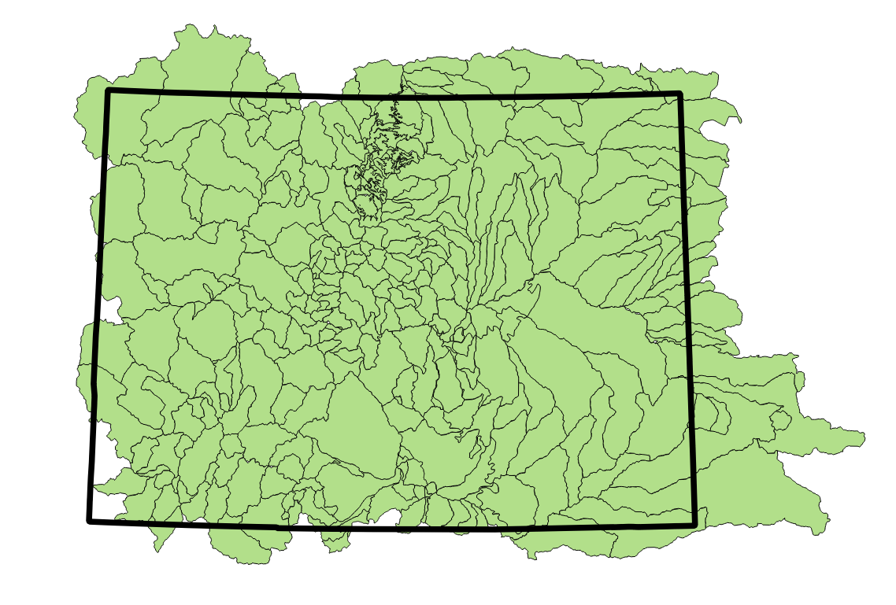

## Basin List

The [watershed basin shapefile input](http://software.openwaterfoundation.org/cdss-app-snodas-tools-doc-dev/software-design/file-structure/#snodastools92staticdata92)
is the zone dataset used by the SNODAS Tools to calculate the daily snowpack statistics for each basin. 

The watershed basin shapefile input for the Colorado project, pictured below in green, is available for download at [this link]().



**TODO smalers 2016-12-11 provide links here again to basin layer and table**
**TODO egiles 2017-03-26 update the image to display the correct shapefile**

## Colorado SNODAS Grid

Each day's SNODAS grid, clipped to the Colorado basin extent is saved on the SNODAS Tools computer as a .tif file, 
using the naming convention ```us_ssmv11034tS__T0001TTNATSYYYYMMDD05HP001.tif``` where YYYYMMDD represents the date of data.
For more information about the location of this file on the SNODAS Tools computer, refer to the 
[File Structure](http://software.openwaterfoundation.org/cdss-app-snodas-tools-doc-dev/software-design/file-structure/#processeddata923_cliptoextent92) 
section of the Developer Manual. 


**TODO 03/26/17 we currently do not have this file accessible in the online application. Discuss with Steve about 
including this layer in the download page**

## Snowpack Statistics

The zonal snowpack statitics for each basin of the watershed basin shapefile input
are calculated, exported and made available for download every day. As explained in 
the [SNODAS Tools Process](../process/overview.md#intersect-snodas-colorado-grid-with-colorado-basins-and-calculate-statistics)
section, the daily snowpack statistics are exported as both tabular and spatial data. 

## Statistics in Table Format

SNODAS Tools export the tabular data in csv format. 

## Statistics in Spatial Format

|Attribute|Description|Field Name - Shapefile|Field Name - GeoJSON|
|-|-|-|-|
|Snowpack Statistic - Mean SWE (inches)|
|Snowpack Statistic - Mean SWE (inches)|
|Snowpack Statistic - Effective Area|


## Basin Map with Statistics

The basin layer for each day is saved as a xxxx file with naming convention xxxx.
The file is available in the CDSS Map Viewer in the xxx group and layer name xxxx.

**TODO smalers 2016-12-11 provide information for how to access in Map Viewer and OWF project page on Amazon.
Describe how we are producing GeoJSON to facilitate access use.
Provide example and explain.**

## Snowpack Time Series Graphs

**TODO smalers 2016-12-11 Include examples and explain.
Need to provide link to products on OWF project page.
Also need to discuss with the State how they might provide access to graphs.**