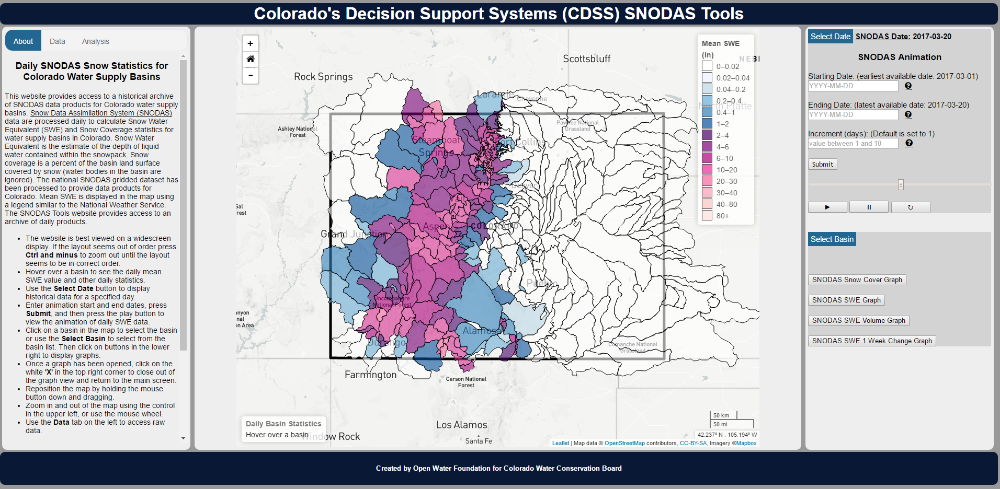

**Colorado's Decision Support Systems SNODAS Tools Web Application**

[Open Water Foundation](http://openwaterfoundation.org/) created a web application to display and host the SNODAS Tools output products 
for download. Click [this link](http://projects.openwaterfoundation.org/owf-proj-co-cwcb-2016-snodas/prototype/index.html) 
to explore the Colorado's Decision Support Systems SNODAS Tools Web Application.

* The CDSS SNODAS Tools Web Application built by Open Water Foundation for the Colorado Water Conservation Board*

|The web application has the following capabilities: |
|-|
|Display the daily mean SWE snowpack statistic for any historical processed day of SNODAS data as a choropleth map.|
|Animate the choropleth map to view change in mean SWE snowpack data across Colorado over time.|
|View time series graphs of the snowpack statistics for each basin.|
|Access all snowpack statistic data for each basin given any historical processed date of SNODAS data.|
|Download SNODAS Tools input data and output products. |
