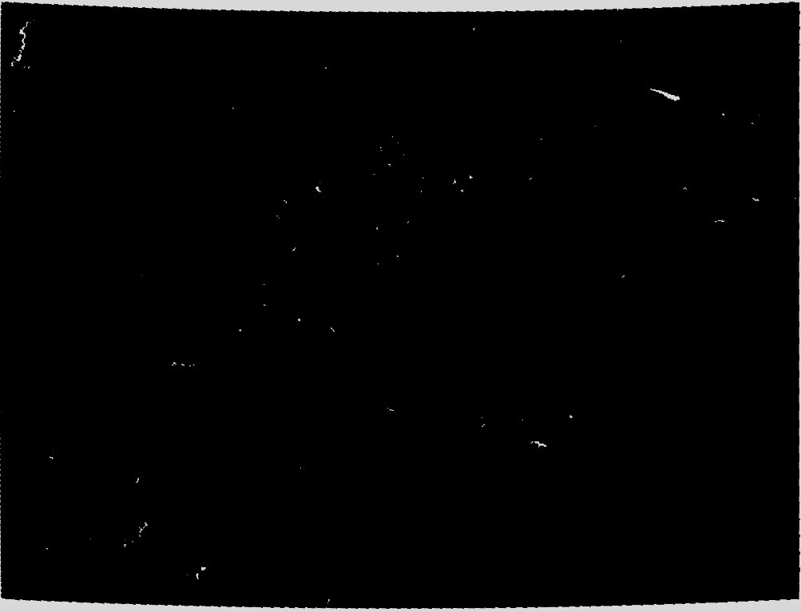
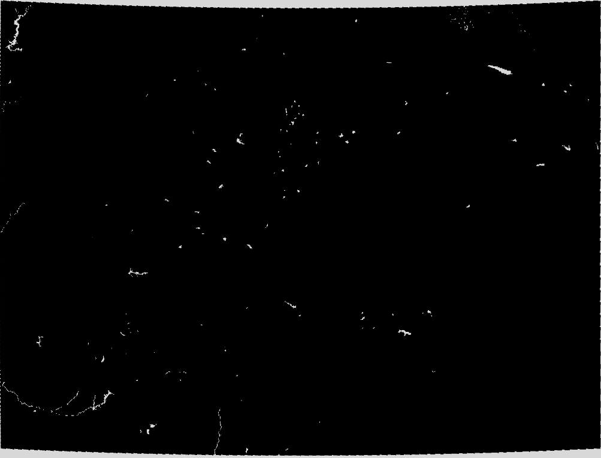
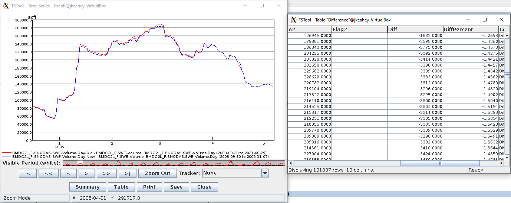
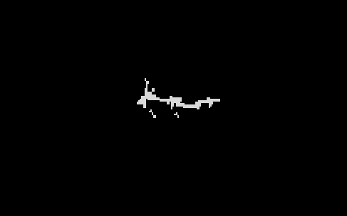
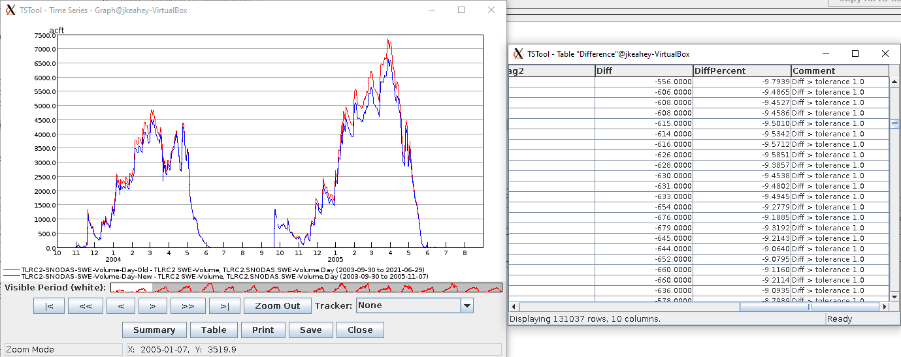
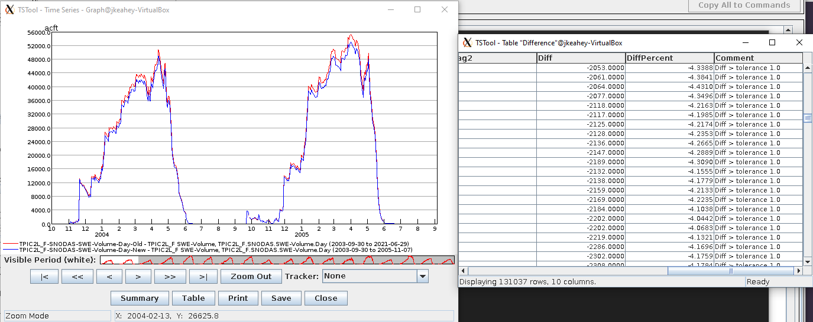

# Comparing old and new QGIS values #

This file describes the steps taken for determining differences between the older
and updated SNODAS Tools computed data. Python and QGIS were updated from version
2 to 3 for each. Syntax on both needed to be changed, and some functions,
constructors, etc. became deprecated and had to be updated to work with the new
version. There was a slight to moderate difference in the computed numbers (inches,
acre feet, snow cover percentage) after the update, even though algorithms and
functions used to get said numbers stayed the same. 

## Algorithm Used ##

The following describes the algorithm used in the `compare-snodas-csv-files.TSTool`
file to compare the old and new time series.

1. A 'for loop' going through two elements in a list: 'old' and 'new'.
2. A 'for loop' going through all basins in Colorado.
3. Read in the CSV file into a table from either the 'old' GCP VM, or 'new' Ubuntu VM.
4. Create the time series for SWE, Volume, and Snow cover.
5. After both loops have finished, compare using the many time series command by
location and data type, and write the difference to a table.

## Useful Information ##

* In the main tstool script located in `/opt/tstool-13.04.00.dev/bin/`, the line
setting the `javaCommand` variable was changed from `-Xmx1024m` to `-Xmx2048m`,
pushing memory from 1GB to 2GB. A heap error was occuring otherwise, and there
was no memory to work with.

* The local and GCP national tif files seem similar enough when compared, but the
local clipped Colorado tif file contained noticable differences from the VM. The
shown bodies of water seem to be more detailed, and in general more pixels are
dedicated to dislaying bodies of water. This could effect the basin area, and
subsequent equations later on, resulting in slightly different outcomes in acft
and other output properties.

## Outcome ##

The culprit here seems to be that the tif file being downloaded and used
from the NSIDC is different and has been updated to display bodies of water in more
detail. Since more pixels on this raster layer are considered water, that has
slightly changed the computed numbers by PYQGIS. Below are examples of the 'old' and
'new' Colorado tif files, three basins that contain updated/changed water body
boundaries & their statistics, and a close-up example of and 'old' and 'new'

### Colorado Old ###

### Colorado New ###

### BMDC2L Basin ###

### BMDC2L Old ###

### BMDC2L New ###

### TLRC2 Basin ###

### TPIC2L Basin ###

